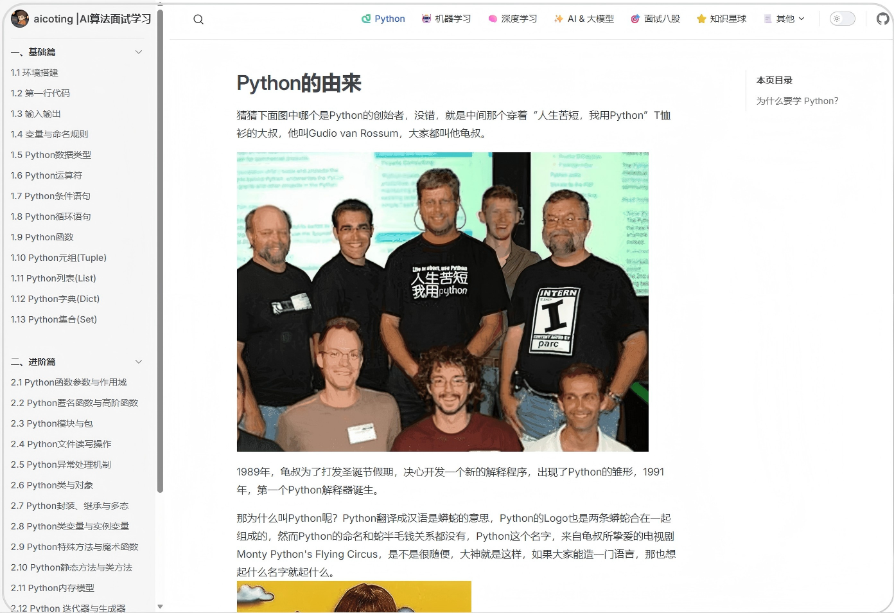
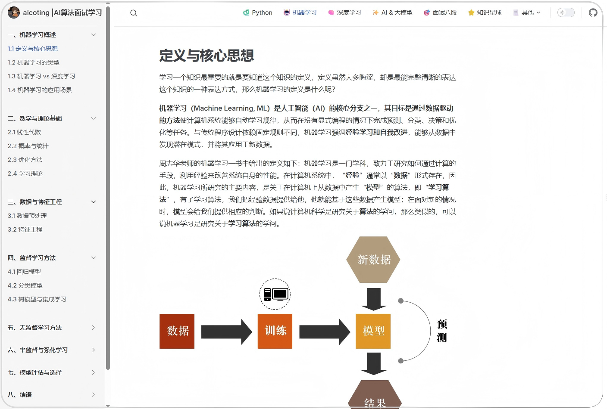
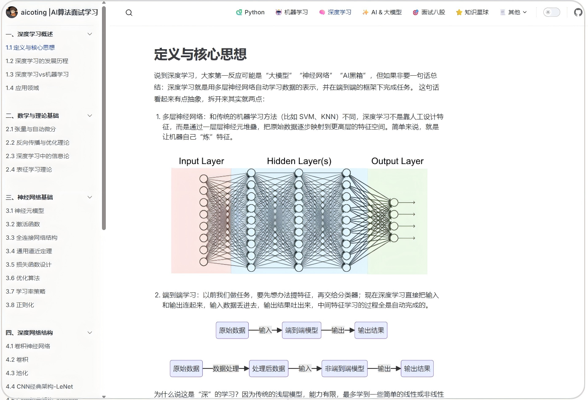
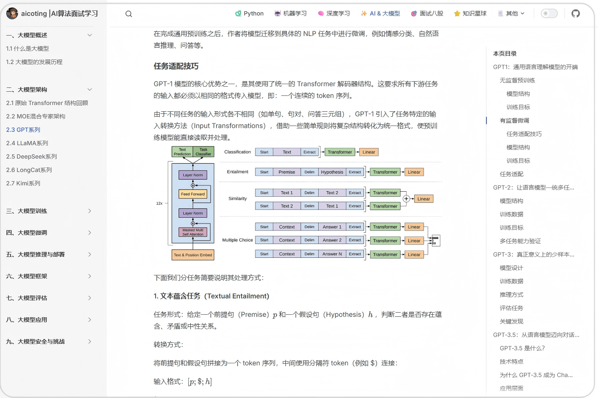

  <h2 align="center">MLHub</h2>
  

    一个机器学习知识的最全八股！
     
     
    <a href="https://aicoting.cn"><strong>» 推荐aicoting网站在线阅读 »</strong></a>
     
  

<!-- 

  
  
  

 -->

  &emsp;
  &emsp;
  &emsp;
  &emsp;
  &emsp;
  &emsp;
  <!-- visitor -->
  &emsp;
  <!-- wakatime -->    
  

  

> 🚀 这里是一个系统化的机器学习知识库 **（包含示例代码）**  
> 记录我的学习与求职历程，也希望能帮助到更多正在学习或者准备 AI 岗位的同学。

## 目录

- 🐫 [机器学习](./docs/)
    - 🐱 [机器学习概述](./docs/一、机器学习概述/)
        - 😼[定义与核心思想](./docs/一、机器学习概述/1.1%20定义与核心思想.md)
        - 😽[机器学习的类型](./docs/一、机器学习概述/1.2%20机器学习的类型.md)
        - 🙀[机器学习 vs 深度学习](./docs/一、机器学习概述/1.3%20机器学习%20vs%20深度学习.md)
        - 😻[机器学习的应用场景](./docs/一、机器学习概述/1.4%20机器学习的应用场景.md)
    - 🪄 [数学与理论基础](./docs/二、数学与理论基础/)
        - 🐎 [线性代数](./docs/二、数学与理论基础/2.1%20线性代数.md)
        - 🐏 [概率与统计](./docs/二、数学与理论基础/2.2%20概率与统计.md)
        - 🎣 [优化方法](./docs/二、数学与理论基础/2.3%20优化方法.md)
        - 🐳 [学习理论](./docs/二、数学与理论基础/2.4%20学习理论.md)
    - 🐋 [数据与特征工程](./docs/三、数据与特征工程/)
        - 🐬 [ 数据预处理](./docs/三、数据与特征工程/3.1%20数据预处理.md)
        - 🐟 [特征工程](./docs/三、数据与特征工程/3.2%20特征工程.md)
    - 🐳 [监督学习方法](./docs/四、监督学习方法/)
        - 🐠 [回归模型](./docs/四、监督学习方法/4.1%20回归模型.md)
        - 🐡 [分类模型](./docs/四、监督学习方法/4.2%20分类模型.md)
        - 🦈 [树模型与集成学习](./docs/四、监督学习方法/4.3%20树模型与集成学习.md)
    - 🐙[无监督学习方法](./docs/五、无监督学习方法/)
        - 🐟 [聚类](./docs/五、无监督学习方法/5.1%20聚类.md)
        - 🦐 [降维与表示学习](./docs/五、无监督学习方法/5.2%20降维与表示学习.md)
        - 🦑 [概率图模型](./docs/五、无监督学习方法/5.3%20概率图模型.md)
    - 🐹 [半监督与强化学习](./docs/六、半监督与强化学习/)
        - 💽 [半监督学习](./docs/六、半监督与强化学习/6.1%20半监督学习.md)
        - 💽 [强化学习](./docs/六、半监督与强化学习/6.2%20强化学习.md)

## 🧭 网站在线阅读  
同时，我也搭建了自己的网站，推荐大家直接在网站在线阅读。

  

<h3 align="center">网站主页</h3>  

<h3 align="center">Python篇</h3>  

<h3 align="center">机器学习篇</h3>  

<h3 align="center">深度学习篇</h3>  

<h3 align="center">大模型篇</h3>  

## 🌟 社区交流

想找人一起：\
&emsp;🤔 深夜讨论模型结构优化？\
&emsp;💡 头脑风暴科研点子？\
&emsp;🧪 分享面试、比赛、科研经验？\
那欢迎加入交流群【AI进阶之路】

在这里我们一起：\
&emsp;👉交流模型优化思路、训练加速技巧、复现经验；\
&emsp;👉分享博客内容背后的思考，探讨代码设计与实验细节；\
&emsp;👉吹水科研生活，也卷一卷代码人生。

📌 群友包括：研究生、算法工程师、AI爱好者、自学深度学习的朋友们\
🎯 目标是：打造一个真·有价值的成长社区！\
📬 进群方式：扫描下方二维码添加我微信（备注“**进群** ”）\
👇(由于人数限制，人数超过200就会加入新建的群) 

我相信： **“分享是一种信仰，连接让成长更有温度。”** 

如果你也在： 

寻找方向、沉淀能力； 
在技术 or 学术路上狂奔； 
希望有伙伴、有资源、有灵感…… 

那就关注我吧，我们一起成长，一起搞事情！

正在更新ing，如果小伙伴对其他内容感兴趣欢迎联系我们😊😊！

仓库中如有侵权请联系删除。

微信公众号：**aicoting**，该公众号主要分享AI与大语言模型（LLM）相关的核心知识、面试内容、实际应用场景及部署技巧等。

## 🌟 希望大家

创建这个知识库工程量还是很大的，从大纲确立到内容书写再到排版，可以说是日积月累的结晶。  

目的就是帮助大家能够建立起机器学习的完整的 **属于自己的体系框架**。  

这个知识库是 **机器学习**，后面我会继续更新 **深度学习知识库** 和 **AI 大模型知识库**。  
如果大家急需的话，可以催更我。

## ❤️ 最后

学习需要坚持。  
无论是找工作、找实习，还是为了提升自己把握未来机会，  
希望这个知识库能让你有所收获，哪怕只是一点点！

## 💪 支持我们

如果我们这个项目对你有所帮助，请给我们一颗 ⭐️  