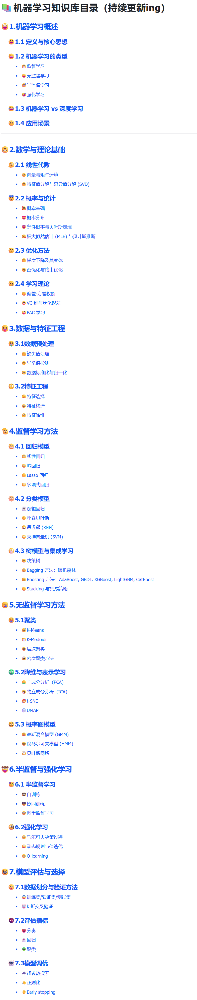

<!--
 * @Author: zhangting
 * @Date: 2025-09-16 11:38:46
 * @LastEditors: Do not edit
 * @LastEditTime: 2025-09-16 12:12:16
 * @FilePath: /zhangting/MLHub/README.md
-->
# MLHub

> 🚀 这里是一个系统化的机器学习知识库**示例代码**  
> 记录我的学习与求职历程，也希望能帮助到更多正在准备AI岗位的同学。

---

## 📌 初心

前段时间在找工作面试，想乘上AI这股东风，正好我所学专业也是人工智能，于是下定决心要找算法岗或者AI岗，很多人都说**算法岗要求高**，没有**顶会顶刊**连面试都进不了，传统算法岗包括**搜广推**，**视觉**等岗位确实需要顶会顶刊，因为论文是能证明你实力的最好方式，但实习的经历让我认识到如今AI大大降低了算法准入的门槛，AI让整个计算机行业，整个互联网行业焕然一新，可以说带来了相当的增量，**有增量就会有人才缺口**，就会适当的降低要求，也更有利于我们搭上AI这趟快车。

⚠️ 但是——门槛降低 ≠ **点击即送**！  
没有顶会顶刊并不代表只会写个 `Hello World` 就能进算法岗。

如今AI岗位一个是传统的**算法研发岗**，研发岗仍然需要过硬的算法能力与优化技巧，这里还是顶会顶刊者的天下，不否认有优秀的人没有顶会顶刊也能进入传统算法岗，但是其中的竞争强度是相当大的。
另外一个就是**AI应用岗**，如今企业更多的要求是将算法落到实地，企业要生存，生存就要赚钱，光研发赚不了钱，研发出来的东西卖出去，有市场有用户有过硬的产品才能赚钱，所以AI应用岗是现在各大厂正在加紧扩招的岗位之一，包括Agent工程师、大模型应用工程师、AI后台工程师等等等等，腾讯、阿里、字节、美团、京东这些大厂也开始下场抢人。

虽说抢人，但是抢的是**优秀的人**，所以我们要在机会来临之前准备好，这样才能变成那个被抢的人。
上面只是我对算法行业的一些粗浅的认识，也更加坚定了我选择算法AI的决心，于是我就开始准备，想从头武装自己。
无论是传统算法岗还是AI应用岗，知识框架和体系都是一样的，想要入门就一定要从机器学习开始，到深度学习，再到AI和大模型，基础打不牢，面试的时候面试官一问就露馅了，但是不像我当初学Java的时候有JavaGuide，背八股有小林coding，我在网上找了一大圈，都没有个像样的AI知识库或者八股，所以我痛定思痛，**没人搞，我搞！**

---

## 📚 笔记软件选择

从有这个想法开始，我就开始干，第一个问题就是我该怎么把知识库展示给大家，我现在没有实力（没钱）去开一台服务器一直托管我的网站，或许后面会哈，所以我就想用现有的笔记软件，决定之后，我就开始试，因为最开始是用语雀写博客，所以对语雀非常了解，他有一个最大的弊端就是每月文档创建上限100篇。

我的目标是把每个知识点都创建一个文档，这样学习起来不用老想“怎么还有这么多”，读一会就读完了，很有成就感，能促进大家学习，所以语雀就Pass了;
接下来我就又去用了Notion，Notion可以说是生态最完善的一个笔记软件了，但是我感觉用起来学习成本稍微有点高；

最后我选择了飞书，飞书不仅没有文档个数限制，并且和语雀的使用方法大概一致，同时他是收购了一家绘图公司，其中对图像的处理比较好，所以飞书简直就是为我而定的，这也就有了你们今天看到的这个知识库！
在使用的过程中，我发现飞书还有很多小优点，比如鼠标放在链接上就可以**预览内容**。

同时对一些专业名词点击就会有**解释**，让我们的学习更加便捷，不用见到一个不知道的名词再去问GPT了。

---

## 🌟 希望大家

创建这个知识库工程量还是很大的，从大纲确立到内容书写再到排版，可以说是日积月累的结晶，目的就是帮助大家能够建立起机器学习的完整的**属于自己的体系框架**，这个知识库是机器学习，后面我会继续更新深度学习知识库和AI大模型知识库，如果大家急需的话，可以催更我。

---

## ❤️ 最后

学习需要坚持。  
无论是找工作、找实习，还是为了提升自己把握未来机会，  
希望这个知识库能让你有所收获，哪怕只是一点点！
