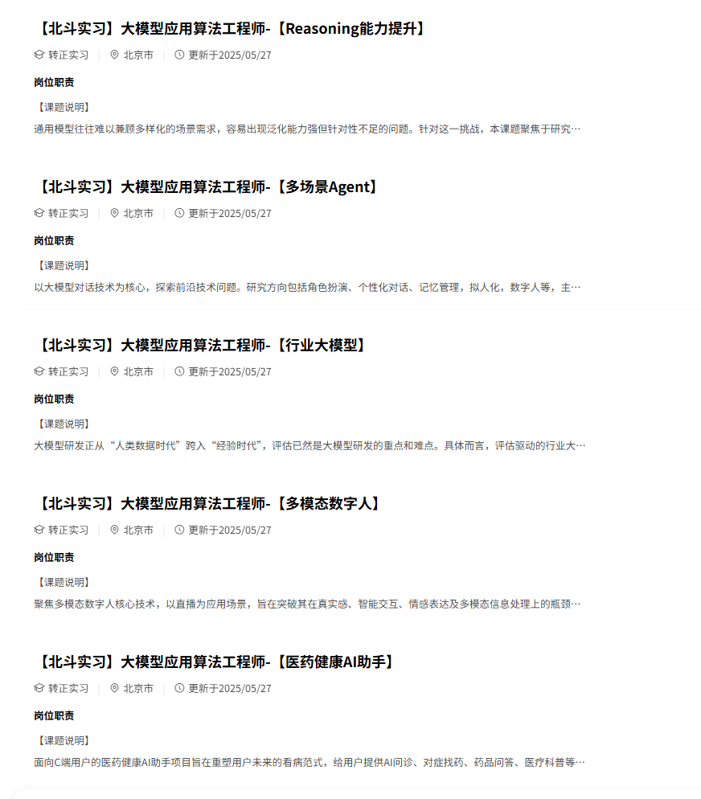

  <h2 align="center">MLHub</h2>
  

    一个机器学习知识的最全八股！
     
     
    <a href="https://aicoting.cn"><strong>» 推荐aicoting网站在线阅读 »</strong></a>
     
  

<!-- 

  
  
  

 -->

  &emsp;
  &emsp;
  &emsp;
  &emsp;
  &emsp;
  <!-- visitor -->
  &emsp;
  <!-- wakatime -->    
  

  

> 🚀 这里是一个系统化的机器学习知识库 **（包含示例代码）**  
> 记录我的学习与求职历程，也希望能帮助到更多正在学习或者准备 AI 岗位的同学。

## 📌 前言

前段时间在找工作面试，想乘上 AI 这股东风，正好我所学专业也是人工智能，于是下定决心要找算法岗或者 AI 岗，很多人都说 **算法岗要求高**，没有 **顶会顶刊** 连面试都进不了，传统算法岗包括 **搜广推**、**视觉** 等岗位确实需要顶会顶刊，因为论文是能证明你实力的最好方式。  
但实习的经历让我认识到，如今 AI 大大降低了算法准入的门槛。AI 让整个计算机行业、整个互联网行业焕然一新，可以说带来了相当的增量，**有增量就会有人才缺口**，就会适当地降低要求，也更有利于我们搭上 AI 这趟快车。

⚠️ 但是——门槛降低 ≠ **点击即送**！  
没有顶会顶刊并不代表只会写个 `Hello World` 就能进算法岗。

如今 AI 岗位一个是传统的 **算法研发岗**，研发岗仍然需要过硬的算法能力与优化技巧，这里还是顶会顶刊者的天下。不否认有优秀的人没有顶会顶刊也能进入传统算法岗，但是其中的竞争强度是相当大的。  
另外一个就是 **AI 应用岗**，如今企业更多的要求是将算法落到实地。企业要生存，就要赚钱，光研发赚不了钱。研发出来的东西卖出去，有市场、有用户、有过硬的产品才能赚钱。  
所以 **AI 应用岗** 是现在各大厂正在加紧扩招的岗位之一，包括 Agent 工程师、大模型应用工程师、AI 后台工程师等等，腾讯、阿里、字节、美团、京东这些大厂也开始下场抢人。

  

  

虽说抢人，但是抢的是 **优秀的人**，所以我们要在机会来临之前准备好，这样才能变成那个被抢的人。  
上面只是我对算法行业的一些粗浅的认识，也更加坚定了我选择算法 AI 的决心，于是我就开始准备，想从头武装自己。  

无论是传统算法岗还是 AI 应用岗，知识框架和体系都是一样的。  
想要入门就一定要从 **机器学习** 开始，到 **深度学习**，再到 **AI 和大模型**。  
基础打不牢，面试的时候面试官一问就露馅了。  

但是不像我当初学 Java 的时候有 JavaGuide，背八股有小林 coding，我在网上找了一大圈，都没有个像样的 AI 知识库或者八股，所以我痛定思痛，**没人搞，我搞！**

## 目录

- 🐫 [机器学习](./docs/)
    - 🐱 [机器学习概述](./docs/一、机器学习概述/)
        - 😼[定义与核心思想](./docs/一、机器学习概述/1.1%20定义与核心思想.md)
        - 😽[机器学习的类型](./docs/一、机器学习概述/1.2%20机器学习的类型.md)
        - 🙀[机器学习 vs 深度学习](./docs/一、机器学习概述/1.3%20机器学习%20vs%20深度学习.md)
        - 😻[机器学习的应用场景](./docs/一、机器学习概述/1.4%20机器学习的应用场景.md)
    - 🪄 [数学与理论基础](./docs/二、数学与理论基础/)
        - 🐎 [线性代数](./docs/二、数学与理论基础/2.1%20线性代数.md)
        - 🐏 [概率与统计](./docs/二、数学与理论基础/2.2%20概率与统计.md)
        - 🎣 [优化方法](./docs/二、数学与理论基础/2.3%20优化方法.md)
        - 🐳 [学习理论](./docs/二、数学与理论基础/2.4%20学习理论.md)
    - 🐋 [数据与特征工程](./docs/三、数据与特征工程/)
        - 🐬 [ 数据预处理](./docs/三、数据与特征工程/3.1%20数据预处理.md)
        - 🐟 [特征工程](./docs/三、数据与特征工程/3.2%20特征工程.md)
    - 🐳 [监督学习方法](./docs/四、监督学习方法/)
        - 🐠 [回归模型](./docs/四、监督学习方法/4.1%20回归模型.md)
        - 🐡 [分类模型](./docs/四、监督学习方法/4.2%20分类模型.md)
        - 🦈 [树模型与集成学习](./docs/四、监督学习方法/4.3%20树模型与集成学习.md)
    - 🐙[无监督学习方法](./docs/五、无监督学习方法/)
        - 🐟 [聚类](./docs/五、无监督学习方法/5.1%20聚类.md)
        - 🦐 [降维与表示学习](./docs/五、无监督学习方法/5.2%20降维与表示学习.md)
        - 🦑 [概率图模型](./docs/五、无监督学习方法/5.3%20概率图模型.md)
    - 🐹 [半监督与强化学习](./docs/六、半监督与强化学习/)
        - 💽 [半监督学习](./docs/六、半监督与强化学习/6.1%20半监督学习.md)
        - 💽 [强化学习](./docs/六、半监督与强化学习/6.2%20强化学习.md)

## 📚 在线阅读

因为最开始是用语雀写博客，所以对语雀非常了解，它有一个最大的弊端就是 **每月文档创建上限 100 篇**。

  

我的目标是把每个知识点都创建一个文档，这样学习起来不用老想“怎么还有这么多”，读一会就读完了，很有成就感，能促进大家学习，所以语雀就 Pass 了。  

接下来我就又去用了 **Notion**。Notion 可以说是生态最完善的一个笔记软件了，但是我感觉用起来学习成本稍微有点高。  

  

最后我选择了 **飞书**。  
飞书不仅没有文档个数限制，并且和语雀的使用方法大概一致。  
同时它收购了一家绘图公司，对图像处理支持比较好，所以飞书简直就是为我而定的。  
这也就有了你们今天看到的这个知识库！  

在使用的过程中，我发现飞书还有很多小优点，比如鼠标放在链接上就可以 **预览内容**。

  

同时对一些专业名词点击就会有 **解释**，让我们的学习更加便捷，不用见到一个不知道的名词再去问 GPT 了。

  

下面是飞书的知识库目录：

如果大家有需要，扫码关注公众号，回复**MLHub**即可

  

## 🌟 希望大家

创建这个知识库工程量还是很大的，从大纲确立到内容书写再到排版，可以说是日积月累的结晶。  

目的就是帮助大家能够建立起机器学习的完整的 **属于自己的体系框架**。  

这个知识库是 **机器学习**，后面我会继续更新 **深度学习知识库** 和 **AI 大模型知识库**。  
如果大家急需的话，可以催更我。

## ❤️ 最后

学习需要坚持。  
无论是找工作、找实习，还是为了提升自己把握未来机会，  
希望这个知识库能让你有所收获，哪怕只是一点点！