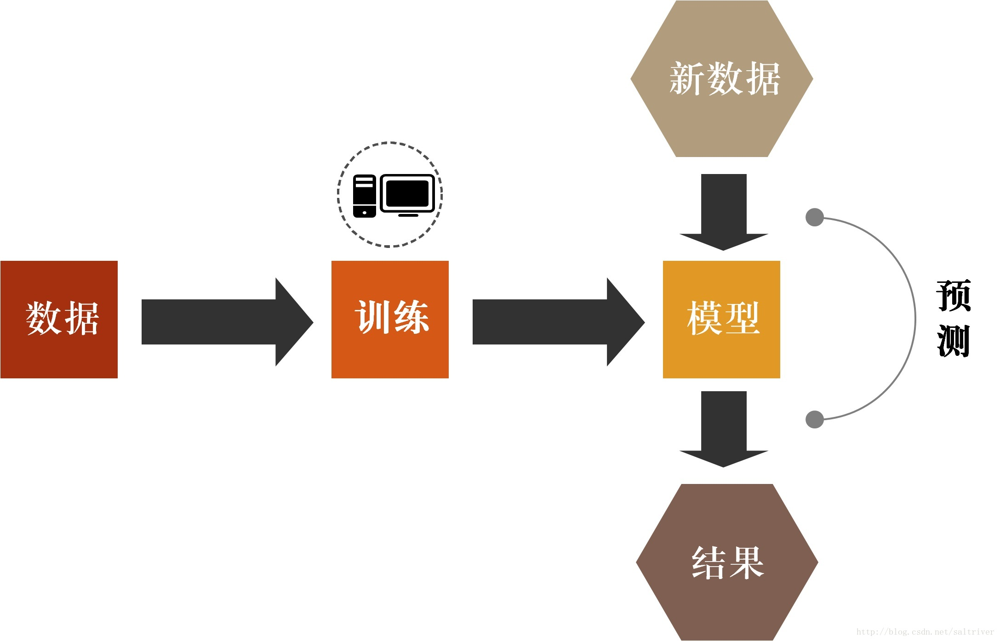

# 定义与核心思想
学习一个知识最重要的就是要知道这个知识的定义，定义虽然大多晦涩，却是最能完整清晰的表达这个知识的一种表达方式，那么机器学习的定义是什么呢？

**机器学习（Machine Learning, ML）是人工智能（AI）的核心分支之一，其目标是通过数据驱动的方法**使计算机系统能够自动学习规律，从而在没有显式编程的情况下完成预测、分类、决策和优化等任务。与传统程序设计依赖固定规则不同，机器学习强调**经验学习和自我改进**，能够从数据中发现潜在模式，并将其应用于新数据。

周志华老师的机器学习一书中给出的定义如下：机器学习是一门学科，致力于研究如何通过计算的手段，利用经验来改善系统自身的性能。在计算机系统中，“**经验**”通常以“**数据**”形式存在，因此，机器学习所研究的主要内容，是关于在计算机上从数据中产生“**模型**”的算法，即“**学习算法**”，有了学习算法，我们把经验数据提供给他，他就能基于这些数据产生模型；在面对新的情况时，模型会给我们提供相应的判断。如果说计算机科学是研究关于**算法**的学问，那么类似的，可以说机器学习是研究关于**学习算法**的学问。

机器学习的核心思想可以概括为以下几个方面：

1. **模型（Model）**：模型是计算机“理解数据”的数学结构，负责从输入数据中捕捉规律，并进行预测或决策。不同的模型适用于不同类型的问题，例如线性回归用于连续值预测，决策树和神经网络适用于复杂模式识别。
2. **训练（Training）**：训练是模型学习的过程，通过输入大量数据，模型不断调整内部参数以最小化预测误差。训练过程的质量直接影响模型的性能和泛化能力。
3. **特征（Feature）**：特征是数据中最有信息量的部分，是模型学习规律的基础。高质量的特征能够显著提升模型的预测能力，而无关或噪声特征可能导致性能下降。
4. **泛化能力（Generalization）**：机器学习不仅关注模型在训练数据上的表现，更重视其在未知数据上的适应能力。泛化能力强的模型能够在新场景中保持稳定的性能，是衡量机器学习系统有效性的关键指标。

简单点说，机器学习的核心思想就是**通过数据驱动的方法，让模型自动学习规律，并能够在新的环境中进行准确预测和决策**。这一思想贯穿所有机器学习算法和应用，是理解后续各类方法和技术的基础。

参考链接

https://imgtec.eetrend.com/blog/2019/100042147.html

最新的文章都在公众号更新，别忘记关注哦！！！如果想要加入技术群聊，扫描下方二维码回复【加群】即可。
