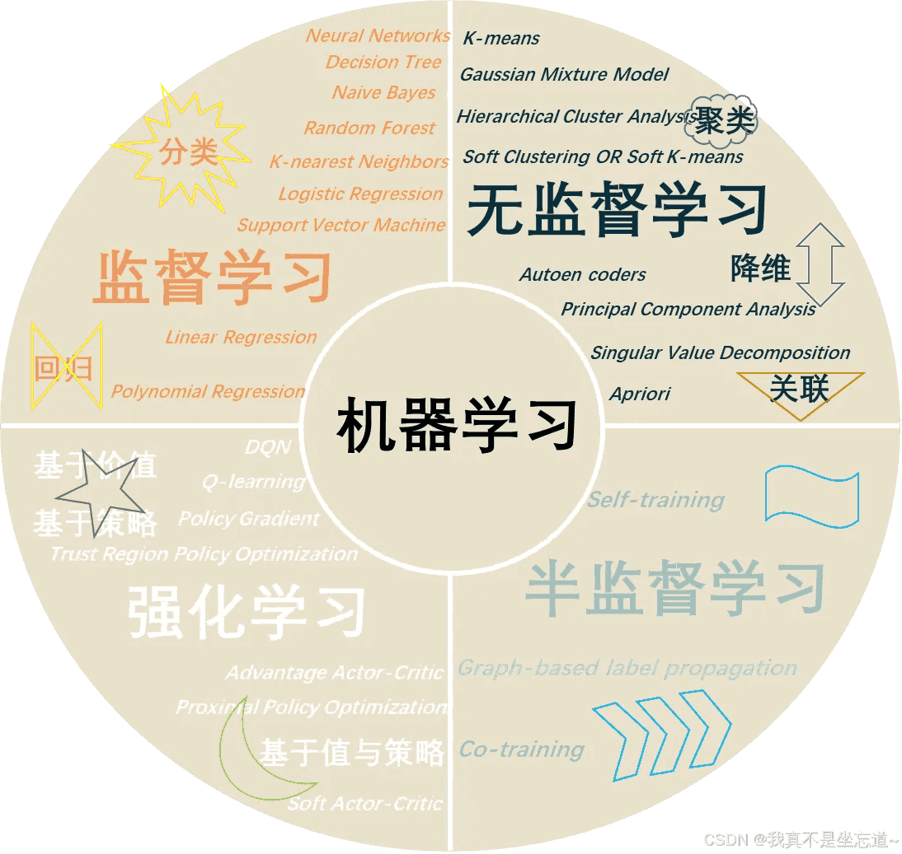
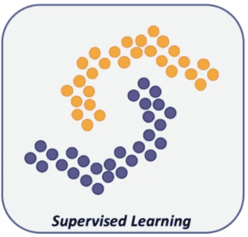
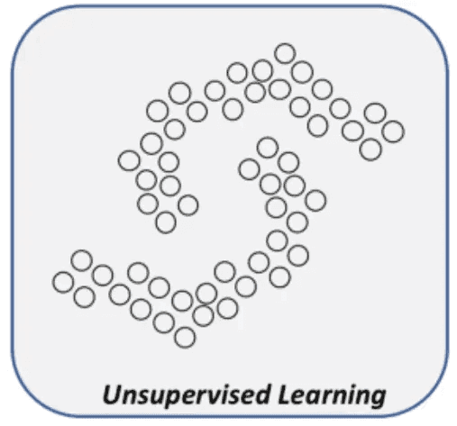
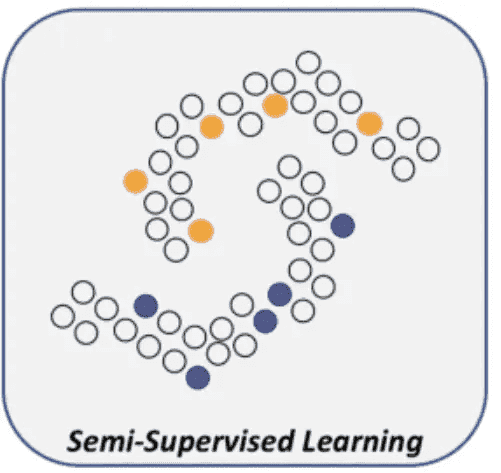
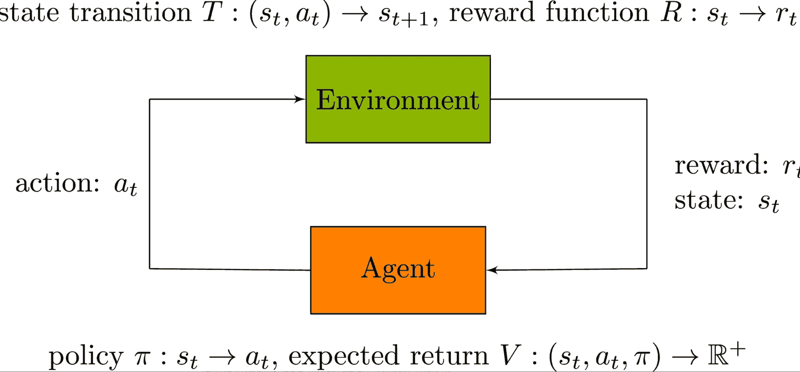

# 机器学习的类型
机器学习根据**学习方式和数据特征**的不同，大致可以分为几类，包括：

+ **监督学习（Supervised Learning）**：通过带有标签的数据进行学习，核心任务是让模型学会“从输入预测输出”。
+ **无监督学习（Unsupervised Learning）**：在没有标签的数据中挖掘潜在规律和结构，常用于模式发现与数据压缩。
+ **半监督学习（Semi-supervised Learning）**：结合少量标注数据与大量未标注数据，提高学习效率与模型性能。
+ **强化学习（Reinforcement Learning）**：通过与环境交互不断试错，并根据奖励反馈逐步优化策略，用于解决动态决策问题。

这些类型共同构成了机器学习的基本版图：有的强调“从老师那里学习”，有的擅长“无师自通”，有的善于“边学边试”。在实际应用中，它们往往不是孤立存在的，而是可以结合使用，从而应对更加复杂和多样化的任务。

## 监督学习
监督学习是机器学习的基石，其优点在于思路清晰、效果直观，且在分类与回归任务中表现优异。无论是垃圾邮件识别、语音识别，还是金融风控和医疗诊断，都离不开监督学习。理解监督学习，你就打开了机器学习世界的大门。

**监督学习（Supervised Learning）**是机器学习中最常见、应用最广的一类方法。它的核心思想是**利用带有输入与输出标签的数据，训练模型学习两者之间的映射关系，从而在新数据上做出预测。**

监督学习的本质是“有老师的学习”。在训练过程中，模型接收大量的输入数据（特征）及其对应的正确答案（标签），并尝试学习一个函数，将输入映射到输出。就像学生在老师的指导下，通过参考答案不断纠正自己的错误，模型也通过误差反馈不断调整参数，使预测结果尽可能接近真实标签。

从数学上看，监督学习可以被表述为：给定一个训练集 $$(x_i, y_i)$$，其中$$x_i$$表示输入，$$y_i$$表示输出，目标是找到一个函数 $$f(x)$$，使得在新的输入 $$x$$下，预测输出 $$\hat{y}=f(x) $$尽可能接近真实输出 $$y$$。

监督学习主要分为两大任务：

+ **分类（Classification）**：输出是离散类别，例如识别图片中的动物种类。
+ **回归（Regression）**：输出是连续值，例如预测房价或气温。

监督学习通常包括以下几个步骤：

1. **数据准备** 收集并整理数据，将输入与对应的标签配对。数据质量和数量直接影响模型的效果。
2. **特征工程** 提取或选择有价值的特征，去除冗余信息，为模型提供有效的学习基础。
3. **模型选择** 根据任务类型选择合适的模型，例如回归任务可用线性回归，分类任务可用逻辑回归、支持向量机或决策树等。
4. **训练模型** 将训练数据输入模型，通过优化算法（如梯度下降）不断调整参数，最小化预测值与真实值之间的误差。
5. **模型评估** 使用验证集或交叉验证方法，评估模型在未见数据上的表现，常见指标包括准确率、均方误差、F1 分数等。
6. **模型应用** 在测试集或真实场景中使用训练好的模型，对新数据进行预测或决策。

## 无监督学习
网络中存在着大量的数据，然而这些数据绝大部分是没有标注的，而标注又需要大量的人力，财力，没人愿意当这个冤大头，科学家就想到了一个好办法：这些数据中本来就存在着某些关联，让模型自己学去吧！无监督学习也就应运而生。

**无监督学习（Unsupervised Learning）是一种无需人工标注数据的机器学习方法。与监督学习不同，它不依赖输入与标签的对应关系，而是在纯粹的输入数据中自主寻找潜在的模式、规律与结构**。

无监督学习的核心思想可以理解为“无老师的学习”。模型并不知道正确答案是什么，它的目标是通过分析数据之间的相似性与差异性，揭示数据背后的隐藏结构。

无监督学习常见的任务包括：

+ **聚类（Clustering）**：将相似的数据自动归为一类，例如把客户划分成不同群体。
+ **降维（Dimensionality Reduction）**：在保留主要信息的前提下，用更少的变量来表示数据，例如将高维图像数据映射到低维空间。
+ **关联规则挖掘（Association Rule Mining）**：发现变量之间的潜在关系，例如“购物篮分析”中找出哪些商品经常一起购买。

可以说，无监督学习更像是探索未知领域，帮助人们理解数据的内在结构，为后续的预测、决策或特征提取提供支持。

无监督学习的一般流程包括以下几个步骤：

1. **数据收集与准备** 获取数据并进行基本清洗，确保输入数据质量。由于没有标签，数据的完整性与代表性显得尤为重要。
2. **特征提取与表示** 将原始数据转化为模型可理解的特征表示，例如数值向量化或归一化处理。
3. **模型选择** 根据任务目标选择合适的方法：若是发现群体结构，可以使用聚类算法；若是降低维度，可以选择主成分分析（PCA）等方法。
4. **模式发现** 模型通过分析数据间的相似性、分布规律或统计特性，挖掘出数据中隐藏的模式。
5. **结果解释与应用** 对模型输出进行解释和验证，并结合业务需求应用，例如用于市场细分、异常检测或数据可视化。

无监督学习的魅力在于**发现未知**。当缺乏标注数据时，它能够帮助我们理解数据的内在结构，揭示潜在规律，并为其他机器学习方法提供支持。在大数据场景下，无监督学习已经成为探索和利用信息的重要工具，例如用户行为分析、基因数据研究、推荐系统预处理等。

## 半监督学习
在现实世界中，获取大量标注数据往往代价高昂、耗时巨大，而未标注数据却随处可见。**半监督学习（Semi-Supervised Learning）** 便是在这种背景下诞生的一种折中方案：它试图结合少量带标签的数据与大量无标签的数据，从而提升模型的学习效果。

半监督学习的核心思想是：**标签稀缺但数据丰富**。相比监督学习完全依赖标注数据，半监督学习希望模型能够借助无标签样本中的潜在结构与分布规律，来辅助模型更好地学习决策边界。

换句话说，带标签的数据告诉模型“该怎么分”，而无标签的数据则揭示了“数据是怎么分布的”。两者结合，既能降低标注成本，又能提升模型的泛化能力。

半监督学习的典型流程一般包括以下几个步骤：

1. **初始训练** 使用少量的标注数据训练一个初始模型，建立基本的预测能力。
2. **利用无标签数据** 借助无标签数据的分布特性，让模型捕捉数据的潜在结构。常见方式包括聚类假设（相似的样本往往属于同一类别）和流形假设（高维数据往往分布在低维流形上）。
3. **伪标签生成** 模型对无标签数据进行预测，并将高置信度的预测结果当作“伪标签”，加入到训练集中，不断扩大标注数据的规模。
4. **迭代优化** 将真实标签与伪标签共同用于训练，迭代更新模型，使其在不断学习中获得更强的泛化能力。

半监督学习广泛应用于标注成本高昂的领域，例如：

+ **医学影像分析**：少量专家标注结合大量未标注图像，有助于疾病诊断模型的训练。
+ **自然语言处理**：在文本分类或情感分析中，大量语料没有标签，半监督方法能有效利用这些数据。
+ **网络安全**：恶意行为样本有限，但大量正常网络流量可以提供辅助信息。

半监督学习是一种巧妙的折中方案：它不依赖于昂贵的大规模标注，也不完全放弃监督信号，而是将“少量已知”与“大量未知”相结合，帮助模型在有限的监督下依然能够“学得更好”。在数据爆炸、标注昂贵的当下，半监督学习无疑是推动人工智能走向现实应用的重要方式。

## 强化学习
如果说监督学习像“老师出题、学生作答”，无监督学习像“学生自学、自己总结”，那么**强化学习（Reinforcement Learning，RL）更像是“学生在游戏中闯关，通过奖励与惩罚不断升级”。它是一种通过与环境交互**来学习决策策略的机器学习方法。

强化学习的核心思想是：**行动 → 奖励 → 学习 → 改进**。 智能体（agent）通过与环境（environment）交互，在不同状态下采取动作（action），环境会反馈奖励（reward）和新的状态。智能体的目标是通过试错，不断优化策略（policy），以获得长期累积的最大奖励。

可以简单理解为：

+ **监督学习**学的是“正确答案”；
+ **无监督学习**学的是“潜在规律”；
+ **强化学习**学的是“如何做选择，才能赢得最多奖励”。

一个典型的强化学习流程包括以下几个关键步骤：

1. **感知环境状态（State）** 智能体观察当前所处的环境，例如机器人看到周围障碍物，游戏玩家知道自己所在位置。
2. **选择动作（Action）** 根据当前的策略，智能体决定采取某种动作，例如向前走、向左转或发起攻击。
3. **环境反馈（Reward & Next State）** 环境根据动作反馈奖励（正向或负向），同时进入新的状态。例如，机器人避开障碍物获得奖励，撞到障碍物则受到惩罚。
4. **策略更新（Policy Update）** 智能体利用反馈信息更新决策策略，让下一次行动更聪明，从而在长期中获得更高的总回报。

这一过程循环往复，直到智能体学会在各种情境下如何选择最佳动作。

强化学习的基本要素通常用五元组来描述：

+ **Agent（智能体）**：学习和决策的主体；
+ **Environment（环境）**：智能体所处的外部世界；
+ **State（状态）**：环境在某一时刻的信息描述；
+ **Action（动作）**：智能体可以采取的行为；
+ **Reward（奖励）**：动作执行后环境给予的反馈。

强化学习已在多个领域展现出强大潜力：

+ **游戏**：AlphaGo 打败世界围棋冠军，展示了强化学习在复杂博弈中的威力。
+ **机器人控制**：机器人通过试错学会走路、抓取物体，甚至完成精细操作。
+ **推荐系统**：根据用户的反馈动态调整推荐内容，优化长期用户体验。
+ **自动驾驶**：强化学习帮助汽车在模拟环境中不断优化驾驶策略。

强化学习是一种基于“试错—反馈—改进”的学习方法，强调长期回报的最大化。它不像监督学习那样依赖大量标注数据，而是通过与环境的不断交互，逐步形成最优策略。随着计算能力和模拟环境的不断发展，强化学习将在更多复杂、动态的现实场景中发挥重要作用。

参考链接

https://blog.csdn.net/qq_40641591/article/details/143150523

最新的文章都在公众号更新，别忘记关注哦！！！如果想要加入技术群聊，扫描下方二维码回复【加群】即可。
