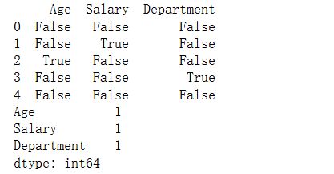
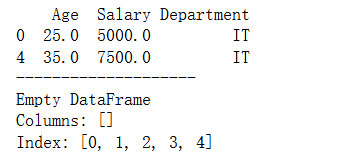
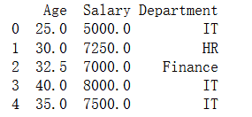
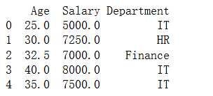
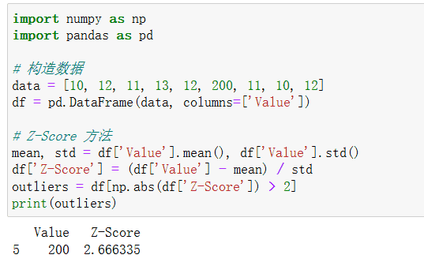
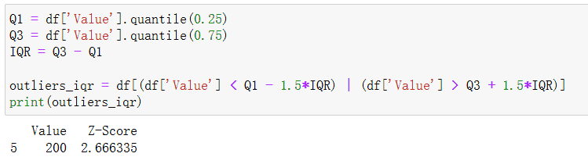
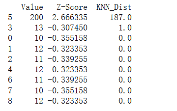
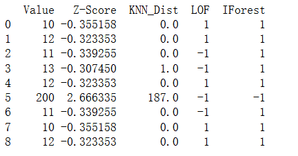
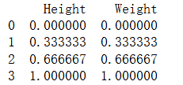

# 数据预处理
数据预处理是机器学习和数据分析流程中的基础步骤，其目标是将原始数据转化为干净、规范且适合模型处理的形式，从而提升模型的训练效率与预测性能。通常，原始数据会存在噪声、缺失值、不一致格式或尺度差异，这些问题若不加处理，往往会导致模型偏差或性能下降。

数据预处理的主要环节包括：
1. 数据清洗：处理缺失值（删除、均值填充、插值等）、检测并修正异常值、去除重复样本，确保数据质量。
2. 数据集成：将来自不同来源的数据进行合并，解决冗余与冲突问题，形成统一的分析对象。
3. 数据变换：通过归一化、标准化、分箱、对数变换或编码等方法，使数据满足模型对分布与尺度的要求。
4. 数据规约：采用特征选择、特征提取或降维方法减少冗余，降低计算复杂度，提高模型泛化能力。
良好的数据预处理不仅能够改善数据质量，还能突出潜在的模式与结构，为后续的特征工程和建模奠定坚实基础。
## 缺失值处理
### 为什么要处理缺失值
在实际的机器学习任务中，数据集往往并不完整：某些样本的特征缺失，或某些传感器在采集时失败。这种情况会导致：
- 模型无法训练：大多数算法无法直接处理缺失值。
- 信息丢失：缺失比例过大时，数据代表性下降。
- 结果偏差：若缺失不是随机的，可能引入系统性偏差。
因此，合理的缺失值处理是数据预处理的重要环节。

### 缺失值的类型
在统计学中，缺失值可分为三类：
1. MCAR（Missing Completely at Random）：完全随机缺失，与特征和标签无关。
2. MAR（Missing at Random）：与已观测到的特征相关，但与缺失本身无关。
3. MNAR（Missing Not at Random）：与缺失值本身相关，例如高收入人群更不愿意填写收入调查。
不同类型缺失对处理方法的选择有影响。

### 缺失值检测
以下的代码在https://github.com/aicoting/MLHub中。
在 Python 中可以用 Pandas 快速检测：
```python
import pandas as pd
import numpy as np

# 构造示例数据
data = {
    "Age": [25, 30, np.nan, 40, 35],
    "Salary": [5000, np.nan, 7000, 8000, 7500],
    "Department": ["IT", "HR", "Finance", None, "IT"]
}
df = pd.DataFrame(data)

# 检查缺失情况
print(df.isnull())
print(df.isnull().sum()) 
```

输出如下：



### 缺失值处理方法
**删除法**

适合缺失值极少的情况。
```python
# 删除含有缺失值的行
df_drop_row = df.dropna()

# 删除含有缺失值的列
df_drop_col = df.dropna(axis=1)
# 检查缺失情况
print(df_drop_row)
print("--------------------")
print(df_drop_col)
```

这种方法的缺点是可能丢失有用信息，不适合缺失比例较高的数据。

**简单填充法**

均值/中位数/众数填充（数值型）
```python
# 用均值填充 Age
df['Age'].fillna(df['Age'].mean(), inplace=True)

# 用中位数填充 Salary
df['Salary'].fillna(df['Salary'].median(), inplace=True)
```
众数填充（类别型）
```python
# 用众数填充 Department
df['Department'].fillna(df['Department'].mode()[0], inplace=True)
print(df)
```



**前向/后向填充法**

前向填充（ffill）：用前一个非缺失值填充当前缺失值。
后向填充（bfill）：用后一个非缺失值填充当前缺失值。
```python
# 前向填充
df_ffill = df.fillna(method='ffill')

# 后向填充
df_bfill = df.fillna(method='bfill')

print(df)
```



**插值法（适合时间序列或数值型变量）**

线性插值（linear）：在缺失值点附近绘制一条直线，根据直线上的点估计缺失值。
```python
# 线性插值
df_interp = df.interpolate(method='linear')

print(df_interp)
```


**基于模型的插补**

利用机器学习模型预测缺失值（适合复杂缺失模式）：
```python
from sklearn.impute import KNNImputer

imputer = KNNImputer(n_neighbors=2)
df_knn = pd.DataFrame(imputer.fit_transform(df.select_dtypes(include=[np.number])),
                      columns=df.select_dtypes(include=[np.number]).columns)
```
说明：KNN 插补会寻找相似样本进行填补，适合特征之间存在相关性的情况。

**多重插补（MICE, Multiple Imputation by Chained Equations）**

MICE 会反复迭代建模与填补，得到多个合理的插补值，最后取平均结果。
```python
from sklearn.experimental import enable_iterative_imputer
from sklearn.impute import IterativeImputer

imputer = IterativeImputer()
df_mice = pd.DataFrame(imputer.fit_transform(df.select_dtypes(include=[np.number])),
                       columns=df.select_dtypes(include=[np.number]).columns)
```
说明：MICE 基于多个模型迭代估计缺失值，适合复杂缺失模式。

## 异常值检测
### 什么是异常值？
异常值（Outlier）是指那些与大部分数据“格格不入”的样本，它们在统计意义上偏离了整体分布。
- 在销售数据中，某一天销量突然是平均值的 10 倍；
- 在传感器数据中，某个数值突然飙升；
- 在金融交易中，某些交易金额异常巨大。

异常值可能是 错误数据（噪声），也可能是 潜在的重要信号（欺诈、设备故障）。因此，异常值检测既是数据清洗的重要步骤，也常用于实际应用（如欺诈检测、入侵检测）。

### 异常值的类型
1. 点异常（Point Outliers）：单个样本与其他数据差异显著。
2. 上下文异常（Contextual Outliers）：在特定上下文中异常，例如冬天的高温。
3. 集体异常（Collective Outliers）：一组数据点作为整体异常，例如网络攻击流量模式。

### 异常值检测的常见方法
**1.基于统计学的方法**

**1.1 Z-Score 方法**

若样本 $$x_i$$ 与均值 $$\mu$$ 的偏差超过 $$k$$ 倍标准差 $$\sigma$$，则视为异常：
$$z_i = \frac{x_i - \mu}{\sigma}$$
若 $$|z_i| > 3$$，通常认为是异常点。
```python
import numpy as np
import pandas as pd

# 构造数据
data = [10, 12, 11, 13, 12, 200, 11, 10, 12]
df = pd.DataFrame(data, columns=['Value'])

# Z-Score 方法
mean, std = df['Value'].mean(), df['Value'].std()
df['Z-Score'] = (df['Value'] - mean) / std
outliers = df[np.abs(df['Z-Score']) > 2]
print(outliers)
```
输出如下：



**1.2 IQR 方法（四分位距法）**

基于箱型图思想：
$$IQR = Q_3 - Q_1$$
若数据点 $$x < Q_1 - 1.5IQR$$ 或 $$x > Q_3 + 1.5IQR$$，则判定为异常。
```python
Q1 = df['Value'].quantile(0.25)
Q3 = df['Value'].quantile(0.75)
IQR = Q3 - Q1

outliers_iqr = df[(df['Value'] < Q1 - 1.5*IQR) | (df['Value'] > Q3 + 1.5*IQR)]
print(outliers_iqr)
```
输出如下：



**2.基于距离的方法**

**2.1 KNN 异常检测**

若某点与其最近邻的平均距离远大于大多数点，则为异常。
```python
from sklearn.neighbors import NearestNeighbors

X = df[['Value']].values
nbrs = NearestNeighbors(n_neighbors=2).fit(X)
distances, indices = nbrs.kneighbors(X)
df['KNN_Dist'] = distances[:, 1]
print(df.sort_values(by='KNN_Dist', ascending=False))
```
输出结果如下：



**3.基于密度的方法**

**3.1 LOF（Local Outlier Factor，本地异常因子）**

LOF 衡量一个点的局部密度与邻居的局部密度之比：
$$LOF(p) = \frac{\sum_{o \in N_k(p)} \frac{lrd(o)}{lrd(p)}}{|N_k(p)|}$$
其中 $$lrd(p)$$ 是点 $$p$$ 的局部可达密度。若 $$LOF(p) > 1$$，则 $$p$$ 更可能是异常点。

```python
from sklearn.neighbors import LocalOutlierFactor

lof = LocalOutlierFactor(n_neighbors=2)
y_pred = lof.fit_predict(X)
df['LOF'] = y_pred
print(df)
```
输出结果如下，输出中 -1 表示异常值，可以看到其他一些值（如 11 和 13）也被标记为 -1，这是因为 n_neighbors=2 对小数据集太小，导致局部密度计算不稳定。


**4.基于模型的方法**

**4.1 Isolation Forest（孤立森林）**

通过构建随机切分树，将容易被分离的点视为异常。
```python
from sklearn.ensemble import IsolationForest

iso = IsolationForest(contamination=0.1, random_state=42)
y_pred = iso.fit_predict(X)
df['IForest'] = y_pred
print(df)
```
输出如下：

## 数据标准化与归一化
### 为什么需要标准化和归一化？
在机器学习中，原始数据的尺度（scale）差异可能非常大。例如：
- 身高（150–200 cm）
- 体重（40–100 kg）
- 收入（几千到几十万）

如果直接将这些特征输入模型，数值大的特征会主导训练过程，导致模型偏向某些特征。为了解决这个问题，需要对数据进行 标准化（Standardization） 或 归一化（Normalization）。

这两个操作的核心目标是：
- 让特征处于相对可比的数值范围；
- 加快模型收敛速度；
- 提升某些对数值敏感模型的性能（如 KNN、SVM、神经网络）。

### 数据标准化（Standardization）

**定义**

标准化是将数据按特征转换为均值为 0、标准差为 1 的分布。公式：
$$x' = \frac{x - \mu}{\sigma}$$

其中：
- $$x$$ 是原始值，
- $$\mu$$ 是特征均值，
- $$\sigma$$ 是特征标准差。

结果：数据分布会变成均值 $$0$$、方差 $$1$$ 的标准正态分布。

**应用场景**
- 假设数据近似正态分布；
- 对 SVM、逻辑回归、KNN、PCA 等算法效果显著；
- 特别适合梯度下降类模型，加快收敛。

**示例代码**
```python
import numpy as np
import pandas as pd
from sklearn.preprocessing import StandardScaler

# 构造数据
data = pd.DataFrame({
    'Height': [160, 170, 180, 190],
    'Weight': [50, 65, 80, 95]
})

scaler = StandardScaler()
standardized = scaler.fit_transform(data)

df_std = pd.DataFrame(standardized, columns=['Height', 'Weight'])
print(df_std)
```
输出结果如下，可以看到变成了均值为0，方差为1的数据：


### 数据归一化（Normalization）
**定义**

归一化是将数据线性映射到指定区间（通常是 [0, 1]）。公式：
$$x' = \frac{x - x_{min}}{x_{max} - x_{min}}$$
其中：
- $$x_{min}, x_{max}$$ 分别是特征的最小值和最大值。
结果：所有数据点会缩放到相同的区间。

**应用场景**

- 特征没有明显的分布假设；
- 适合 神经网络（Sigmoid、Tanh 激活函数），避免梯度消失；
- 适合需要计算 距离（欧式距离、余弦相似度） 的算法，如 KNN、K-means。
**示例代码**
```python
from sklearn.preprocessing import MinMaxScaler

scaler = MinMaxScaler()
normalized = scaler.fit_transform(data)

df_norm = pd.DataFrame(normalized, columns=['Height', 'Weight'])
print(df_norm)
```
输出结果如下，全部映射到了[0,1]空间内：



### 高级扩展
**Robust Scaler（稳健标准化）**

**定义**

使用中位数和四分位差，而不是均值和标准差：
$$x' = \frac{x - Q_2}{Q_3 - Q_1}$$

**应用场景**
- 数据存在异常值；
- 对模型稳定性有要求。

**示例代码**
```python
from sklearn.preprocessing import RobustScaler

scaler = RobustScaler()
robust_scaled = scaler.fit_transform(data)
print(robust_scaled)
```
输出结果如下：


**MaxAbs Scaler**

将数据缩放到 [-1, 1]，保持稀疏矩阵稀疏性，常用于文本数据。

**定义**

$$x' = \frac{x}{|x_{max}|}$$

**应用场景**
- 数据存在异常值；
- 对模型稳定性有要求。

**示例代码**
```python
from sklearn.preprocessing import MaxAbsScaler

scaler = MaxAbsScaler()
scaled = scaler.fit_transform(data)
print(scaled)
```
输出结果如下：


总结一下就是标准化用于保持分布形态，适合正态分布假设的模型。归一化用于强制压缩到固定区间，适合距离度量和神经网络。鲁棒标准化在面对异常值时更稳健。在实践中，可以根据数据分布特性（是否正态）、模型需求（是否依赖距离、梯度）、是否存在异常值来选择合适的方式。

最新的文章都在公众号更新，别忘记关注哦！！！如果想要加入技术群聊，扫描下方二维码回复【加群】即可。

