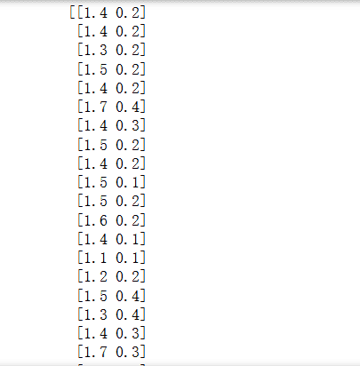
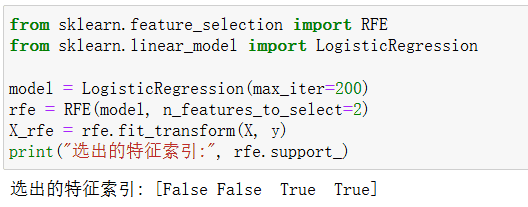
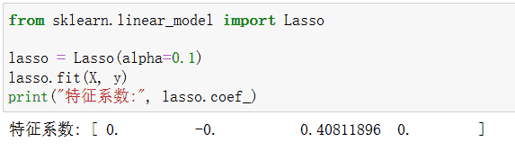
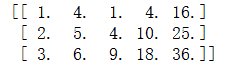
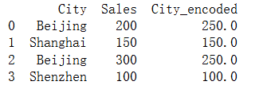
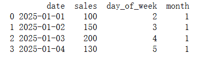
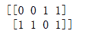
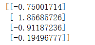
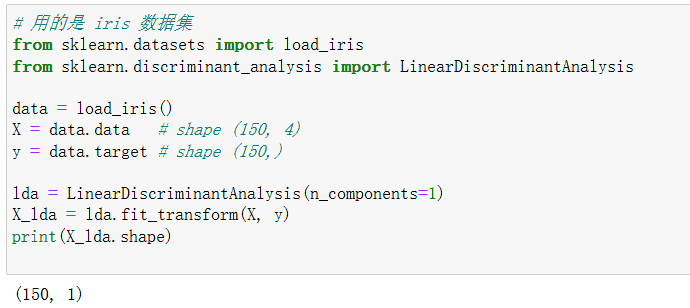
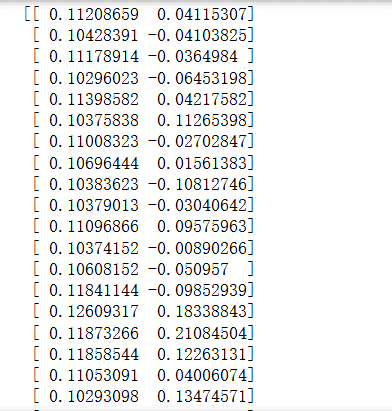

# 特征工程
特征工程（Feature Engineering） 是机器学习流程中将原始数据转换为适合模型学习的特征的关键步骤。它直接决定了模型能否高效捕捉数据中的规律。好的特征可以显著提升模型性能，而差的特征即使模型再复杂也难以取得好效果。

特征工程的核心目标是：
- 提取有效信息：将原始数据中有价值的信号转化为模型可以理解的特征；
- 减少冗余与噪声：去掉无关或多余的特征，使模型更简洁、更泛化；
- 增强表达能力：通过构造、组合或降维生成新的特征，使模型能够更好地捕捉数据的复杂关系；
- 提高训练效率：减少特征维度、统一尺度，使模型训练更快、收敛更稳定。

特征工程通常包括三个主要环节：
1. 特征选择：识别并保留对预测任务最有贡献的特征；
2. 特征构造：基于现有特征生成新的、更具信息量的特征，例如多项式特征、交互特征；
3. 特征降维：通过方法如 PCA、LDA、ICA，将高维特征压缩到低维空间，同时保留主要信息。

特征工程在机器学习中与算法本身同等重要。这也是机器学习和深度学习的最大区别所在，通过合理的特征处理，可以让简单的模型也取得出色的效果，为后续模型训练和优化打下坚实基础。

## 特征选择

### 什么是特征选择？
特征选择是指从原始特征集合中挑选出对模型预测任务最有价值的特征，同时去掉无关或冗余特征的过程。
- 目标：提高模型性能、减少过拟合、降低计算成本、提升可解释性。
- 问题背景：在大数据时代，数据集可能包含成百上千个特征，很多特征对预测没有帮助甚至有害。

### 特征选择的原则
特征选择通常遵循以下原则：
1. 相关性原则：保留与目标变量相关性高的特征。
2. 冗余最小化：去掉高度相关或重复的特征。
3. 可解释性：保留对业务有意义的特征。
4. 泛化能力：选择能够提高模型在新数据上表现的特征。

### 特征选择的方法分类
**1. 过滤法（Filter Method）**

核心思想：通过统计指标对特征进行排序和筛选，独立于具体模型。

常用指标
- 相关系数（Correlation）：Pearson、Spearman。
- 卡方检验（Chi-Square）：用于分类问题的离散特征。
- 互信息（Mutual Information）：衡量特征与目标的依赖关系。
```python       
import pandas as pd
from sklearn.datasets import load_iris
from sklearn.feature_selection import SelectKBest, chi2, f_classif

# 加载数据
iris = load_iris()
X, y = iris.data, iris.target

# 卡方检验选择前2个特征
chi2_selector = SelectKBest(score_func=chi2, k=2)
X_chi2 = chi2_selector.fit_transform(X, y)
print(X_chi2)

# 方差分析选择前2个特征
f_selector = SelectKBest(score_func=f_classif, k=2)
X_f = f_selector.fit_transform(X, y)
# print(X_f)
```
输出如下：

过滤法的优点是简单快速、与模型无关并且可处理高维数据；缺点是忽略特征间的关联、可能丢失非线性关系信息。

**2.包裹法（Wrapper Method）**

核心思想：通过模型性能作为评价标准，使用搜索策略挑选特征。
常用策略
- 递归特征消除（RFE, Recursive Feature Elimination）：反复训练模型，每次剔除最不重要的特征。
- 前向选择（Forward Selection）：从空特征集开始，逐步加入最优特征。
- 后向消除（Backward Elimination）：从完整特征集开始，逐步删除最差特征。
```python
from sklearn.feature_selection import RFE
from sklearn.linear_model import LogisticRegression

model = LogisticRegression(max_iter=200)
rfe = RFE(model, n_features_to_select=2)
X_rfe = rfe.fit_transform(X, y)
print("选出的特征索引:", rfe.support_)
``` 
运行的结果如下：

包裹法的优点是考虑特征间交互作用，并且可提升模型性能；但是缺点是计算成本高，尤其在高维数据中，同时对模型依赖强，不同模型结果不同。

**3.嵌入法（Embedded Method）**

核心思想：在模型训练过程中自动选择特征。模型本身带有特征选择能力。
常用方法
- 正则化回归（Lasso/L1）：对不重要的特征权重压缩为零。
- 决策树 / 随机森林特征重要性：根据信息增益或 Gini 指数衡量特征贡献。
示例代码（Python + Lasso）
```python
from sklearn.linear_model import Lasso

lasso = Lasso(alpha=0.1)
lasso.fit(X, y)
print("特征系数:", lasso.coef_)
```
输出结果为：

嵌入法的优点是将特征选择融入训练过程，相比包裹法更高效，适合高维稀疏数据。但是缺点是对模型类型依赖，可能错过非线性关系。

## 特征构造
### 什么是特征构造？
特征构造是 通过已有的原始特征生成新的、更具信息量的特征 的过程。它是特征工程中提升模型性能的重要手段。
- 目标：
  - 增强特征的表达能力，使模型更容易捕捉数据的潜在规律；
  - 提升模型的预测准确性和泛化能力；
  - 简化模型复杂度，通过高信息量的特征减少需要的模型参数。
举例：
- 原始特征：身高（Height） 和 体重（Weight）
- 构造特征：BMI = Weight / Height^2，直接反映身体健康状态，比单独使用身高或体重更有预测价值。

### 特征构造的方法
**1.数值特征变换**

通过数学运算或函数映射增强特征信息。

**常见方法**
- 多项式特征（Polynomial Features）：增加特征的高次幂及交互项
$$x_1, x_2 \rightarrow x_1^2, x_2^2, x_1 x_2$$
- 对数/指数变换：对偏态分布进行平滑
$$x' = \log(x + 1), \quad x' = \exp(x)$$
- 标准化/归一化：统一尺度，提升模型收敛效率
```python
import pandas as pd
from sklearn.preprocessing import PolynomialFeatures

# 构造数据
data = pd.DataFrame({'x1': [1,2,3], 'x2': [4,5,6]})

poly = PolynomialFeatures(degree=2, include_bias=False)
data_poly = poly.fit_transform(data)
print(data_poly)
```
输出特征包含原始特征、平方项和交互项。


**2.类别特征编码与构造**

对于类别特征，直接用原始编码可能无法被模型理解，需要构造数值特征。

**常用方法**
1. 独热编码（One-Hot Encoding）
2. 目标编码（Target Encoding）：类别与目标变量的均值映射
3. 频率编码：类别出现频率作为特征值
```python
import pandas as pd

data = pd.DataFrame({'City': ['Beijing', 'Shanghai', 'Beijing', 'Shenzhen'],
                     'Sales': [200, 150, 300, 100]})

# 目标编码
target_mean = data.groupby('City')['Sales'].mean()
data['City_encoded'] = data['City'].map(target_mean)
print(data)
```
输出如下：


**3.时间序列特征构造**

针对时间数据，提取周期性或趋势性特征：
- 年、月、日、星期、季度
- 滑动窗口统计值（均值、最大值、最小值、标准差）
- 时间间隔特征：如两次事件间的天数
```python
import pandas as pd

data = pd.DataFrame({'date': pd.date_range('2025-01-01', periods=4),
                     'sales':[100,150,200,130]})
data['day_of_week'] = data['date'].dt.dayofweek
data['month'] = data['date'].dt.month
print(data)
```
输出如下：


**4.文本特征构造**

文本特征可从原始文本中提取信息：
- 长度特征：字符数、词数
- 词频特征：TF-IDF
- 情感特征：正向/负向情感得分
- 词嵌入：Word2Vec、BERT 等
```python
from sklearn.feature_extraction.text import CountVectorizer

texts = ["I love ML", "ML is fun"]
vectorizer = CountVectorizer()
X = vectorizer.fit_transform(texts).toarray()
print(X)
```
输出如下：


**5.特征组合与交互**

通过组合不同特征生成新的信息，尤其在非线性问题中有效：
$$x_{\text{new}} = x_i \cdot x_j, \quad x_{\text{new}} = x_i / (x_j + \epsilon)$$

在构造特征的时候，要注意避免维度爆炸，尤其是多项式特征和交互特征，过多特征可能导致训练成本高、过拟合。同时构造特征应有实际意义，如 BMI、用户活跃天数等。
## 特征降维
### 什么是特征降维？
特征降维是指在 保留数据主要信息的前提下，将高维特征映射到低维空间 的过程。它在机器学习中非常重要，尤其面对高维数据时，可以：
- 减少计算成本和存储空间；
- 降低过拟合风险，提高模型泛化能力；
- 消除特征冗余和噪声，提高训练效率。

### 特征降维的基本思路
特征降维通常有两个目标：
1. 保持数据的主要信息（方差/信息量）；
2. 降低维度，简化模型结构。
在数学上，给定原始数据矩阵 $$X \in \mathbb{R}^{n \times d}$$，通过降维方法得到低维表示 $$Z \in \mathbb{R}^{n \times k}$$，其中 $$k < d$$。

### 特征降维方法分类
**1.主成分分析（PCA, Principal Component Analysis）**

原理：PCA 通过线性变换，将原始特征投影到方差最大的方向（主成分），保留数据中最重要的信息。

步骤如下：
1. 均值中心化：
$$X_{centered} = X - \mu$$
2. 计算协方差矩阵：
$$\Sigma = \frac{1}{n} X_{centered}^T X_{centered}$$
3. 特征值分解：
$$\Sigma v_i = \lambda_i v_i$$
4. 选择前 k 个特征向量 $$v_1, \dots, v_k$$ 构成投影矩阵 W，得到降维结果：
$$Z = X_{centered} W$$
```python
import numpy as np
from sklearn.decomposition import PCA

# 构造数据
X = np.array([[2.5, 2.4],
              [0.5, 0.7],
              [2.2, 2.9],
              [1.9, 2.2]])

# PCA 降到 1 维
pca = PCA(n_components=1)
X_pca = pca.fit_transform(X)
print(X_pca)
```
输出如下：

PCA常用于高维数据可视化、噪声去除，作为特征预处理，提高模型效率。

**2.线性判别分析（LDA, Linear Discriminant Analysis）**

原理：LDA 是一种监督降维方法，通过最大化类间方差、最小化类内方差，将数据投影到低维空间，增强类别可分性。

- 类内散度矩阵 $$S_W$$：
$$S_W = \sum_{c=1}^{C} \sum_{x_i \in c} (x_i - \mu_c)(x_i - \mu_c)^T$$
- 类间散度矩阵 $$S_B$$：
$$S_B = \sum_{c=1}^{C} n_c (\mu_c - \mu)(\mu_c - \mu)^T$$
- 求解广义特征值问题：
$$S_W^{-1} S_B v = \lambda v$$
```python
# 用的是 iris 数据集
from sklearn.datasets import load_iris
from sklearn.discriminant_analysis import LinearDiscriminantAnalysis

data = load_iris()
X = data.data   # shape (150, 4)
y = data.target # shape (150,)

lda = LinearDiscriminantAnalysis(n_components=1)
X_lda = lda.fit_transform(X, y)
print(X_lda.shape)
```
输出如下：

LDA常用于分类任务特征降维，提高模型的类别可分性，适合类别标签已知的数据集。

**3.独立成分分析（ICA, Independent Component Analysis）**

原理：ICA 假设观测数据是若干独立非高斯信号的线性混合，通过寻找独立成分分解原始特征。
优点：
- 去除混合噪声；
- 可用于信号分离（如 EEG、音频源分离）。
```python
from sklearn.decomposition import FastICA

ica = FastICA(n_components=2)
X_ica = ica.fit_transform(X)
print(X_ica)
```
输出如下：

ICA常用于信号处理、音频源分离等任务，通过独立成分分析，将混合信号分离为原始独立信号。


**4.非线性降维方法**
1. t-SNE：适合高维数据可视化，保留局部结构；
2. UMAP：保留局部和全局结构，速度快，可扩展性好。
```python
from sklearn.manifold import TSNE

tsne = TSNE(n_components=2, random_state=42)
X_tsne = tsne.fit_transform(X)
print(X_tsne.shape)
```

t-SNE常用于高维数据可视化，将数据映射到 2D 或 3D 空间，展示数据分布和聚类结构。

特征降维的部分到此就结束啦，是不是也没有那么难，你现在已经知道了特征降维是 特征工程的重要环节，与特征选择和特征构造结合，可以让模型在高维数据中保持高效和稳定。

最新的文章都在公众号更新，别忘记关注哦！！！如果想要加入技术群聊，扫描下方二维码回复【加群】即可。
