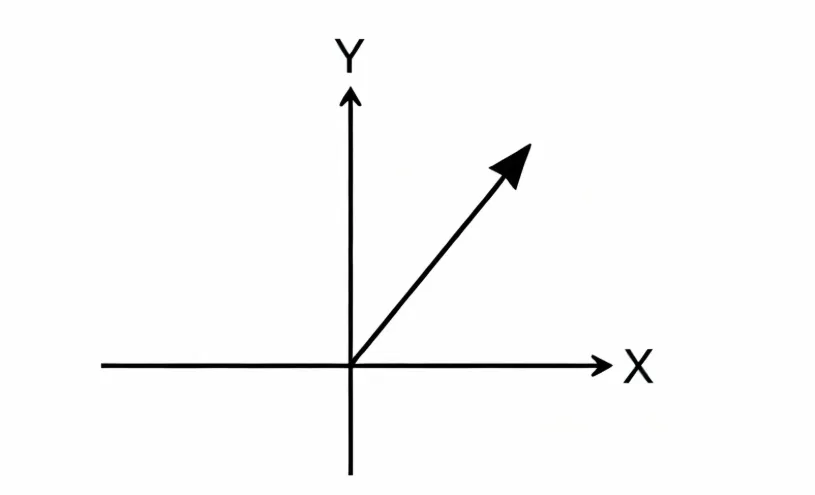
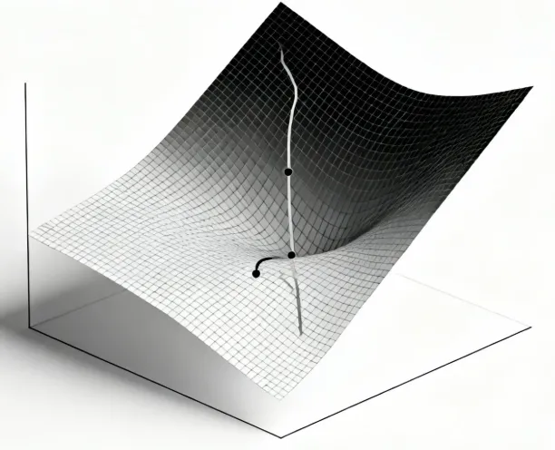
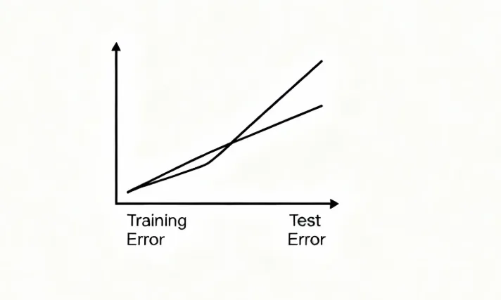

# 线性代数
如果说机器学习是构建智能大厦的过程，那么数学就是奠定大厦的基石。没有扎实的数学与理论基础，算法再华丽也难以稳固。数学不仅提供了工具，更提供了理解与推理的语言，使得学习过程、模型原理和优化机制都能被系统地解释与改进。

相信大家都已经是大学生了，大学牲一定学过高等数学了，那我就默认你们都会哈，哈哈哈哈哈，当然不会也可以去B站大学，推荐宋浩老师哦！

机器学习所依赖的数学基础主要集中在以下几个方面：

**线性代数**

向量与矩阵是数据的基本表现形式。无论是表示图像像素、文本词向量，还是在模型中进行参数运算，线性代数都是幕后操盘手。特征值分解与奇异值分解等方法，更是理解降维和表示学习的核心工具。

**概率与统计**

机器学习本质上是在不确定性下做出最优决策，而概率与统计正是描述和推理不确定性的语言。从常见的高斯分布到条件概率、贝叶斯定理，再到极大似然估计与贝叶斯推断，这些概念构成了算法建模与预测的逻辑框架。**线性代数和概率论**都是本科开设的课程，相信大家已经在学或者学完了。

**优化方法**

训练一个模型，归根结底是一个“**优化问题**”。如何让损失函数最小化，如何高效地找到参数的最佳解，是优化方法所要回答的核心。梯度下降及其变体、凸优化与约束优化，都是机器学习训练过程的主角。这个课程对应的是组合优化与凸优化，据我了解这个应该是研究生才会开课，不过没关系，**这个学过高等数学基本就能理解。**

**学习理论**

如果说前面三部分是工具，那么学习理论就是指南。它回答了模型能否学好、学多少以及为什么能学好的问题。偏差-方差权衡、VC 维、泛化误差与 PAC 学习，都是理解模型性能与泛化能力的重要理论支柱。

数学与理论基础在机器学习中的地位，就像空气一样不可或缺。它不仅为算法设计提供了方法论，也为结果解释提供了理论依据。**只有理解背后的数学逻辑，才能真正做到从会用到会改，再到会创新。**

下面就让我们一起看看线性代数的基础知识。

当然，这个部分不看也是可以的，如果在后面看到不会的知识点，再回来找找就可以。
## 向量与矩阵运算
### 向量与矩阵
**向量**（Vector）

向量可以看作是有序数值的集合，用于表示样本特征。

例如，一个房屋数据可以表示为：$$\mathbf{x} = \begin{bmatrix} \text{面积} \\ \text{房间数} \\ \text{楼层} \end{bmatrix} = \begin{bmatrix} 120 \\ 3 \\ 5 \end{bmatrix}$$

在机器学习中，样本就是向量，特征数决定了向量的维度。

**矩阵**（Matrix）

多个样本堆叠成矩阵，例如一个包含 m 个样本、每个样本 n 个特征的数据集可以表示为：

$$X = \begin{bmatrix} x_{11} & x_{12} & \cdots & x_{1n} \\ x_{21} & x_{22} & \cdots & x_{2n} \\ \vdots & \vdots & \ddots & \vdots \\ x_{m1} & x_{m2} & \cdots & x_{mn} \end{bmatrix}$$

其中，每一行是一个样本，每一列是一个特征。

### 向量运算与几何意义
**内积**（Dot Product）

两个向量 $$\mathbf{a}, \mathbf{b} \in \mathbb{R}^n$$ 的内积定义为：

$$\mathbf{a} \cdot \mathbf{b} = \sum_{i=1}^n a_i b_i = \mathbf{a}^T \mathbf{b}$$  

几何意义上，内积表示两个向量的相似度：$$\mathbf{a} \cdot \mathbf{b} = \|\mathbf{a}\|\|\mathbf{b}\|\cos\theta$$

这在推荐系统（如计算用户与物品的相似度）和分类（如支持向量机的超平面）中至关重要。

**范数**（Norm）

向量的长度由范数衡量。常见的有：
- L2 范数： $$\mathbf{x}\|_2 = \sqrt{\sum_{i=1}^n x_i^2}$$ 
- L1 范数： $$\mathbf{x}\|_1 = \sum_{i=1}^n |x_i|$$

在正则化中，L1 范数鼓励稀疏解（特征选择），L2 范数则抑制过大权重（防止过拟合）。

### 矩阵运算与模型计算
**矩阵乘法**

如果输入样本为 $$\mathbf{x} \in \mathbb{R}^n$$，权重矩阵W为 $$\mathbb{R}^{m \times n}$$  ，则输出为：$$\mathbf{y} = W \mathbf{x}$$

这就是神经网络中 一层全连接层 的计算方式。

**转置与对称矩阵**

- 矩阵转置 $$A^T$$ 在内积与相似度计算中常见。
- 对称矩阵（如协方差矩阵）在 PCA、特征值分解中起核心作用。

## 特征值分解与奇异值分解
在机器学习中，数据通常是高维的，直接处理既费计算又不易理解。特征值分解（Eigen Decomposition）和奇异值分解（SVD）提供了强大的工具，让我们能够发现数据的“核心方向”，实现降维、特征提取和压缩。

### 特征值分解
给定一个方阵 $$\mathbb{R}^{n \times n}$$，如果存在标量 $$\lambda$$ 和非零向量 $$\mathbf{v}$$，使得：$$\mathbf{v} = \lambda \mathbf{v}$$，则称  $$\lambda$$ 为 特征值， $$\mathbf{v}$$为 特征向量。

考虑一个简单的 2x2 矩阵：$$A = \begin{bmatrix} 2 & 1 \\ 1 & 2 \end{bmatrix}$$

求解特征值和特征向量：$$\det(A - \lambda I) = 0 \quad \Rightarrow \quad \begin{vmatrix} 2-\lambda & 1 \\ 1 & 2-\lambda \end{vmatrix} = 0$$

得到特征值 $$\lambda_1 = 3, \lambda_2 = 1$$，对应特征向量分别为：$$\mathbf{v}_1 = \begin{bmatrix} 1 \\ 1 \end{bmatrix}, \quad \mathbf{v}_2 = \begin{bmatrix} 1 \\ -1 \end{bmatrix}$$

矩阵 A 作用在 v1 上，方向不变，只拉伸了 3 倍；作用在 v2 上，方向不变，只拉伸了 1 倍。

特征值分解的应用场景包括：
- PCA 降维：在 PCA（主成分分析）中，我们对数据的协方差矩阵 $$\frac{1}{m} X^T X$$ 进行特征值分解，得到最大方差方向上的主成分。
- 谱聚类：用 Laplacian 矩阵特征向量划分数据
- 稳态分析：马尔可夫链转移矩阵的特征值分析收敛性

### 奇异值分解（SVD）
对于任意矩阵 $$X \in \mathbb{R}^{m \times n}$$，可以分解为：$$X = U \Sigma V^T$$

其中：
- $$U \in \mathbb{R}^{m \times m}$$ 和 $$V \in \mathbb{R}^{n \times n}$$ 是正交矩阵
- $$\Sigma \in \mathbb{R}^{m \times n}$$是对角矩阵，包含奇异值 $$\sigma_1 \ge \sigma_2 \ge \dots \ge 0$$

奇异值表示矩阵在各个方向上的“能量大小”。SVD 可用于非方阵，比特征值分解更通用。
SVD 在降维、信息检索（LSA）、推荐系统（矩阵分解）中应用广泛。

考虑矩阵$$X = \begin{bmatrix} 3 & 1 \\ 1 & 3 \\ \end{bmatrix}$$

SVD 分解结果近似为：$$U = \begin{bmatrix} \frac{1}{\sqrt{2}} & -\frac{1}{\sqrt{2}} \\ \frac{1}{\sqrt{2}} & \frac{1}{\sqrt{2}} \end{bmatrix}, \quad \Sigma = \begin{bmatrix} 4 & 0 \\ 0 & 2 \end{bmatrix}, \quad V^T = \begin{bmatrix} \frac{1}{\sqrt{2}} & \frac{1}{\sqrt{2}} \\ -\frac{1}{\sqrt{2}} & \frac{1}{\sqrt{2}} \end{bmatrix}$$

矩阵 X 可以看作先旋转（ $$V^T$$），再拉伸（ $$\Sigma$$），再旋转（U），得到原矩阵。保留最大奇异值对应的方向，就能得到数据最重要的信息。

奇异值分解的应用场景包括：
- 推荐系统：矩阵分解找到用户和物品的潜在因子
- 图像压缩：保留主奇异值重建近似图像
- 潜在语义分析（LSA）：从文档-词矩阵提取潜在语义结构

### 线性代数与机器学习模型
**线性回归**

预测公式可以写作：$$\hat{\mathbf{y}} = X \mathbf{w}$$

其中， $$\mathbf{w}$$ 是回归系数。

利用最小二乘法，参数解为：$$\mathbf{w} = (X^T X)^{-1} X^T \mathbf{y}$$

这是线性代数在回归分析中的直接应用。

**支持向量机**（SVM）

SVM 本质上是寻找一个超平面 $$\mathbf{w}^T \mathbf{x} + b = 0$$，最大化数据点与超平面的几何间隔。

这是典型的线性代数与凸优化结合的例子。

**神经网络**

神经网络中，每一层的计算都是矩阵运算：$$\mathbf{h}^{(l)} = f(W^{(l)} \mathbf{h}^{(l-1)} + \mathbf{b}^{(l)})$$

其中 $$f(\cdot)$$是激活函数。可见整个网络就是一连串的线性变换+非线性映射。

最新的文章都在公众号更新，别忘记关注哦！！！如果想要加入技术群聊，扫描下方二维码回复【加群】即可。
