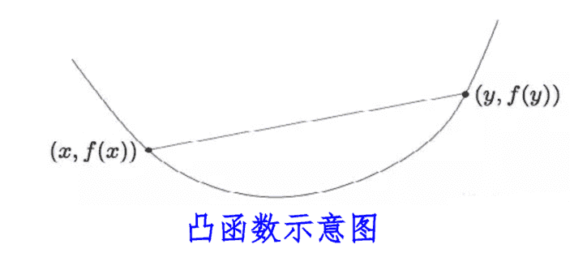

# 优化方法
在机器学习中，模型的训练本质上是一个优化问题：我们希望找到一组参数，使得模型在给定数据上的损失最小化（或目标函数最大化）。优化方法提供了一套系统的数学工具，用于高效、稳定地寻找最佳参数。

优化方法部分我们来看一下最经典的梯度下降，并且为大家简单的介绍一下凸优化和约束优化，前面说过这部分其实是研究生课程，不用担心，我写的是简单内容，大家应该都能看懂！

## 梯度下降及其变体
在机器学习中，梯度下降（Gradient Descent, GD）是优化模型参数最核心的方法。通过沿着损失函数的梯度反方向更新参数，梯度下降可以找到使损失最小的参数组合。

### 基本梯度下降（Batch Gradient Descent, BGD）
**原理**

BGD 每次使用整个训练集计算梯度，更新参数：$$\theta_{t+1} = \theta_t - \eta \nabla_\theta L(\theta_t)$$
- $$\theta_t$$：当前参数
- $$\eta$$：学习率
- $$\nabla_\theta L(\theta_t)$$：损失函数对参数的梯度

**优缺点**

基本梯度下降方法梯度稳定，更新方向准确，收敛稳定，不容易跳出局部极小值（凸问题除外）。

但是大数据集计算成本高，不适合在线学习或实时训练。

**应用场景**
- 小型数据集或需要精确优化的线性模型（如线性回归）

### 随机梯度下降（Stochastic Gradient Descent, SGD）
**原理**

SGD 每次只使用一个样本计算梯度：$$\theta_{t+1} = \theta_t - \eta \nabla_\theta L(x_i, y_i; \theta_t)$$
- $$x_i, y_i$$：当前样本
- $$\eta$$：学习率

**优缺点**

随机梯度下降计算效率高，适合大规模数据，梯度噪声有助于跳出局部极小值。

但是梯度震荡，收敛不稳定，可能需要更多迭代次数。

**应用场景**
- 在线学习、深度神经网络训练
- 推荐系统或大规模数据流处理

### Mini-batch 梯度下降
**原理**
- 每次使用小批量样本（如 32 或 128 个）计算梯度
- 参数更新公式：$$\theta_{t+1} = \theta_t - \eta \frac{1}{m} \sum_{i=1}^{m} \nabla_\theta L(x_i, y_i; \theta_t)$$
- m为批量大小

**优缺点**

Mini-batch 梯度下降兼顾了 SGD 的效率和 BGD 的稳定性,可利用 GPU 并行计算。

但是批量大小需要调优，批量过小可能震荡，过大降低效率。

**应用场景**    
- 深度学习训练中的默认选择
- CNN、RNN 等大规模模型训练

### 动量法（Momentum）
**原理**
- 引入“惯性”，累积历史梯度，减少震荡，加快收敛：
  $$v_t = \gamma v_{t-1} + \eta \nabla_\theta L(\theta_t)$$
  $$\theta_{t+1} = \theta_t - v_t$$
- $$\gamma$$ 为动量系数（通常 0.9）

**优缺点**

动量法可以加快收敛速度，减少梯度方向震荡。

但是需要调节动量系数，可能对非凸损失函数过冲。

**应用场景**
- 深度神经网络
- CNN、RNN 等梯度震荡明显的网络

### 自适应学习率方法
**1.AdaGrad**
**原理**
- 为每个参数使用不同的自适应学习率：
$$\theta_{t+1} = \theta_t - \frac{\eta}{\sqrt{G_t + \epsilon}} \nabla_\theta L(\theta_t)$$
- $$G_t$$ 为梯度平方累积
- 优点：适合稀疏特征
- 缺点：学习率随迭代不断衰减，可能过早停止

**2.RMSProp**
**原理**
- 改进 AdaGrad，使用梯度平方的指数衰减平均：
$$E[g2]t−1+(1−β)(∇θL(θt))2 L(\theta_t))^2$$
$$\theta_{t+1} = \theta_t - \frac{\eta}{\sqrt{E[g^2]_t + \epsilon}} \nabla_\theta L(\theta_t)$$
- 优点：解决 AdaGrad 学习率过快衰减问题

**3.Adam（Adaptive Moment Estimation）**
**原理**
- 结合动量和自适应学习率
$$m_t = \beta_1 m_{t-1} + (1-\beta_1)\nabla_\theta L(\theta_t)$$
$$v_t = \beta_2 v_{t-1} + (1-\beta_2)(\nabla_\theta L(\theta_t))^2$$
$$\hat{\theta}_{t+1} = \theta_t - \eta \frac{m_t / (1-\beta_1^t)}{\sqrt{v_t / (1-\beta_2^t)} + \epsilon}$$
- 优点：
  - 收敛快，适合大多数深度学习任务
  - 自动调节学习率
- 缺点：
  - 对超参数敏感
  - 内存占用较高

**应用场景**
- CNN、RNN、Transformer 等深度网络
- 高维稀疏特征优化

### 学习率策略
**1.固定学习率**:简单但不灵活

**2.学习率衰减**：随训练轮数降低 $$\eta$$

**3.循环学习率（Cyclic LR）**：周期性调整学习率，如从低到高再到低

**4.自适应优化算法（Adam、RMSProp）**：自动调节学习率，无需手动调整

## 凸优化与约束优化
在机器学习中，优化问题无处不在。无论是训练线性回归、支持向量机，还是深度神经网络，核心目标都是通过优化方法找到最优参数。为了更高效地求解这些问题，凸优化（Convex Optimization）与约束优化（Constrained Optimization）提供了理论基础和方法支持。
### 凸优化（Convex Optimization）
**定义**

一个优化问题称为凸优化问题，如果其目标函数是凸函数，且约束条件是凸集合。形式化表示为：
$$\min_{\theta \in \mathcal{C}} f(\theta)$$
- f(θ)为凸函数，即满足：$$f(\lambda \theta_1 + (1-\lambda) \theta_2) \le \lambda f(\theta_1) + (1-\lambda) f(\theta_2), \quad \forall \lambda \in [0,1]$$
- $$\mathcal{C}$$ 为凸集合
直观点理解就是凸函数形状像碗，任何两点连线都在函数曲面之上。凸优化问题只有一个全局最优点，没有局部极小值困扰。

**常见凸优化问题**

1. 线性回归：$$L(\theta) = \frac{1}{2n} \sum_{i=1}^n (y_i - X_i \theta)^2$$
2. 支持向量机（SVM）凸优化：$$\min_\theta \frac{1}{2} \|\theta\|^2 \quad \text{s.t.} \quad y_i (X_i^\top \theta + b) \ge 1$$
3. Lasso 回归（带 L1 正则）：$$\min_\theta \frac{1}{2n} \sum_{i=1}^n (y_i - X_i \theta)^2 + \lambda \|\theta\|_1$$

凸优化求解方法包括梯度下降（Gradient Descent）、牛顿法（Newton’s Method）、拟牛顿法（BFGS）、内点法（Interior Point Method），这些方法理论保证收敛到全局最优解，算法稳定高效。

### 约束优化（Constrained Optimization）
**定义**

约束优化问题是指优化目标受约束条件限制，形式化表示为：$$\min_\theta f(\theta) \quad \text{s.t.} \quad g_i(\theta) \le 0, \quad h_j(\theta) = 0$$
- $$g_i(\theta)$$：不等式约束
- $$h_j(\theta)$$：等式约束
也就是优化的解必须同时满足“边界条件”，比如权重非负、概率和为 1。

**求解方法**

**1. 拉格朗日乘子法（Lagrange Multiplier）**
- 构造拉格朗日函数：$$\mathcal{L}(\theta, \lambda, \nu) = f(\theta) + \sum_i \lambda_i g_i(\theta) + \sum_j \nu_j h_j(\theta)$$
- 求解一阶条件（KKT 条件）得到最优解

**2. 投影梯度法（Projected Gradient Descent）**
- 每次梯度更新后，将参数投影到可行集合内：$$\theta_{t+1} = \Pi_\mathcal{C} (\theta_t - \eta \nabla_\theta f(\theta_t))$$

**3. 罚函数法（Penalty Method）**
- 将约束转化为损失函数的一部分：$$\min_\theta f(\theta) + \rho \sum_i \max(0, g_i(\theta))^2$$

约束优化的应用场景包括支持向量机(保证分类间隔约束)、概率模型(保证概率和为 1)、资源分配问题(权重或预算限制)等等。

但是在许多机器学习问题中，凸优化和约束优化往往结合使用，SVM 是典型例子：凸目标函数 + 不等式约束，Lasso 回归也可看作带约束的凸优化问题（L1 范数约束）。

最新的文章都在公众号更新，别忘记关注哦！！！如果想要加入技术群聊，扫描下方二维码回复【加群】即可。
