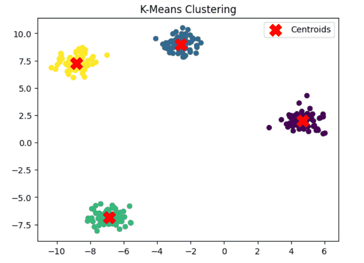
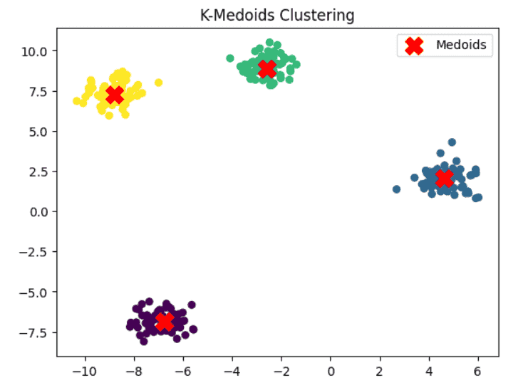
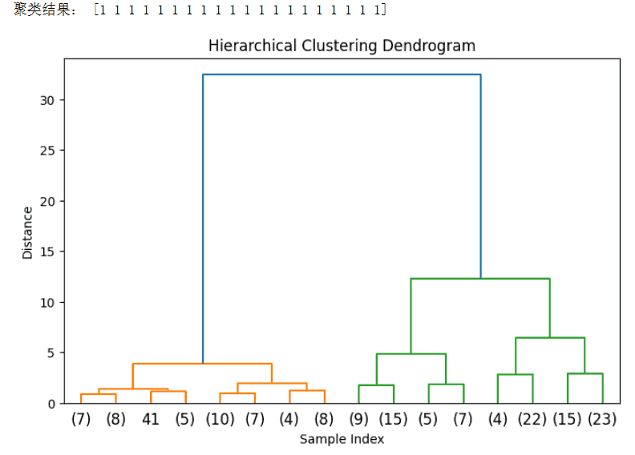
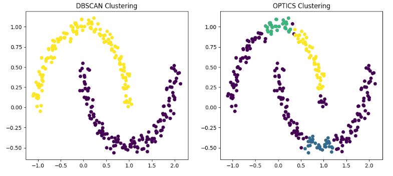

# 聚类
聚类（Clustering）是一种典型的无监督学习方法，其目标是在没有标签信息的情况下，将数据样本按照相似性划分为若干簇，使得同一簇内的样本相似度高，不同簇之间差异显著。常见方法包括基于划分的 K-Means、基于层次的 层次聚类、以及基于密度的 DBSCAN、OPTICS 等。聚类广泛应用于用户分群、市场细分、文本主题发现、图像分割等任务，是数据挖掘和探索性分析中的重要工具。
## K-Means 聚类
K-Means 是最经典的聚类算法之一，属于基于划分（Partition-based）的聚类方法。它通过迭代优化目标函数，将数据划分为 $$K$$ 个簇，使得同簇内样本之间相似度最大化，而不同簇之间相似度最小化。一个簇说白了就是一组相同类别的东西，只是在这个方法里起了个名字叫簇，比如苹果，香蕉，橘子属于水果那一簇，彭于晏，刘亦菲和你们属于帅哥美女那一簇。由于其简单、高效，K-Means 在数据挖掘、文本分析、图像分割等领域被广泛应用。

K-Means 的目标是最小化簇内平方误差（Within-Cluster Sum of Squares, WCSS），即：$$J = \sum_{i=1}^{K} \sum_{x \in C_i} \| x - \mu_i \|^2$$

其中：
- $$K$$：簇的个数
- $$C_i$$：第 $$i$$ 个簇
- $$\mu_i$$：簇$$C_i$$的质心（均值向量）
- $$\| x - \mu_i \|^2$$：样本点与簇中心的欧式距离
K-Means的核心思想就是不断更新簇划分与质心，直到收敛（目标函数不再显著下降）。

K-Means的算法流程也很容易理解：
1. 初始化：随机选择 $$K$$ 个样本作为初始质心。
2. 分配样本：将每个样本分配到距离最近的簇中心。
3. 更新质心：对每个簇，计算所有样本的均值作为新的质心。
4. 迭代：重复步骤 2-3，直到簇划分不再变化或目标函数收敛。

下面基于Scikit-learn编写一段示例代码让咱们更好的理解一下：
```python
from sklearn.datasets import make_blobs
from sklearn.cluster import KMeans
import matplotlib.pyplot as plt

# 1. 生成模拟数据
X, y = make_blobs(n_samples=300, centers=4, cluster_std=0.6, random_state=42)

# 2. 训练 K-Means
kmeans = KMeans(n_clusters=4, random_state=42, n_init=10)
y_pred = kmeans.fit_predict(X)

# 3. 可视化结果
plt.scatter(X[:, 0], X[:, 1], c=y_pred, s=30, cmap='viridis')
plt.scatter(kmeans.cluster_centers_[:, 0], kmeans.cluster_centers_[:, 1],
            c='red', marker='X', s=200, label='Centroids')
plt.legend()
plt.title("K-Means Clustering")
plt.show()
```
运行结果如下，不同颜色表示不同簇，红色 X 为聚类中心。

总结环节！K-Means 作为经典的无监督学习方法，凭借其高效性和直观性，成为最常用的聚类算法之一。但在实际应用中，需要注意簇数选择、初始点敏感性以及对复杂分布的适用性问题。针对这些不足，研究者提出了 K-Means++、Mini-Batch K-Means 等改进方法，使其在大规模机器学习任务中依然具有重要地位。
## K-Medoids 聚类
K-Medoids（又称 PAM，Partitioning Around Medoids）是一种基于划分的聚类方法，与 K-Means 类似，但它使用数据集中真实存在的点作为簇中心（称为“Medoid”），而不是均值向量。这使得 K-Medoids 对 异常值和噪声更加鲁棒，适合处理非欧式距离或离散型数据。

K-Medoids 的目标函数是最小化样本与所属簇中心的距离和：$$J = \sum_{i=1}^{K} \sum_{x \in C_i} d(x, m_i)$$

其中：
- $$K$$：簇的个数
- $$C_i$$：第 $$i$$ 个簇
- $$m_i$$：簇 $$C_i$$ 的中心（medoid，即簇中某个实际点）
- $$d(x, m_i)$$：样本点 $$x$$ 与簇中心 $$m_i$$ 之间的距离（可以是欧式距离、曼哈顿距离，甚至非向量空间距离）

与 K-Means 的主要区别是：
- K-Means 的中心是 簇内均值，可能不属于数据集；
- K-Medoids 的中心是 真实样本点，因此对噪声更稳健。

K-Medoids 最经典的实现是 PAM（Partitioning Around Medoids），流程如下：
1. 初始化：随机选择 $$K$$ 个点作为初始 medoid。
2. 分配样本：将每个样本分配给距离最近的 medoid。
3. 更新 medoid：
  - 对于每个簇，尝试用簇中其他点替换当前 medoid；
  - 计算代价函数变化，如果代价减少，则更新 medoid。
  
**4.** 迭代：重复步骤 2-3，直到 medoid 不再变化或代价函数收敛。
PAM 的计算复杂度较高，约为 $$O(k \cdot (n-k)^2)$$，因此在大规模数据集上常用 CLARA（Clustering Large Applications） 或 CLARANS 进行加速。

下面基于Scikit-learn-extra编写了一段示例代码：
```python
from sklearn.datasets import make_blobs
from sklearn_extra.cluster import KMedoids
import matplotlib.pyplot as plt

# 1. 生成模拟数据
X, y = make_blobs(n_samples=300, centers=4, cluster_std=0.6, random_state=42)

# 2. 训练 K-Medoids
kmedoids = KMedoids(n_clusters=4, random_state=42, metric='euclidean')
y_pred = kmedoids.fit_predict(X)

# 3. 可视化结果
plt.scatter(X[:, 0], X[:, 1], c=y_pred, s=30, cmap='viridis')
plt.scatter(kmedoids.cluster_centers_[:, 0], kmedoids.cluster_centers_[:, 1],
            c='red', marker='X', s=200, label='Medoids')
plt.legend()
plt.title("K-Medoids Clustering")
plt.show()
```
运行结果如下，其中不同颜色表示不同簇，红色 X 为 medoid。


K-Medoids 是 K-Means 的一种稳健变体，适合在存在噪声、异常点或非欧式距离情况下使用。它的 优势 在于簇中心是实际样本点，结果更具可解释性，同时对异常值和噪声更鲁棒，并且可用于任意距离度量，不局限于欧式空间。但它计算复杂度较高，不适合大规模数据，并且对簇形状仍有一定假设，不适合处理复杂非凸簇。

在实践中，K-Medoids 更适合小规模、高质量数据集，或对稳健性有较高要求的任务，而在大规模场景中往往结合 CLARA/CLARANS 进行优化。

## 层次聚类
在无监督学习方法中，层次聚类（Hierarchical Clustering）是一种常见且直观的聚类方法，广泛应用于文本分析中的主题发现、基因表达数据的模式识别、社会网络中群体结构挖掘、以及图像处理和市场细分等场景。与 K-Means 等划分式方法不同，层次聚类通过构建样本间的层次关系，形成一棵聚类树（dendrogram），帮助我们理解数据的多层次结构。

层次聚类的核心思想是：
- 自底向上（凝聚型，Agglomerative）：初始时将每个样本视为一个簇，然后逐步将最相似的簇合并，直到最终形成一个簇或达到设定的簇数。
- 自顶向下（分裂型，Divisive）：初始时将所有样本视为一个整体簇，然后逐步分裂为更小的簇，直至达到指定的簇数。

常用的是凝聚型层次聚类，因为其计算效率更高且直观。

层次聚类依赖于簇间的距离定义，不同的度量方式会影响结果：
- 单链法（Single Linkage）：簇间最短距离。容易出现“链式效应”。
- 全链法（Complete Linkage）：簇间最长距离。倾向于得到紧凑的簇。
- 平均链法（Average Linkage）：簇间平均距离。综合了单链与全链的特点。
- Ward 方法：基于平方误差最小化，倾向于生成方差较小、大小相对均衡的簇。

以凝聚型层次聚类为例，算法的工作步骤如下：
1. 将每个样本作为一个独立簇。
2. 计算所有簇之间的距离。
3. 找到最近的两个簇并合并。
4. 更新簇间距离矩阵。
5. 重复步骤 2-4，直到所有样本被合并为一个簇或达到预设簇数。

是不是有点像二分法或者归并排序。

最终结果可以用树状图（dendrogram）直观展示，每个分支的高度代表簇之间的距离。

下面用一段代码形象的理解一下：
```python
from sklearn.datasets import load_iris
from sklearn.cluster import AgglomerativeClustering
import matplotlib.pyplot as plt
from scipy.cluster.hierarchy import dendrogram, linkage

# 1. 加载数据
iris = load_iris()
X = iris.data

# 2. 层次聚类 (AgglomerativeClustering)
model = AgglomerativeClustering(n_clusters=3, linkage='ward')
labels = model.fit_predict(X)

print("聚类结果：", labels[:20])

# 3. 绘制树状图
Z = linkage(X, method='ward')
plt.figure(figsize=(8, 5))
dendrogram(Z, truncate_mode='level', p=3)
plt.title("Hierarchical Clustering Dendrogram")
plt.xlabel("Sample Index")
plt.ylabel("Distance")
plt.show()
```
输出结果如下：

我简单解释一下，比如第一次聚类，第7个样本和第8个样本距离最近，那么他们就成一个组合，组合之间再进行聚类，最后是不是就聚成了目标类别了。

层次聚类的优势在于无需预先指定簇数，能够揭示数据的多层次结构，且结果可视化直观。但其缺点是计算复杂度较高，难以扩展到超大规模数据集，同时对噪声与异常值敏感。在小规模数据分析、模式探索和数据可视化场景中，层次聚类依然是一种非常有价值的方法。

## 密度聚类方法
密度聚类方法通过寻找数据空间中高密度区域来划分簇，能够自然地处理噪声和非凸形簇结构，是传统划分式方法（如 K-Means）难以解决的问题。我们出去玩在地图中搜索美食，这些热点区域或者人口事件聚集区都是通过密度聚类方法实现的。

DBSCAN（Density-Based Spatial Clustering of Applications with Noise）和 OPTICS（Ordering Points To Identify the Clustering Structure）是两种典型的密度聚类方法。

### DBSCAN 
DBSCAN 的核心思想是：簇是由密度可达的点组成的区域，而低密度区域视为噪声。

- 核心概念：
  - $$\epsilon$$-邻域：样本点周围半径为 $$\epsilon$$ 的区域。
  - 核心点：其 $$\epsilon$$-邻域内点数 ≥ minPts。
  - 边界点：位于核心点 $$\epsilon$$-邻域内，但本身点数 < minPts。
  - 噪声点：不属于任何簇的点。
- 聚类规则：
  1. 从任意未访问点开始，若其为核心点，则以该点为中心扩展簇，将密度可达的点加入簇。
  2. 对簇中新增的核心点重复扩展过程，直到簇无法再扩展。
  3. 重复以上步骤，直到所有点都被访问过。

DBSCAN 可以发现任意形状的簇，能自动识别噪声点，并且无需预设簇数。但是它对参数 $$\epsilon$$ 和 minPts 比较敏感，同时在高维数据中效果会有所下降，因为高维数据中密度概念就失效了。

### OPTICS 
OPTICS 是 DBSCAN 的改进，主要解决 DBSCAN 在参数选择（尤其是 $$\epsilon$$）上的限制。
- 核心思想：不直接生成簇，而是生成 可达距离序列（reachability distance），记录点之间的密度结构。
- 聚类规则：
  1. 对每个点计算核心距离（core distance）和可达距离（reachability distance）；
  2. 按可达距离顺序访问所有点，形成一个有序列表；
  3. 可通过可达距离的突变检测不同密度区域，从而识别簇。

OPTICS能发现不同密度的簇，并且不需要严格指定 ε 值，适合数据密度不均匀的场景。但是计算复杂度比 DBSCAN 高，结果需要进一步分析才能确定簇边界。
下面我们用实现的代码展示一下这两种方法的效果好坏：
```python
from sklearn.datasets import make_moons
from sklearn.cluster import DBSCAN
from sklearn.cluster import OPTICS
import matplotlib.pyplot as plt

# 生成非凸形数据
X, y = make_moons(n_samples=300, noise=0.05, random_state=42)

# DBSCAN 聚类
dbscan = DBSCAN(eps=0.2, min_samples=5)
labels_dbscan = dbscan.fit_predict(X)

# OPTICS 聚类
optics = OPTICS(min_samples=5, xi=0.05, min_cluster_size=0.1)
labels_optics = optics.fit_predict(X)

# 可视化 DBSCAN
plt.figure(figsize=(12,5))
plt.subplot(1,2,1)
plt.scatter(X[:,0], X[:,1], c=labels_dbscan, cmap='viridis', s=30)
plt.title("DBSCAN Clustering")

# 可视化 OPTICS
plt.subplot(1,2,2)
plt.scatter(X[:,0], X[:,1], c=labels_optics, cmap='viridis', s=30)
plt.title("OPTICS Clustering")
plt.show()
```
运行结果如下，可以看到DBSCAN 和 OPTICS 都能识别非凸簇，OPTICS 对不同密度簇表现更稳健。


总结时刻到，DBSCAN 和 OPTICS 是密度聚类的代表方法：
- DBSCAN 简单高效，适合簇密度均匀、噪声点明确的数据；
- OPTICS 解决了 DBSCAN 对参数敏感的问题，能处理不同密度的簇，但计算复杂度更高。

总体来说，密度聚类方法在非球形簇、异常点检测和探索性数据分析中具有明显优势，是传统划分聚类方法的重要补充。

最新的文章都在公众号更新，别忘记关注哦！！！如果想要加入技术群聊，扫描下方二维码回复【加群】即可。
