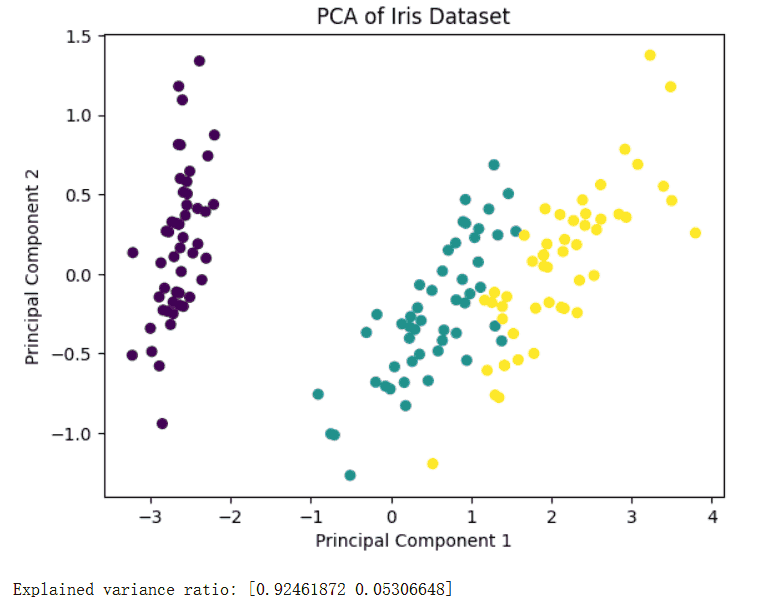
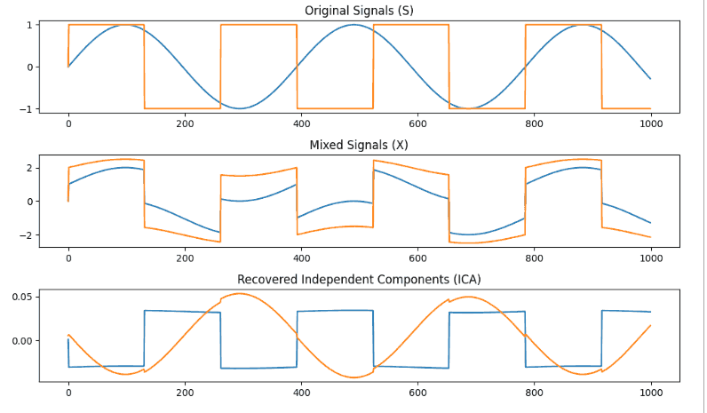
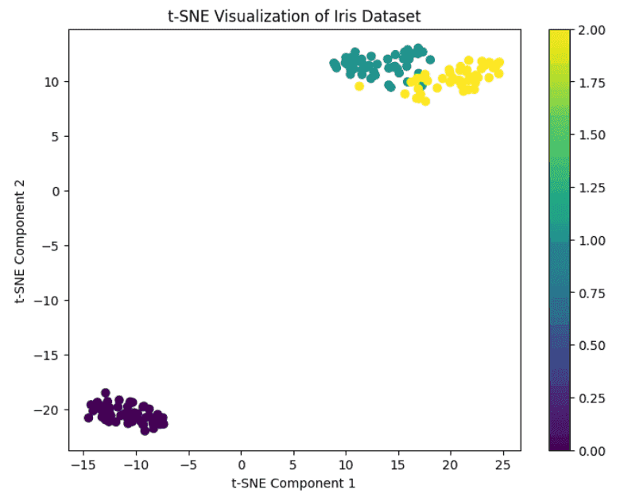
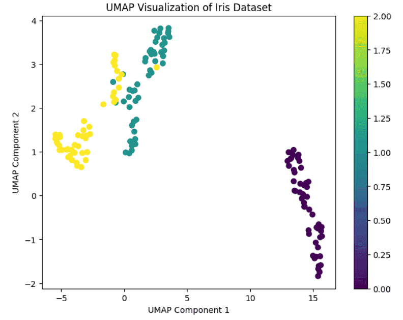

# 降维与表示学习
降维与表示学习是无监督学习中的重要方法，旨在将高维数据映射到低维空间，同时尽可能保留数据的结构与信息。降维方法如 主成分分析（PCA）、独立成分分析（ICA） 能去除冗余特征，降低计算复杂度，并便于可视化；非线性方法如 t-SNE、UMAP 则能在低维空间中保留数据的局部或全局结构。表示学习通过自动提取数据的潜在特征表示，为后续聚类、分类或生成模型提供更加紧凑和有效的特征，是处理高维复杂数据的重要工具。
## 主成分分析（PCA）
主成分分析（PCA, Principal Component Analysis）是一种经典的线性降维方法，旨在将高维数据映射到低维空间，同时保留数据的主要信息。通过提取数据中的主要方向（主成分），PCA 可以去除冗余特征、降低计算复杂度，并方便可视化和后续分析。

常见应用场景包括：
- 数据可视化：将高维数据降到 2D 或 3D，便于观察数据分布和聚类结构。
- 特征压缩：减少特征数量，提高机器学习模型训练效率。
- 噪声去除：去掉低方差方向的特征，提升数据质量。
- 模式识别：提取数据的主要变化方向，用于分类、聚类或异常检测。

PCA 的目标是找到一个正交坐标系，使得数据在新坐标轴上的投影方差最大。设数据矩阵为 $$X \in \mathbb{R}^{n \times d}$$，每行表示一个样本，每列表示一个特征。

主成分分析的核心步骤包括：
1. 中心化：减去每个特征的均值，使数据均值为零。
2. 协方差矩阵：$$\Sigma = \frac{1}{n} X^T X$$
3. 特征值分解（EVD）：求协方差矩阵的特征值和特征向量。
4. 选择主成分：选取前 $$k$$ 个最大特征值对应的特征向量作为投影矩阵 $$W$$。
5. 数据投影：$$X_{\text{reduced}} = X W$$

PCA 的每个主成分都是数据的线性组合，且相互正交，第一主成分方差最大，第二主成分方差次大，以此类推。

PCA的算法步骤如下：
1. 对原始数据进行中心化处理。
2. 计算数据的协方差矩阵。
3. 对协方差矩阵进行特征值分解或奇异值分解（SVD）。
4. 选择前 k 个特征向量构建投影矩阵。
5. 将原始数据投影到低维空间，得到降维后的数据。
下面通过示例代码实现来形象的理解：
```python
from sklearn.datasets import load_iris
from sklearn.decomposition import PCA
import matplotlib.pyplot as plt

# 1. 加载数据
iris = load_iris()
X = iris.data
y = iris.target

# 2. PCA 降维到 2 维
pca = PCA(n_components=2)
X_pca = pca.fit_transform(X)

# 3. 可视化
plt.scatter(X_pca[:,0], X_pca[:,1], c=y, cmap='viridis', s=30)
plt.xlabel("Principal Component 1")
plt.ylabel("Principal Component 2")
plt.title("PCA of Iris Dataset")
plt.show()

# 4. 查看各主成分解释的方差比例
print("Explained variance ratio:", pca.explained_variance_ratio_)
```
运行结果如下，其中散点图展示了降维后的样本分布，explained_variance_ratio 显示每个主成分解释的数据方差比例。


PCA的优点是简单易用，计算高效，可以降低维度，减少噪声和冗余；但是它仅考虑线性关系，无法捕捉非线性结构，并且主成分的物理意义可能不明确，同时对异常值敏感，噪声可能影响主成分方向。

## 独立成分分析（ICA）
独立成分分析（ICA, Independent Component Analysis）是一种重要的降维与表示学习方法，用于将观测数据分解为相互独立的潜在信号。与 PCA 不同，ICA 不仅关注数据之间的相关性，还追求统计独立性，这使它在盲源分离、脑电信号分析和图像特征提取中非常有用。ICA 的基本假设是观测数据是若干潜在独立信号的线性组合，通过恢复这些独立成分，可以发现数据中隐藏的结构或源信号。

ICA 的应用非常广泛。例如，在音频处理中，有多个麦克风同时记录多个声源的混合信号。通过 ICA，可以将混合信号恢复成独立的原始声音，实现“鸡尾酒会问题”的解决。在神经科学中，ICA 可用于分析脑电图（EEG）或功能性磁共振成像（fMRI）数据，将复杂脑信号分解为独立的神经活动模式。在图像分析中，ICA 可以用于纹理分解、特征提取和图像压缩，使低维表示更加有意义。

设观测数据为 $$\mathbf{X} \in \mathbb{R}^{n \times d}$$，潜在独立成分为 $$\mathbf{S} \in \mathbb{R}^{n \times k}$$，混合矩阵为 $$\mathbf{A} \in \mathbb{R}^{d \times k}$$，则有： $$\mathbf{X} = \mathbf{A} \mathbf{S}$$

ICA 的目标是估计 $$\mathbf{S}$$ 与 $$\mathbf{A}$$，使得 $$\mathbf{S}$$ 的各行成分相互统计独立。与 PCA 不同，ICA 通过最大化非高斯性或独立性指标来恢复信号，而不仅仅是去相关。常用方法包括 FastICA，它基于迭代优化非高斯性指标（如负熵）从而快速找到独立成分。

在使用 ICA 时，通常需要对数据进行中心化和白化，使得每个特征均值为零，且各特征方差归一化并相互不相关。白化可以减少参数数量，提高算法稳定性和收敛速度。

以 FastICA 为例，算法可以总结为以下步骤：
1. 数据中心化：减去每个特征的均值，使数据均值为零。
2. 数据白化：对数据进行线性变换，使各特征不相关且方差归一化。
3. 初始化权重矩阵：随机选择初始权重向量。
4. 迭代优化：通过最大化非高斯性指标（如负熵）更新权重，寻找独立成分方向。
5. 正交化权重向量：保证各独立成分正交，避免重复。
6. 恢复独立成分：通过权重矩阵将观测数据投影到独立成分空间，得到矩阵 S。
7. 结果输出：得到独立成分和混合矩阵，可用于后续分析或可视化。

下面使用 FastICA 对混合信号进行分离：
```python
import numpy as np
import matplotlib.pyplot as plt
from sklearn.decomposition import FastICA

# 生成模拟信号
np.random.seed(42)
time = np.linspace(0, 8, 1000)
s1 = np.sin(2 * time)                  # 正弦信号
s2 = np.sign(np.sin(3 * time))         # 方波信号
S = np.c_[s1, s2]

# 混合信号
A = np.array([[1, 1], [0.5, 2]])
X = S @ A.T

# 使用 FastICA 分离独立成分
ica = FastICA(n_components=2, random_state=42)
S_ = ica.fit_transform(X)
A_ = ica.mixing_

# 可视化
plt.figure(figsize=(10,6))

plt.subplot(3,1,1)
plt.plot(S)
plt.title("Original Signals (S)")

plt.subplot(3,1,2)
plt.plot(X)
plt.title("Mixed Signals (X)")

plt.subplot(3,1,3)
plt.plot(S_)
plt.title("Recovered Independent Components (ICA)")

plt.tight_layout()
plt.show()
```
运行结果中，第一幅图展示原始独立信号，第二幅图为混合信号，第三幅图为 ICA 分离出的独立成分。可以看到，ICA 成功恢复了原始信号的独立性。


独立成分分析是一种强大的降维和信号分离方法，它通过统计独立性和非高斯性优化，能够从复杂的混合数据中提取潜在的独立信号。与 PCA 相比，ICA 不仅去相关，还能捕捉高阶统计特性，因此在盲源分离、神经信号分析和图像特征提取中具有不可替代的作用。

尽管 ICA 对噪声敏感、计算复杂度较高，但通过合理的预处理和参数选择，它仍然是处理高维复杂数据的重要工具。结合 PCA 和其他降维方法，ICA 可以为数据分析提供更加丰富和有效的特征表示，使高维数据更易于理解和处理
## t-SNE 降维
在高维数据分析和可视化中，t-SNE（t-distributed Stochastic Neighbor Embedding,t-分布随机邻域嵌入） 是一种非常流行的非线性降维方法，特别适用于将高维数据嵌入到二维或三维空间以进行可视化。

与 PCA 或 ICA 不同，t-SNE 并不关注全局结构，而是重点保持数据在局部邻域的结构关系，使相似样本在低维空间中保持相对接近，而不相似样本尽量远离，从而直观展示数据的聚类或分布模式。

t-SNE 的核心思想是将高维数据中的相似性映射到低维空间。它首先计算高维空间中每对样本的条件概率，表示一个样本选择另一个样本作为邻居的可能性。接着，t-SNE 在低维空间中定义类似的条件概率，并通过最小化高维与低维概率分布之间的 Kullback-Leibler（KL）散度，使低维嵌入尽量保持高维局部相似性。

为了防止“拥挤问题”（Crowding Problem），t-SNE 使用 t 分布（自由度为 1 的学生 t 分布）代替高斯分布，增加低维空间中样本间的分离度。

t-SNE 的算法流程通常包括以下步骤：
1. 计算高维相似度：对高维数据中的每对样本 $$x_i, x_j$$，使用高斯核计算条件概率 $$p_{j|i}$$，表示 $$x_i$$ 选择 $$x_j$$作为邻居的概率。
2. 对称化概率：将条件概率对称化得到 $$p_{ij} = (p_{j|i} + p_{i|j}) / 2n$$。
3. 初始化低维嵌入：通常随机初始化低维空间中的点 $$y_i$$。
4. 计算低维相似度：使用 t 分布计算低维空间中每对点的相似度 $$q_{ij}$$。
5. 最小化 KL 散度：通过梯度下降最小化高维分布 P 与低维分布 Q 的 KL 散度：$$KL(P||Q) = \sum_{i\neq j} p_{ij} \log \frac{p_{ij}}{q_{ij}}$$
6. 迭代优化：更新低维嵌入，直到 KL 散度收敛或达到预设迭代次数。

t-SNE 的核心特点是局部结构保持能力强，能很好地将数据中的簇结构和局部关系呈现在低维空间中，但它对全局结构的保留较弱。此外，t-SNE 对超参数敏感，如 perplexity（相当于邻居数量的平滑参数）、学习率和迭代次数都会显著影响结果。实践中，通常需要尝试不同参数组合以获得稳定的可视化效果。

下面使用 Scikit-learn 对 Iris 数据集进行 t-SNE 可视化：
```python
from sklearn.datasets import load_iris
from sklearn.manifold import TSNE
import matplotlib.pyplot as plt

# 加载数据
iris = load_iris()
X = iris.data
y = iris.target

# t-SNE 降维到 2 维
tsne = TSNE(n_components=2, perplexity=30, learning_rate=200, n_iter=1000, random_state=42)
X_tsne = tsne.fit_transform(X)

# 可视化
plt.figure(figsize=(8,6))
plt.scatter(X_tsne[:,0], X_tsne[:,1], c=y, cmap='viridis', s=40)
plt.xlabel("t-SNE Component 1")
plt.ylabel("t-SNE Component 2")
plt.title("t-SNE Visualization of Iris Dataset")
plt.colorbar()
plt.show()
```
运行结果如下，二维散点图展示了不同类别样本的聚类情况。可以看到，t-SNE 能很好地区分数据的不同簇，并且保持每个簇的局部结构。

总结来说，t-SNE 是一种强大的非线性降维和可视化方法，尤其适用于高维数据的探索性分析。它能有效揭示数据的簇结构和局部关系，使数据可视化更直观。相比 PCA、ICA 等线性方法，t-SNE 更关注局部相似性，但也因此存在全局结构保留不足和计算开销较大的问题。在实际使用中，通过调整超参数，可以获得不同的可视化效果，广泛应用于图像、文本、基因组数据等领域。

## UMAP 降维

UMAP（Uniform Manifold Approximation and Projection）是一种先进的非线性降维方法，用于将高维数据映射到低维空间，同时尽可能保留数据的局部和全局结构。

UMAP 结合了流形学习理论和图论方法，相比 t-SNE，它不仅保留局部邻域关系，同时在低维空间中对全局结构的保留也更好，并且计算效率更高。UMAP 广泛应用于高维数据可视化、聚类分析、特征提取等场景。

### 算法原理
UMAP 基于流形假设，假设高维数据分布在低维流形上，并且数据的局部邻域可以反映流形的几何结构。UMAP 的核心思想是：首先通过高维空间中的邻域关系构建一个加权图，然后将图映射到低维空间，通过优化低维空间中点的相似性，使得邻居关系尽可能保持一致。

具体而言，UMAP 通过以下步骤建立映射：
1. 高维邻域图构建：对每个样本计算 k 个最近邻，并使用模糊集合理论定义邻居之间的相似度权重。
2. 低维图初始化：随机初始化低维空间中每个样本的位置。
3. 优化嵌入：通过交叉熵损失函数最小化高维图和低维图之间的差异，使低维点的邻居关系与高维数据尽量一致。

UMAP 的优化过程使用随机梯度下降（SGD），使其在处理大规模数据时也能保持高效率。UMAP 的非线性特性使它能够捕捉复杂的数据结构，同时保留局部和部分全局关系。

### 算法特点
与其他降维方法相比，UMAP 具有以下显著特点：
- 局部结构保持能力强：类似 t-SNE，能够将相似样本在低维空间中聚集。
- 全局结构保留较好：相比 t-SNE，UMAP 在低维空间中更好地保持簇之间的相对位置关系。
- 高计算效率：UMAP 利用图近似和优化算法，对大规模数据的降维速度快。
- 可扩展性强：UMAP 可以处理数十万到百万级样本的数据集，同时支持新样本的嵌入。
- 超参数可控：主要包括 n_neighbors（邻居数量）和 min_dist（最小距离），分别控制局部平滑和低维空间簇的紧密程度。

下面用 Python 的 umap-learn 库对 Iris 数据集进行降维和可视化示例：
```python
import umap
from sklearn.datasets import load_iris
import matplotlib.pyplot as plt

# 加载数据
iris = load_iris()
X = iris.data
y = iris.target

# UMAP 降维到 2 维
umap_model = umap.UMAP(n_neighbors=15, min_dist=0.1, n_components=2, random_state=42)
X_umap = umap_model.fit_transform(X)

# 可视化
plt.figure(figsize=(8,6))
plt.scatter(X_umap[:,0], X_umap[:,1], c=y, cmap='viridis', s=40)
plt.xlabel("UMAP Component 1")
plt.ylabel("UMAP Component 2")
plt.title("UMAP Visualization of Iris Dataset")
plt.colorbar()
plt.show()
```
在结果中，不同类别的样本被清晰地分开，UMAP 能同时保留局部簇结构和簇之间的全局关系。

UMAP 适用于多种高维数据分析任务：
- 数据可视化：二维或三维投影，便于观察数据分布和聚类结构。
- 聚类前处理：降低维度减少计算量，提高聚类算法效率。
- 特征提取：从高维数据中提取低维特征用于分类或回归任务。
- 生物信息学：用于单细胞 RNA-seq 数据分析和可视化。
- 图像与文本：在图像嵌入和自然语言处理特征表示中广泛使用。

总结一下，UMAP 是一种高效、灵活的非线性降维方法，结合了流形学习和图优化思想，能够在低维空间中同时保留局部和全局结构。相比 t-SNE，它在可视化高维数据簇结构和保持簇间关系方面表现更好，同时计算速度更快。UMAP 的超参数可调，使其在不同数据集和任务中灵活适配。通过合理使用 UMAP，可以将复杂高维数据的模式、簇结构和潜在特征直观呈现，为后续分析和建模提供有力支持。

最新的文章都在公众号更新，别忘记关注哦！！！如果想要加入技术群聊，扫描下方二维码回复【加群】即可。
