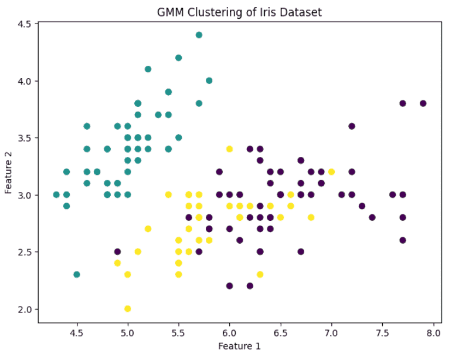
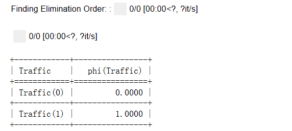

# 概率图模型
概率图模型（Probabilistic Graphical Models, PGM）是一类结合概率论与图论的强大工具，用于描述多个随机变量之间的依赖关系。它通过图结构将复杂的联合概率分布分解为局部条件概率分布，使得对高维数据建模和推断变得可行且高效。

根据图的类型，PGM 可分为有向图模型（如贝叶斯网络）和无向图模型（如马尔可夫随机场）。贝叶斯网络利用有向无环图表示变量之间的因果关系，适合建模因果推断和序列数据；马尔可夫随机场则通过无向图捕捉变量之间的联合约束，更适合处理对称依赖或空间关系。

概率图模型广泛应用于自然语言处理、计算机视觉、基因组学和推荐系统等领域，能够实现推断、学习和预测等多种任务，为复杂系统提供可解释的概率表示。
## 高斯混合模型
高斯混合模型（Gaussian Mixture Model, GMM）是一种重要的概率图模型，用于对数据进行聚类和密度估计。GMM 假设数据来自若干个高斯分布的线性组合，每个高斯分布称为一个“分量”，模型通过估计各个分量的均值、方差以及混合权重来刻画整个数据分布。

与 K-means 等硬聚类方法不同，GMM 是软聚类方法，每个样本属于每个簇的概率可以不同，更加灵活地刻画数据的连续性和重叠结构。

高斯混合模型在金融风控、语音识别、图像分割以及异常检测等场景中应用广泛。例如，在图像分割中，每个像素的颜色可以建模为若干高斯分布，通过 GMM 可以将图像自动分割为不同区域。在异常检测中，GMM 可以对正常数据建模，当新样本的概率很低时被判定为异常。

### 模型原理
假设观测数据为 $$X = \{x_1, x_2, ..., x_n\}$$，GMM 假设每个数据点由 K 个高斯分布中的一个生成。数学表达式为：

$$p(x_i) = \sum_{k=1}^{K} \pi_k \mathcal{N}(x_i|\mu_k, \Sigma_k)$$

其中：
- $$\pi_k$$ 为第 k 个高斯分布的混合权重，满足 $$\sum_{k=1}^K \pi_k = 1$$
- $$\mathcal{N}(x|\mu_k, \Sigma_k)$$是均值为 $$\mu_k$$、协方差矩阵为 $$\Sigma_k$$ 的高斯分布

GMM 的目标是通过最大化观测数据的似然函数来估计参数 $$\{\pi_k, \mu_k, \Sigma_k\}$$。由于直接最大化似然函数困难，通常使用 期望最大化算法（EM） 来迭代求解。

### EM 算法流程
EM 算法通过两个步骤交替进行，直至参数收敛：
1. 初始化：随机初始化每个高斯分布的均值 $$\mu_k$$、协方差 $$\Sigma_k$$ 和混合权重 $$\pi_k$$。
2. E 步（Expectation）：计算每个样本属于每个分量的后验概率（责任度）：$$\gamma_{ik} = \frac{\pi_k \mathcal{N}(x_i|\mu_k, \Sigma_k)}{\sum_{j=1}^K \pi_j \mathcal{N}(x_i|\mu_j, \Sigma_j)}$$
3. M 步（Maximization）：根据责任度更新参数：
$$\mu_k = \frac{\sum_i \gamma_{ik} x_i}{\sum_i \gamma_{ik}}, \quad \Sigma_k = \frac{\sum_i \gamma_{ik} (x_i - \mu_k)(x_i - \mu_k)^T}{\sum_i \gamma_{ik}}, \quad \pi_k = \frac{\sum_i \gamma_{ik}}{n}$$
4. 迭代：重复 E 步和 M 步，直到似然函数收敛或达到最大迭代次数。

下面使用 Scikit-learn 对 Iris 数据集进行 GMM 聚类示例：
```python
from sklearn.datasets import load_iris
from sklearn.mixture import GaussianMixture
import matplotlib.pyplot as plt

# 加载数据
iris = load_iris()
X = iris.data
y = iris.target

# 定义 GMM 模型
gmm = GaussianMixture(n_components=3, covariance_type='full', random_state=42)
gmm.fit(X)
labels = gmm.predict(X)

# 可视化前两维
plt.figure(figsize=(8,6))
plt.scatter(X[:,0], X[:,1], c=labels, cmap='viridis', s=40)
plt.xlabel("Feature 1")
plt.ylabel("Feature 2")
plt.title("GMM Clustering of Iris Dataset")
plt.show()
```
在结果中，不同颜色表示样本被分配到不同的高斯分量，GMM 能够捕捉簇的概率结构，并允许簇之间存在重叠。


由上面的内容来看，高斯混合模型是一种灵活的软聚类方法和概率密度建模工具，通过将数据表示为若干高斯分布的混合，实现对数据的连续建模。与 K-means 相比，GMM 能更好地处理簇形状不规则、簇间重叠的情况。它广泛应用于聚类、图像分割、异常检测、语音识别等领域。

通过合理选择分量数量和协方差类型，GMM 可以在实际问题中提供高精度的聚类和密度估计能力。
## 隐马尔可夫模型
隐马尔可夫模型（Hidden Markov Model, HMM） 是一种经典的概率图模型，用于建模含有隐含状态的序列数据。它假设观测序列是由一组不可直接观察的隐藏状态生成的，而隐藏状态之间满足马尔可夫性（当前状态只依赖于前一个状态）。HMM 在自然语言处理、语音识别、基因序列分析、行为预测等领域都有广泛应用，能够有效处理时间序列或序列依赖数据。

在 HMM 中，每个隐藏状态会以一定概率生成观测值，因此 HMM 不仅可以对序列进行建模，还可以进行序列预测、状态解码以及参数估计。与 GMM 等静态概率模型不同，HMM 显式考虑了数据的时序特性，能捕捉动态演化规律。

### 模型定义
一个 HMM 通常由以下三部分组成：
1. 状态集 $$S = \{s_1, s_2, ..., s_N\}$$ ：表示模型的隐藏状态，总数为 N。
2. 观测集 $$O = \{o_1, o_2, ..., o_M\}$$ ：表示可观测的符号或特征，总数为 M。
3. 参数集：
  - 状态转移概率矩阵 $$A = [a_{ij}]$$，其中 $$a_{ij} = P(s_j \mid s_i)$$
  - 观测概率矩阵 $$B = [b_{jk}]$$，其中 $$b_{jk} = P(o_k \mid s_j)$$
  - 初始状态概率向量 $$\pi = [\pi_i]$$，其中 $$\pi_i = P(s_i \text{ at time } t=1)$$

HMM 的核心目标是通过观测序列 $$O = (o_1, o_2, ..., o_T) $$来解决三个典型问题：
1. 评估问题：给定模型参数，计算观测序列的概率 $$P(O|\lambda)$$。
2. 解码问题：给定观测序列，找到最可能的隐藏状态序列（常用 Viterbi 算法）。
3. 学习问题：给定观测序列，估计模型参数 $$(A, B, \pi)$$（常用 Baum-Welch/EM 算法）。

### 算法流程
以最常用的 Baum-Welch 算法（EM 算法的一种）为例，HMM 的训练流程如下：
1. 初始化：随机初始化状态转移矩阵 A、观测概率矩阵 B 和初始状态概率 $$\pi$$。
2. E 步（Expectation）：计算前向概率 $$\alpha$$ 和后向概率 $$\beta$$，用于估计每个时间点的状态概率。
3. M 步（Maximization）：根据前向后向概率更新 $$A, B, \pi$$ 参数，使观测序列的似然概率最大化。
4. 迭代：重复 E 步和 M 步，直到模型收敛或达到最大迭代次数。

对于状态解码问题，常用 Viterbi 算法，通过动态规划求解最可能的隐藏状态序列。

下面使用 hmmlearn 库对一个简单的离散序列进行 HMM 建模和预测：
```python
import numpy as np
from hmmlearn import hmm

# 假设观测值 0,1,2（离散类别），隐藏状态 0,1
obs = np.array([[0],[1],[0],[2],[1],[0],[2],[1]])  # 注意列向量

# 定义 HMM，禁止自动初始化
model = hmm.MultinomialHMM(n_components=2, n_iter=100, random_state=42, init_params="")

# 手动设置参数
model.startprob_ = np.array([0.6, 0.4])
model.transmat_ = np.array([[0.7, 0.3],
                            [0.4, 0.6]])

# emissionprob_ 形状必须是 (n_components, n_features)
# n_features = 3，因为观测值 0,1,2 共 3 类
model.emissionprob_ = np.array([[0.5, 0.4, 0.1],
                                [0.1, 0.3, 0.6]])

# 训练 HMM
model.fit(obs)

# 解码隐藏状态序列
hidden_states = model.predict(obs)
print("隐藏状态序列:", hidden_states)
```

在这个示例中，HMM 对观测序列进行了建模，并预测了最可能的隐藏状态序列。

HMM 的时序建模能力使其在多个领域表现出色：
- 语音识别：将语音信号序列映射到音素或文字序列。
- 自然语言处理：词性标注、命名实体识别等序列标注任务。
- 生物信息学：基因序列分析、蛋白质二级结构预测。
- 行为预测与异常检测：对时间序列数据进行模式发现和异常识别。

简单总结一下HMM，HMM 是一种经典的序列概率模型，通过隐藏状态和观测概率描述序列数据的生成机制。与静态概率模型（如 GMM）不同，HMM 显式考虑时序依赖和马尔可夫性，能够捕捉动态演化规律。

通过合理设计状态数和初始化参数，HMM 可以在语音、文本、生物序列及行为数据等领域提供强大的建模能力。
## 贝叶斯网络
贝叶斯网络（Bayesian Network, BN） 是一种基于概率的图模型，用于表示变量之间的条件依赖关系。它由一个有向无环图（Directed Acyclic Graph, DAG）和与节点对应的条件概率表（Conditional Probability Table, CPT）组成。节点代表随机变量，边表示变量之间的依赖关系，而 CPT 则量化了这种依赖关系的强度。

贝叶斯网络能够处理不确定性、推理复杂系统、进行因果分析，并广泛应用于医疗诊断、故障检测、自然语言处理、风险评估等领域。与其他概率模型不同，贝叶斯网络显式地表示变量之间的条件依赖与独立性，使得复杂的联合概率分布能够分解为局部概率分布的乘积，从而大幅降低计算复杂度。

### 模型定义
一个贝叶斯网络通常由两部分组成：

**1. 结构（DAG）**
  - 节点 $$X_1, X_2, ..., X_n $$表示随机变量
  - 有向边 $$X_i \to X_j$$ 表示 $$X_j$$ 的概率分布依赖于 $$X_i$$
  - 图中不允许环路（无环性保证了概率计算的正确性）

**2. 参数（CPT）**
  - 每个节点 $$X_i$$ 都有条件概率表 $$P(X_i \mid \text{Parents}(X_i))$$
  - 若节点没有父节点，则为边缘概率 $$P(X_i)$$
  - 联合概率分布可分解为各节点条件概率的乘积： $$P(X_1, X_2, ..., X_n) = \prod_{i=1}^{n} P(X_i \mid \text{Parents}(X_i))$$

### 核心特点
贝叶斯网络的核心特点：
- 表达条件独立性：通过 DAG 的结构，能够清晰地表示哪些变量是条件独立的，从而减少计算复杂度。
- 因果建模能力：可以用于描述因果关系而不仅仅是相关性。
- 灵活的概率推理：可以进行边缘化、条件推理和后验推断。

**优点：**
- 模型可解释性强
- 能处理不完整数据
- 可进行推理和决策支持

**缺点：**
- 学习 DAG 结构复杂（尤其是变量多时）
- CPT 随父节点数量增加呈指数增长
- 对连续变量需要离散化或假设特定分布

### 学习与推理
贝叶斯网络涉及两类核心任务：

**1. 结构学习**
  - 从数据中学习网络结构
  - 常用方法：贪心搜索、约束方法、得分函数（如 BIC, AIC）

**2. 参数学习**
  - 给定 DAG，学习 CPT
  - 可使用极大似然估计（MLE）或贝叶斯估计

**3. 推理（Inference）**
  - 给定部分变量的观测值，计算其他变量的后验分布
  - 方法：精确推理（变量消元、信念传播）和近似推理（蒙特卡洛采样、Gibbs 采样）

下面用 pgmpy 对一个简单的贝叶斯网络建模、参数学习和推理：
```python
import pandas as pd
from pgmpy.models import BayesianModel
from pgmpy.estimators import MaximumLikelihoodEstimator
from pgmpy.inference import VariableElimination

# 定义网络结构
model = BayesianModel([('Rain', 'Traffic'), ('Accident', 'Traffic')])

# 构造数据
data = pd.DataFrame({
    'Rain': [0, 0, 1, 1, 0, 1, 0, 1],
    'Accident': [0, 1, 0, 1, 0, 0, 1, 1],
    'Traffic': [0, 1, 1, 1, 0, 1, 1, 1]
})

# 参数学习
model.fit(data, estimator=MaximumLikelihoodEstimator)

# 推理
infer = VariableElimination(model)
posterior = infer.query(variables=['Traffic'], evidence={'Rain': 1, 'Accident': 0})
print(posterior)
```
在这个示例中：
- Rain 和 Accident 是 Traffic 的父节点
- 学习 CPT 后可以基于观测推断 Traffic 的概率
运行结果如下：


贝叶斯网络是一种强大的概率图模型，通过 DAG 表示变量之间的条件依赖关系，能够高效地进行联合概率建模和推理。它特别适合处理复杂系统的因果分析和不确定性建模。

最新的文章都在公众号更新，别忘记关注哦！！！如果想要加入技术群聊，扫描下方二维码回复【加群】即可。
