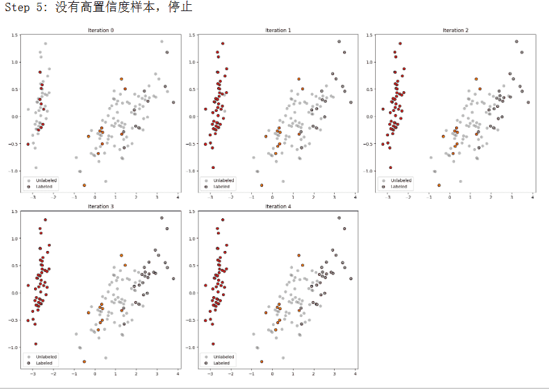
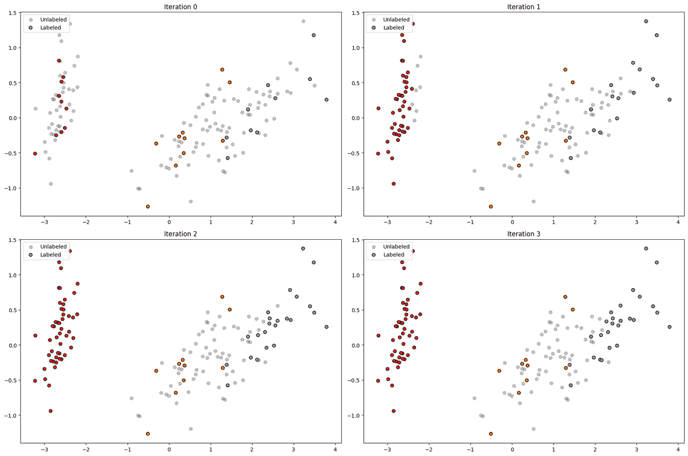
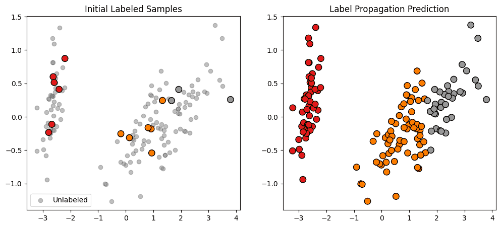

# 半监督学习
半监督学习（Semi-Supervised Learning）是一类介于监督学习和无监督学习之间的方法，旨在利用少量带标签的数据与大量无标签的数据共同训练模型。在现实任务中，标注数据通常获取成本高，而无标签数据丰富，比如要进行物体检测，那么就要人工用一个方框把不同的物体标注出来，而且不同的类别标注也要不同，我在大三的时候就干过，从那之后再也不想标注了，这个是耗费时间和精力巨大的一个工作。

半监督学习通过挖掘数据分布结构与标签信息之间的关联，提高模型的泛化能力。其主要技术包括自训练、协同训练、基于图的标签传播、半监督支持向量机以及与深度学习结合的生成式与一致性正则化方法，广泛应用于文本分类、图像识别、医疗分析等场景。

## 自训练
自训练（Self-training）是半监督学习中最经典、最直观的方法之一。它通过利用少量带标签数据训练一个初始模型，再借助该模型对未标注数据进行预测，将高置信度的预测结果作为伪标签（pseudo labels），逐步扩充训练集，从而提升模型性能。自训练的核心思想是 模型自己教自己，不断利用无标签数据中潜在的信息来改进预测能力。

自训练的一般过程可以概括为以下几个步骤：
1. 初始训练：使用少量标注数据训练一个监督学习模型。
2. 伪标签生成：用该模型预测未标注数据，并计算每个样本的置信度。
3. 样本筛选：选择置信度较高的预测样本，赋予其伪标签。
4. 数据扩充：将这些伪标签样本加入训练集，形成新的“标注”数据集。
5. 迭代更新：重新训练模型，并重复上述步骤，直到性能收敛或达到预设迭代次数。

以逻辑回归（Logistic Regression）为例，可以先用少量带标签样本训练一个模型，然后利用该模型预测未标注样本的类别，并选择置信度超过阈值的样本作为伪标签，逐步加入训练集，迭代更新模型。
```python
import matplotlib.pyplot as plt
from sklearn.datasets import load_iris
from sklearn.linear_model import LogisticRegression
import numpy as np

# 1. 加载数据，只取前两个特征便于二维可视化
X, y = load_iris(return_X_y=True)
X = X[:, :2]

n_labeled = 30
X_labeled, y_labeled = X[:n_labeled], y[:n_labeled]
X_unlabeled = X[n_labeled:]

# 2. 初始训练
model = LogisticRegression(max_iter=200)
model.fit(X_labeled, y_labeled)

# 可视化函数：绘制决策边界 + 已标注/伪标签样本
def plot_step(X_labeled, y_labeled, X_unlabeled, title):
    h = .02  # 网格步长
    x_min, x_max = X[:, 0].min() - 1, X[:, 0].max() + 1
    y_min, y_max = X[:, 1].min() - 1, X[:, 1].max() + 1
    xx, yy = np.meshgrid(np.arange(x_min, x_max, h),
                         np.arange(y_min, y_max, h))
    
    Z = model.predict(np.c_[xx.ravel(), yy.ravel()])
    Z = Z.reshape(xx.shape)
    
    plt.contourf(xx, yy, Z, alpha=0.3, cmap=plt.cm.Set1)
    plt.scatter(X_unlabeled[:, 0], X_unlabeled[:, 1], 
                c='gray', marker='x', label='Unlabeled', alpha=0.5)
    plt.scatter(X_labeled[:, 0], X_labeled[:, 1], 
                c=y_labeled, cmap=plt.cm.Set1, edgecolor='k', label='Labeled')
    plt.title(title)
    plt.legend()
    plt.show()

# 3. 自训练循环
for step in range(5):
    plot_step(X_labeled, y_labeled, X_unlabeled, f"Iteration {step}")
    
    probs = model.predict_proba(X_unlabeled)
    pseudo_labels = probs.argmax(axis=1)
    confidences = probs.max(axis=1)
    mask = confidences > 0.9  # 高置信度样本
    
    if mask.sum() == 0:
        break
    
    # 将伪标签样本加入训练集
    X_labeled = np.vstack([X_labeled, X_unlabeled[mask]])
    y_labeled = np.concatenate([y_labeled, pseudo_labels[mask]])
    X_unlabeled = X_unlabeled[~mask]
    
    # 重新训练
    model.fit(X_labeled, y_labeled)

# 最终可视化
plot_step(X_labeled, y_labeled, X_unlabeled, "Final Model")
```
输出如下，背景颜色表示模型预测的 分类区域；圆点表示已标注/伪标注样本，色表示 未标注样本；

每次迭代会画一张图，可以看到随着伪标签样本加入，决策边界逐渐变化，覆盖更多未标注数据。

初始迭代时，模型仅依赖少量标注样本，分类区域相对狭窄；随着高置信度伪标签被加入训练集，模型能够利用更多信息进行更新，训练样本分布更加丰富，分类边界逐渐调整，覆盖更多未标注样本。最终，模型的决策能力明显增强，未标注样本被较好地划分到正确类别中。


自训练的优点在于实现简单，几乎可以应用于任何监督学习模型，例如逻辑回归、SVM、神经网络等，而且能够有效利用大量未标注数据，在标注样本稀缺的情况下提升性能。然而，该方法也存在局限性：如果初始模型质量较差或预测出现错误，高置信度的伪标签可能会传播错误，从而降低整体性能。此外，它对数据分布也有一定依赖，类别分布不均衡或边界复杂时容易产生偏差。

为了解决这些问题，研究者提出了多种改进方法，例如动态调整置信度阈值以减少错误传播，使用多个模型互相生成伪标签以降低偏差，或者结合深度学习中的一致性正则化、生成对抗网络等方法，以增强对复杂任务的适应能力。这些改进使得自训练在实际应用中更为稳健和高效。

目前，自训练已经在多个领域得到应用。在文本分类中，它能利用少量人工标注的语料扩展到大规模未标注文本；在图像识别中，尤其是医学影像和遥感等标注成本高的任务中，自训练能够显著减轻标注负担；在语音识别中，它也能借助未标注语音数据提升识别准确率。凭借简单性和灵活性，自训练不仅是半监督学习的重要基石，还常作为更复杂方法的组成部分，在现代机器学习中依然发挥着重要作用。

## 协同训练
协同训练（Co-training）是半监督学习中一种经典且有效的方法，由 Blum 和 Mitchell 在 1998 年提出。与自训练不同，协同训练依赖于数据具有 两种或多种互补的特征视图（views），每个视图都能够单独完成分类任务。

其核心思想是训练两个（或多个）分类器，分别利用不同视图的标注数据进行初始训练，然后让它们互相为对方提供高置信度的未标注样本作为伪标签，从而扩充训练集。通过这种互助式学习，协同训练能够充分利用未标注数据提升模型性能。

协同训练的一般步骤可以概括如下：
1. 数据视图划分：将原始特征集划分为两个或多个互补视图，例如文本数据可以分为标题和正文两部分；图像数据可以使用不同特征提取方法生成两个视图。
2. 初始训练：使用少量带标签样本训练每个视图对应的分类器。
3. 互助伪标签：每个分类器在未标注数据上进行预测，并选择置信度较高的样本，将其伪标签提供给另一个分类器。
4. 训练集扩充：将伪标签样本加入训练集，重新训练两个分类器。
5. 迭代更新：重复互助伪标签和训练集扩充的过程，直到模型收敛或达到预设迭代次数。

以文本分类为例，假设我们有新闻文章数据，每篇文章包含标题和正文两部分：
- 视图 1（标题）训练分类器 A；视图 2（正文）训练分类器 B。
- 分类器 A 预测未标注样本的类别，并将高置信度样本提供给 B；B 同样将高置信度样本提供给 A。
- 每次迭代，两个分类器的训练集不断扩充，利用未标注数据互相改进性能。

这种方法的特点是充分利用 多视图之间的互补性，在每个视图上单独训练可能效果一般，但互相辅助后可以显著提升整体性能。

我们使用鸢尾花数据集，把前两个特征和后两个特征分别作为两个视图，用 两个逻辑回归模型 互相生成伪标签，迭代更新训练集。
```python
import numpy as np
import matplotlib.pyplot as plt
from sklearn.datasets import load_iris
from sklearn.linear_model import LogisticRegression
from sklearn.decomposition import PCA
from sklearn.model_selection import train_test_split

# 1. 数据
X, y = load_iris(return_X_y=True)
X_labeled, X_unlabeled, y_labeled, y_unlabeled_true = train_test_split(
    X, y, train_size=30, stratify=y, random_state=42
)

# 2. PCA 可视化
pca = PCA(n_components=2)
X_2d = pca.fit_transform(X)
X_labeled_2d = pca.transform(X_labeled)
X_unlabeled_2d = pca.transform(X_unlabeled)

# 3. 划分视图
X_labeled_view1 = X_labeled[:, :2]
X_labeled_view2 = X_labeled[:, 2:]
X_unlabeled_view1 = X_unlabeled[:, :2]
X_unlabeled_view2 = X_unlabeled[:, 2:]

# 4. 分类器
clf1 = LogisticRegression(max_iter=200)
clf2 = LogisticRegression(max_iter=200)
clf1.fit(X_labeled_view1, y_labeled)
clf2.fit(X_labeled_view2, y_labeled)

history = [(X_labeled_2d.copy(), y_labeled.copy(), X_unlabeled_2d.copy())]

# 5. 协同训练循环
for step in range(5):
    probs1 = clf1.predict_proba(X_unlabeled_view1)
    pseudo_labels1 = probs1.argmax(axis=1)
    confidences1 = probs1.max(axis=1)

    probs2 = clf2.predict_proba(X_unlabeled_view2)
    pseudo_labels2 = probs2.argmax(axis=1)
    confidences2 = probs2.max(axis=1)

    # 高置信度样本
    mask1 = confidences1 > 0.9
    mask2 = confidences2 > 0.9

    # 新增样本：确保不会重复
    new_mask = mask1 | mask2
    if new_mask.sum() == 0:
        print(f"Step {step+1}: no confident samples, stop.")
        break

    # 生成伪标签
    pseudo_labels = np.where(mask1, pseudo_labels1, pseudo_labels2)
    
    # 更新训练集
    X_labeled_view1 = np.vstack([X_labeled_view1, X_unlabeled_view1[new_mask]])
    X_labeled_view2 = np.vstack([X_labeled_view2, X_unlabeled_view2[new_mask]])
    X_labeled_2d = np.vstack([X_labeled_2d, X_unlabeled_2d[new_mask]])
    y_labeled = np.concatenate([y_labeled, pseudo_labels[new_mask]])

    # 移除已加入的未标注样本
    X_unlabeled_view1 = X_unlabeled_view1[~new_mask]
    X_unlabeled_view2 = X_unlabeled_view2[~new_mask]
    X_unlabeled_2d = X_unlabeled_2d[~new_mask]

    # 重新训练
    clf1.fit(X_labeled_view1, y_labeled)
    clf2.fit(X_labeled_view2, y_labeled)

    # 保存状态
    history.append((X_labeled_2d.copy(), y_labeled.copy(), X_unlabeled_2d.copy()))

# 6. 绘图 2x2 网格
fig, axes = plt.subplots(2, 2, figsize=(18, 12))
axes = axes.flatten()

for i, (X_l, y_l, X_u) in enumerate(history):
    ax = axes[i]
    ax.scatter(X_u[:, 0], X_u[:, 1], c='gray', label='Unlabeled', alpha=0.5)
    ax.scatter(X_l[:, 0], X_l[:, 1], c=y_l, cmap='Set1', edgecolor='k', label='Labeled')
    ax.set_title(f"Iteration {i}")
    ax.legend()

for j in range(len(history), 4):
    axes[j].axis('off')

plt.tight_layout()
plt.show()
```
其中的步骤大概为
1. 视图划分：这里把前两个特征作为视图 1，后两个特征作为视图 2。
2. 互助伪标签：每个分类器将高置信度的预测结果加入另一个分类器的训练集。
3. 迭代更新：循环几步，训练集不断扩充，模型性能提升。
4. 高置信度阈值：这里用 0.9，保证加入训练集的伪标签可靠性。

运行结果如下，其中显示协同训练能够在少量初始标签的情况下，通过两个不同视图的分类器互相提供高置信度伪标签，逐步将未标注样本加入训练集，使训练集规模不断扩大，彩色点逐渐覆盖灰色未标注样本。

协同训练的优点在于能够充分利用未标注数据，特别适合 多视图信息丰富 的任务，如网页分类（标题与正文）、多模态数据（图像与文本特征）、音视频分析等。相比自训练，协同训练更稳健，因为两个分类器互相监督，单一模型的错误不容易传播。

然而，协同训练也存在局限性。首先，它依赖于特征视图的充分互补性，如果两个视图高度相关或某个视图信息不足，效果可能不佳。其次，伪标签的质量仍然会影响迭代过程，如果两个分类器都产生大量错误伪标签，模型性能可能下降。为了改进，研究者提出了方法，例如动态选择最可靠的伪标签、引入一致性约束或结合深度特征学习，以增强在复杂任务中的适应性。

协同训练在实际应用中已经被广泛使用。在文本分类中，可以利用标题与正文两个视图互相提供信息，减少人工标注成本；在图像识别和多模态任务中，不同特征提取方式可以形成互补视图，提升分类准确率；在网页推荐或社交网络分析中，用户行为和内容特征也可作为两种视图进行协同训练。

## 图半监督学习
图半监督学习是一类利用图结构表示数据关系，并在少量标注样本指导下进行预测的机器学习方法。与传统半监督学习不同，图半监督学习不仅考虑单个样本特征，还将样本之间的相似性或邻接关系编码为图结构，通过图的传播机制将标注信息扩散到未标注节点上，从而实现全局一致性的学习。该方法特别适用于数据天然具有网络结构的场景，如社交网络、知识图谱、分子结构和推荐系统等。

在图半监督学习中，首先将数据构建为图 $$G = (V, E)$$，其中节点 $$V$$ 表示样本，边 $$E$$ 表示样本之间的相似性或关联。通常，边的权重 $$w_{ij}$$ 通过样本间特征距离或相似性度 $$w_{ij}$$ 量（如高斯核）计算得到。

图半监督学习的核心思想是“标签平滑假设（label smoothness assumption）”，即相连的节点倾向于具有相同标签。基于这一假设，可以通过优化目标或传播算法，将少量标注信息传播到整个图中，从而对未标注节点进行预测。
### 典型方法
**1**. 标签传播（Label Propagation, LP）

 标签传播方法利用图的邻接矩阵和归一化权重，通过迭代更新未标注节点的标签分布，直到收敛。每轮迭代中，节点的标签信息根据邻居节点的标签加权平均更新，从而实现标签的平滑扩散。
 
**2**. 图正则化方法（Graph Regularization）

 图正则化方法将图结构引入损失函数，通过增加正则化项鼓励相连节点的预测结果相似。典型形式是最小化以下目标函数：
  $$\mathcal{L} = \sum_{i \in L} \ell(y_i, f(x_i)) + \lambda \sum_{i,j} w_{ij} \| f(x_i) - f(x_j) \|^2$$

其中第一项是标注节点的监督损失，第二项是图平滑正则化项，λ 控制平滑程度。

**3**.图神经网络（Graph Neural Networks, GNNs）

 随着深度学习的发展，图神经网络成为图半监督学习的主流方法。GNN通过节点特征的消息传递机制，将邻居节点信息整合到目标节点表示中，既能捕捉局部结构，又能利用标注信息进行端到端训练。常见模型包括 GCN（Graph Convolutional Network）、GraphSAGE、GAT（Graph Attention Network）等。

下面我们使用 sklearn 的 LabelPropagation 来演示图半监督学习：

```python
import numpy as np
import matplotlib.pyplot as plt
from sklearn.datasets import load_iris
from sklearn.semi_supervised import LabelPropagation
from sklearn.decomposition import PCA
from sklearn.model_selection import train_test_split

# 1. 加载数据
X, y = load_iris(return_X_y=True)

# 2. 随机挑选带标签样本
rng = np.random.RandomState(42)
n_total = X.shape[0]
n_labeled = 15  # 只标注部分样本
indices = np.arange(n_total)
rng.shuffle(indices)

y_semi = -np.ones(n_total)  # 未标注样本用 -1 表示
y_semi[indices[:n_labeled]] = y[indices[:n_labeled]]

# 3. PCA 降维便于可视化
pca = PCA(n_components=2)
X_2d = pca.fit_transform(X)

# 4. 构建 LabelPropagation 模型
label_prop_model = LabelPropagation(kernel='rbf', gamma=20)
label_prop_model.fit(X, y_semi)

# 5. 预测所有样本
y_pred = label_prop_model.transduction_

# 6. 可视化结果
plt.figure(figsize=(12, 5))

# 原始带标签样本
plt.subplot(1, 2, 1)
plt.scatter(X_2d[:, 0], X_2d[:, 1], c='gray', alpha=0.5, label='Unlabeled')
plt.scatter(X_2d[indices[:n_labeled], 0], X_2d[indices[:n_labeled], 1], c=y[indices[:n_labeled]], cmap='Set1', edgecolor='k', s=80)
plt.title("Initial Labeled Samples")
plt.legend()

# Label Propagation 预测结果
plt.subplot(1, 2, 2)
plt.scatter(X_2d[:, 0], X_2d[:, 1], c=y_pred, cmap='Set1', edgecolor='k', s=80)
plt.title("Label Propagation Prediction")
plt.show()
```
运行结果下图所示，
1. 左图：初始带标签样本很少（15 个），大部分样本为灰色未标注。
2. 右图：Label Propagation 利用图结构（RBF 核构建相似性）将标签从少量标注样本传播到整个数据集，几乎所有未标注样本都被正确分类。


图半监督正是学习如何利用样本间相似性，将标注信息扩散到未标注样本，从而实现高效预测。

图半监督学习在社交网络中，可以利用部分用户的兴趣标签预测其他用户的兴趣偏好；在知识图谱中，可以推断未标注实体的类别或关系；在化学分子数据中，可以根据少量标注分子性质预测其他分子的性质；在推荐系统中，通过用户或物品之间的关联图，实现对冷启动用户或物品的预测。

总结一下，图半监督学习充分利用数据间的关系结构，在标注样本有限的情况下，通过标签传播、图正则化或图神经网络等方法，实现对未标注数据的高效预测。

最新的文章都在公众号更新，别忘记关注哦！！！如果想要加入技术群聊，扫描下方二维码回复【加群】即可。
