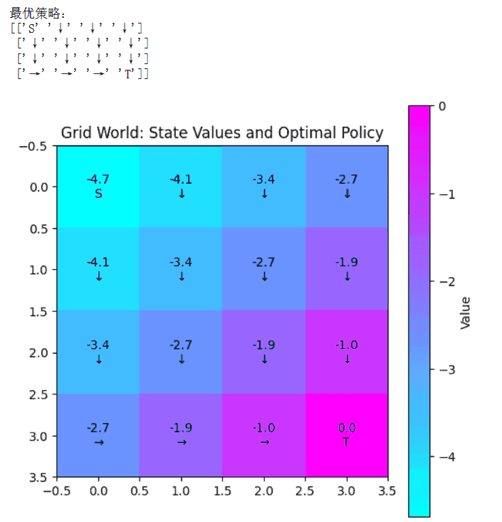
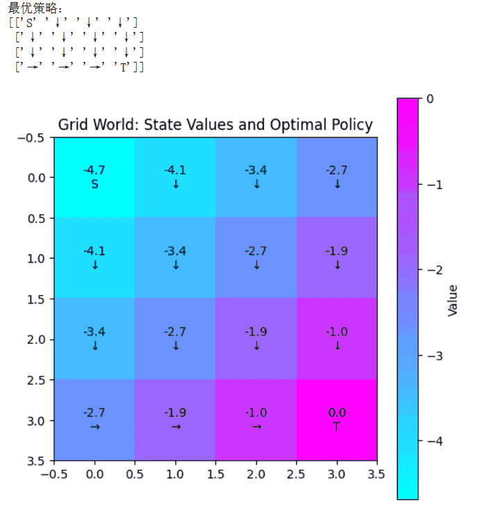
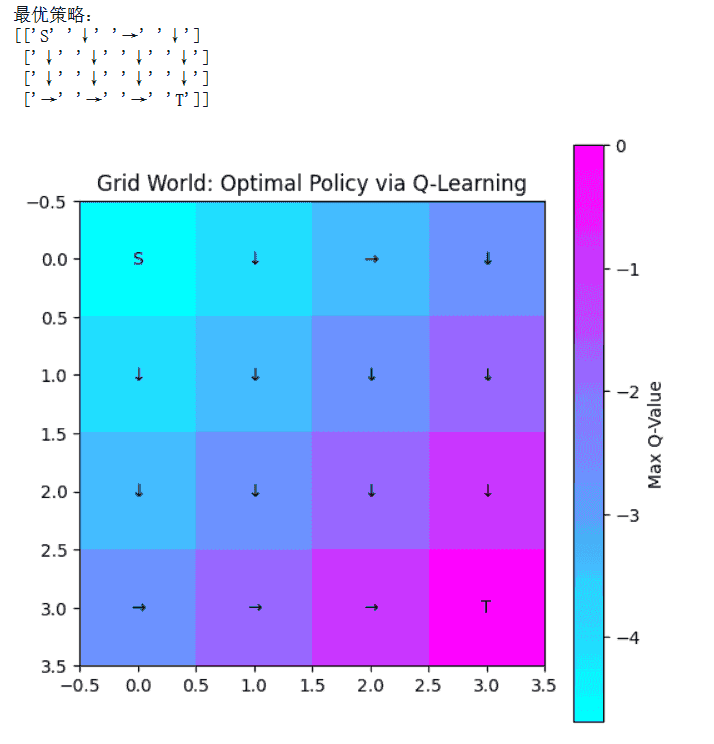

# 强化学习
强化学习（Reinforcement Learning, RL）是一类通过与环境交互来学习最优决策策略的机器学习方法。与监督学习不同，强化学习没有直接提供的“正确答案”，而是通过奖励信号（reward）来评估行为的好坏。智能体（agent）在环境（environment）中执行动作（action），根据环境反馈获得奖励，并观察状态（state）变化。

强化学习的目标是学习一个策略，使得智能体在长期交互中获得累计奖励最大化。典型方法包括基于值函数的策略（如 Q-learning、SARSA）、基于策略优化的方法（如 Policy Gradient）、以及结合深度神经网络的深度强化学习（Deep RL）。如今，强化学习已经在机器人控制、游戏智能、资源调度和自动驾驶等领域逐步铺开。

由于本知识库的主题是机器学习，强化学习是机器学习的分支，但是强化学习内的知识体系又相当庞大，所以本知识库点到为止，目的是构建一个宏观的知识体系，如果有同学还想了解更多，我后续可以再出一个强化学习的知识库！
## 马尔可夫决策过程
马尔可夫决策过程（MDP）是强化学习和决策理论中的核心数学框架，用于描述具有随机性和序列决策特征的环境。MDP 假设环境的状态随时间变化，并且未来状态的转移只依赖于当前状态和智能体的行为，而与过去状态无关，这就是经典的“马尔可夫性”假设。

马尔可夫决策过程（MDP）是一个四元组 $$(S, A, P, R, \gamma)$$，其中：
1. 状态空间 S：表示环境可能处于的所有状态集合，每个状态 $$s \in S$$ 描述了环境在某一时刻的情况。
2. 动作空间 A：表示智能体在每个状态下可选择的所有动作集合，动作决定智能体对环境的干预。
3. 状态转移概率  $$P(s'|s,a)$$：描述在状态  $$s$$  采取动作 $$a$$ 后转移到状态 $$s'$$ 的概率分布，用于建模环境的随机性。
4. 奖励函数 $$R(s,a,s')$$：表示智能体在状态 $$s$$ 执行动作 $$a$$ 并转移到状态 $$s'$$ 时获得的即时反馈，指导智能体选择更优策略。
5. 折扣因子 $$\gamma \in [0,1]$$：用于计算累计奖励的折扣，使得智能体在做决策时平衡短期奖励和长期收益。

MDP 的核心问题是找到一个最优策略 $$\pi^*$$，使智能体在环境中采取策略后获得的 期望累计奖励最大化。策略 $$\pi(s)$$ 定义了在每个状态下选择动作的规则。

解决 MDP 的常用方法包括：

**1**. 动态规划（Dynamic Programming, DP）

 通过贝尔曼方程（Bellman Equation）迭代求解状态值函数 V(s) 或动作值函数 Q(s,a)，逐步更新策略，直至收敛到最优策略。

**2**. 值迭代（Value Iteration）与策略迭代（Policy Iteration）
  - 值迭代直接迭代更新值函数，最终根据值函数导出最优策略。
  - 策略迭代交替进行策略评估和策略改进，直到策略不再改变，得到最优策略。

**3**. 强化学习方法

 当环境的状态转移概率和奖励函数未知时，可通过交互式学习方法（如 Q-learning、SARSA）估计值函数，逐步逼近最优策略。

下面我们通过代码演示如何在一个小型 MDP 上使用 值迭代（Value Iteration） 求解最优策略，为了直观展示，我用一个简单的网格世界（Grid World）环境：
```python
import numpy as np
import matplotlib.pyplot as plt

# 1. 网格世界参数
n_rows, n_cols = 4, 4
n_states = n_rows * n_cols
n_actions = 4  # 上,下,左,右

action_offsets = [(-1,0),(1,0),(0,-1),(0,1)]
action_symbols = ['↑','↓','←','→']

start_state = 0       # 左上角 S
terminal_state = n_states - 1  # 右下角 T
reward_step = -1
reward_terminal = 0

# 状态转移函数
def next_state_reward(s, a):
    row, col = divmod(s, n_cols)
    if s == terminal_state:
        return s, reward_terminal
    dr, dc = action_offsets[a]
    new_row = min(max(row+dr,0), n_rows-1)
    new_col = min(max(col+dc,0), n_cols-1)
    s_next = new_row * n_cols + new_col
    return s_next, reward_step

# 2. 值迭代
gamma = 0.9
theta = 1e-4
V = np.zeros(n_states)

while True:
    delta = 0
    for s in range(n_states):
        if s == terminal_state:
            continue
        v = V[s]
        V[s] = max([next_state_reward(s,a)[1] + gamma*V[next_state_reward(s,a)[0]] for a in range(n_actions)])
        delta = max(delta, abs(v-V[s]))
    if delta < theta:
        break

# 3. 求最优策略
policy = np.full(n_states,'',dtype=object)
for s in range(n_states):
    if s == start_state:
        policy[s] = 'S'
    elif s == terminal_state:
        policy[s] = 'T'
    else:
        q_values = [next_state_reward(s,a)[1] + gamma*V[next_state_reward(s,a)[0]] for a in range(n_actions)]
        policy[s] = action_symbols[np.argmax(q_values)]

grid_policy = policy.reshape(n_rows, n_cols)
print("最优策略：")
print(grid_policy)

# 4. 可视化值函数和策略
plt.figure(figsize=(6,6))
plt.imshow(V.reshape(n_rows, n_cols), cmap='cool', interpolation='nearest')
for i in range(n_rows):
    for j in range(n_cols):
        plt.text(j,i,f"{V[i*n_cols+j]:.1f}\n{grid_policy[i,j]}",ha='center',va='center',color='black')
plt.title("Grid World: State Values and Optimal Policy")
plt.colorbar(label="Value")
plt.show()
```
运行结果如下图，其中输出网格中每个状态对应的最优动作（↑↓←→），终点用 T 标记。颜色越深表示状态价值越高，图上同时标出最优策略，可以直观看到智能体如何从左上角走向右下角终点。


MDP 在强化学习和决策问题中应用广泛。例如，机器人控制任务中，状态表示机器人的位置和姿态，动作表示可执行的控制命令；在资源调度问题中，状态表示系统资源使用情况，动作表示任务分配策略；在游戏 AI 中，状态表示游戏棋盘或场景信息，动作表示玩家可能采取的操作。通过将这些问题建模为 MDP，可以系统性地求解最优策略，实现智能体自主决策和长期收益最大化。

马尔可夫决策过程提供了一个结构化的数学框架，将序列决策问题形式化为状态、动作、奖励和转移概率的组合。通过动态规划、值迭代、策略迭代以及强化学习方法，MDP 可以帮助智能体在不确定环境中学习最优策略。作为强化学习的理论基础，MDP 不仅在学术研究中具有重要意义，也在机器人、游戏、调度和自动驾驶等实际应用中展现出强大的价值。

## 动态规划与值迭代
在强化学习中，动态规划（Dynamic Programming, DP） 是求解决策问题的一种经典方法，它假设环境的状态转移概率和奖励函数已知，通过系统地分解问题、利用最优子结构特性求解最优策略。

值迭代（Value Iteration）是动态规划中最常用的一种算法，能够高效地计算马尔可夫决策过程（MDP）中的最优状态价值函数，从而导出最优策略。

动态规划的核心思想是 将复杂的决策问题拆解成子问题，并通过已解决的子问题结果来求解整体问题。对于强化学习中的 MDP（Markov Decision Process），动态规划的目标是计算每个状态的最优价值函数 $$V^*(s)$$。

$$V^*(s) = \max_a \sum_{s'} P(s'|s,a) \big[ R(s,a,s') + \gamma V^*(s') \big]$$

其中：
- $$s$$ 表示当前状态
- $$a$$ 表示动作
- $$s′$$ 表示下一状态
- $$P(s′∣s,a)$$ 为状态转移概率
- $$R(s,a,s′)$$ 为奖励函数
- $$γ$$ 为折扣因子，控制未来奖励的重要性

一旦求得最优状态价值函数  $$V^*(s)$$，最优策略 $$\pi^*(s)$$ 可以通过选择在当前状态下能获得最大期望收益的动作得到：$$\pi^*(s) = \arg\max_a \sum_{s'} P(s'|s,a) \big[ R(s,a,s') + \gamma V^*(s') \big]$$

值迭代（Value Iteration） 是一种基于动态规划的迭代方法，用于求解 MDP 的最优状态价值函数和策略。它的主要步骤如下：
1. 初始化：将每个状态的价值函数 $$V(s)$$ 初始化为 0 或任意值。
2. 迭代更新：对于每个状态 $$s$$，更新其价值： $$V(s) \leftarrow \max_a \sum_{s'} P(s'|s,a) \big[ R(s,a,s') + \gamma V(s') \big]$$
3. 收敛判定：当所有状态价值更新变化量 $$\Delta$$ 小于阈值 $$\theta$$ 时，迭代停止。
4. 导出最优策略：根据收敛后的价值函数，选择使期望收益最大的动作作为最优策略。

相比策略迭代，值迭代每一步只更新价值函数，不需要显式地保存和更新策略，因此实现更简单且计算效率高。

下面通过一个 4×4 网格世界示例展示值迭代的实现：
```python
import numpy as np
import matplotlib.pyplot as plt

# 网格世界参数
n_rows, n_cols = 4, 4
n_states = n_rows * n_cols
n_actions = 4  # 上,下,左,右
action_offsets = [(-1,0),(1,0),(0,-1),(0,1)]
action_symbols = ['↑','↓','←','→']

start_state = 0
terminal_state = n_states-1
reward_step = -1
reward_terminal = 0
gamma = 0.9
theta = 1e-4

def next_state_reward(s,a):
    row,col = divmod(s,n_cols)
    if s==terminal_state:
        return s, reward_terminal
    dr,dc = action_offsets[a]
    new_row = min(max(row+dr,0),n_rows-1)
    new_col = min(max(col+dc,0),n_cols-1)
    s_next = new_row*n_cols+new_col
    return s_next, reward_step

# 值迭代
V = np.zeros(n_states)
while True:
    delta = 0
    for s in range(n_states):
        if s==terminal_state:
            continue
        v = V[s]
        V[s] = max([next_state_reward(s,a)[1]+gamma*V[next_state_reward(s,a)[0]] for a in range(n_actions)])
        delta = max(delta, abs(v-V[s]))
    if delta<theta:
        break

# 导出最优策略
policy = np.full(n_states,'',dtype=object)
for s in range(n_states):
    if s==start_state:
        policy[s]='S'
    elif s==terminal_state:
        policy[s]='T'
    else:
        q_values = [next_state_reward(s,a)[1]+gamma*V[next_state_reward(s,a)[0]] for a in range(n_actions)]
        policy[s]=action_symbols[np.argmax(q_values)]

grid_policy = policy.reshape(n_rows,n_cols)
print("最优策略：")
print(grid_policy)

# 可视化值函数和策略
plt.figure(figsize=(6,6))
plt.imshow(V.reshape(n_rows,n_cols), cmap='cool', interpolation='nearest')
for i in range(n_rows):
    for j in range(n_cols):
        plt.text(j,i,f"{V[i*n_cols+j]:.1f}\n{grid_policy[i,j]}",ha='center',va='center',color='black')
plt.title("Grid World: State Values and Optimal Policy")
plt.colorbar(label="Value")
plt.show()
```
结果如下，左上角为起点 S，右下角为终点 T。每个格子显示对应的最优动作方向（↑↓←→），智能体能够顺利从起点到达终点，颜色越深表示状态价值越高，显示状态越接近终点的累计收益越大。值迭代通过迭代更新状态价值函数，最终收敛到最优值函数，从而导出全局最优策略。


总结一下就是动态规划提供了求解马尔可夫决策过程的一般框架，而值迭代则是最常用的实现方式之一。通过迭代更新状态价值函数，值迭代能够高效求得最优策略。

## Q-learning
Q-Learning 是强化学习中最经典的基于值函数的无模型方法（model-free method）之一，用于求解马尔可夫决策过程（MDP）中的最优策略。它不依赖于已知的环境状态转移概率，只需通过智能体与环境的交互经验就能学习最优策略，因此在实际强化学习任务中应用广泛。

Q-Learning 的核心是学习每个状态-动作对的价值函数（Q 函数）：

$$Q(s,a) = \text{在状态 } s \text{下选择动作 } a \text{的期望累积回报}$$

最优 Q 函数满足贝尔曼最优方程：$$Q^*(s,a) = \mathbb{E}\big[ R_{t+1} + \gamma \max_{a'} Q^*(s_{t+1},a') \,|\, s_t=s, a_t=a \big]$$

其中：
- $$s$$ 为当前状态
- $$a$$ 为当前动作
- $$s′$$ 为下一个状态
- $$R_{t+1}$$ 为即时奖励
- $$\gamma$$ 为折扣因子

通过不断更新 Q 值，Q-Learning 能收敛到最优 Q 函数 $$Q^*$$，从而导出最优策略：$$\pi^*(s) = \arg\max_a Q^*(s,a)$$

Q-Learning 算法的步骤如下：
1. 初始化：对每个状态-动作对 Q(s,a) 初始化为 0 或小随机数。
2. 交互学习：在每个时间步 t，智能体从状态 s 选择动作 a（通常采用 ϵ-贪心策略）。
3. 执行动作：智能体执行动作 a，观察奖励$$R_{t+1}$$  和下一个状态 s'。
4. 更新 Q 值： $$Q(s,a) \leftarrow Q(s,a) + \alpha \big[ R_{t+1} + \gamma \max_{a'} Q(s',a') - Q(s,a) \big]$$，其中 $$\alpha$$为学习率。
5.  迭代直到收敛：重复步骤 2-4，直至 Q 值收敛或达到最大迭代次数。

下面我们通过 4×4 网格世界演示 Q-Learning 学习最优策略，
```python
import numpy as np
import matplotlib.pyplot as plt

# 网格世界参数
n_rows, n_cols = 4, 4
n_states = n_rows * n_cols
n_actions = 4  # 上,下,左,右
action_offsets = [(-1,0),(1,0),(0,-1),(0,1)]
action_symbols = ['↑','↓','←','→']

start_state = 0
terminal_state = n_states-1
reward_step = -1
reward_terminal = 0

gamma = 0.9
alpha = 0.1
epsilon = 0.1
n_episodes = 5000

# 状态转移
def next_state_reward(s,a):
    row,col = divmod(s,n_cols)
    if s==terminal_state:
        return s,reward_terminal
    dr,dc = action_offsets[a]
    new_row = min(max(row+dr,0),n_rows-1)
    new_col = min(max(col+dc,0),n_cols-1)
    s_next = new_row*n_cols+new_col
    return s_next,reward_step

# 初始化 Q 表
Q = np.zeros((n_states,n_actions))

# Q-Learning 主循环
for episode in range(n_episodes):
    s = start_state
    while s != terminal_state:
        # epsilon-greedy 选择动作
        if np.random.rand() < epsilon:
            a = np.random.randint(n_actions)
        else:
            a = np.argmax(Q[s])
        s_next, r = next_state_reward(s,a)
        Q[s,a] += alpha*(r + gamma*np.max(Q[s_next]) - Q[s])
        s = s_next

# 导出最优策略
policy = np.full(n_states,'',dtype=object)
for s in range(n_states):
    if s==start_state:
        policy[s]='S'
    elif s==terminal_state:
        policy[s]='T'
    else:
        policy[s] = action_symbols[np.argmax(Q[s])]

grid_policy = policy.reshape(n_rows,n_cols)
print("最优策略：")
print(grid_policy)

# 可视化
plt.figure(figsize=(6,6))
plt.imshow(np.max(Q,axis=1).reshape(n_rows,n_cols), cmap='cool', interpolation='nearest')
for i in range(n_rows):
    for j in range(n_cols):
        plt.text(j,i,f"{grid_policy[i*n_cols+j]}",ha='center',va='center',color='black')
plt.title("Grid World: Optimal Policy via Q-Learning")
plt.colorbar(label="Max Q-Value")
plt.show()
```
结果如下图，同样，起点 S 到终点 T 的路径由策略指示，方向箭头指明智能体应该采取的动作，颜色深表示该状态下最大 Q 值较高，说明靠近终点或通往终点的动作更优。

简单总结一下，Q-Learning 是强化学习中基础而重要的算法，通过不断更新状态-动作价值函数，智能体可以在未知环境中学习最优策略。其优点是无模型、简单易实现、收敛性良好，缺点是状态空间和动作空间过大时需要采用函数逼近（如深度 Q 网络）。

最新的文章都在公众号更新，别忘记关注哦！！！如果想要加入技术群聊，扫描下方二维码回复【加群】即可。
