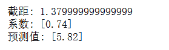
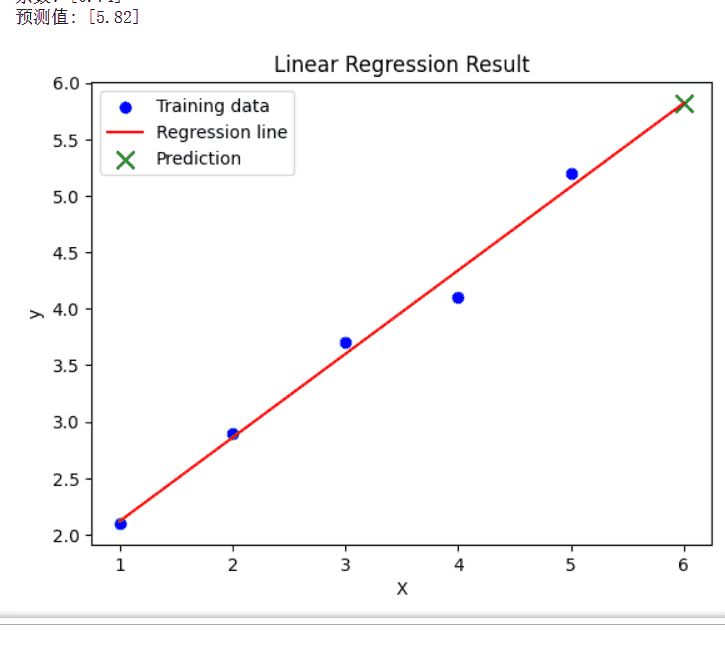
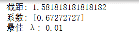
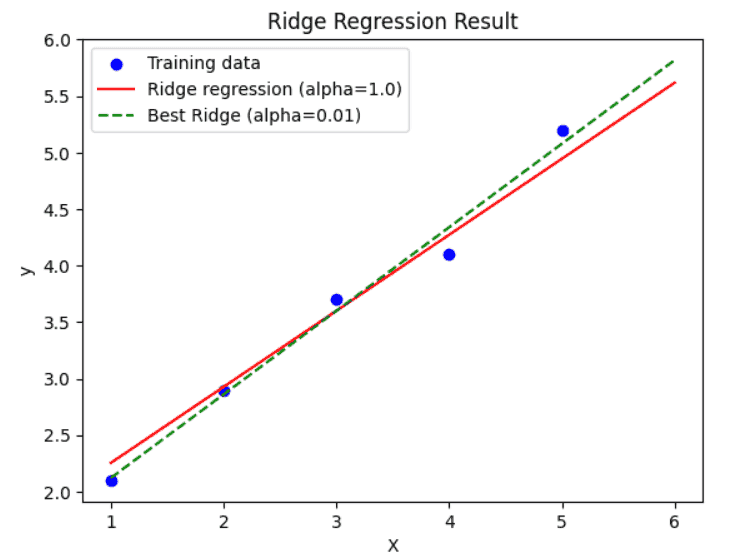
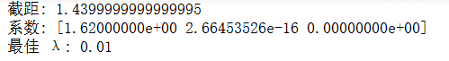
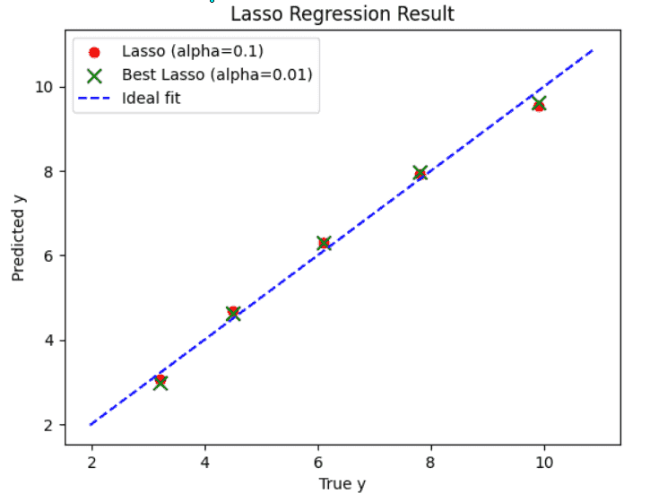
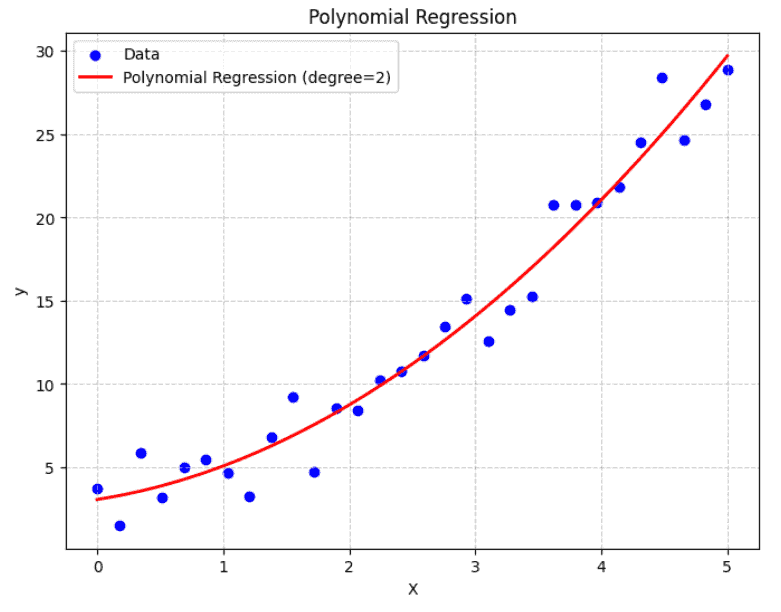

# 回归模型
回归模型（Regression Models） 是监督学习中用于预测连续数值的一类方法，其核心目标是：根据输入特征预测数值型输出。
回归模型尝试学习一个函数 $$f(x)$$，使得输入特征 $$x$$ 映射到连续输出 $$y$$：
$$y≈f(x)$$

回归任务在现实生活中非常常见，比如预测房价、股票价格、销量、温度等。

根据模型形式和复杂度，回归模型可以分为多种类型：
- 线性回归：假设输出是输入特征的线性组合，简单高效；
- 正则化回归（Ridge、Lasso）：在线性回归基础上加入约束，防止过拟合；
- 多项式回归：通过高次项捕捉非线性关系；
- 树回归与集成方法：如决策树回归、随机森林回归、GBDT 等，适合复杂非线性问题。

回归模型不仅关注预测精度，也常用于 特征分析 和 因果关系探索，在工业和科研领域都有广泛应用。

## 线性回归
### 什么是线性回归
线性回归是最基础也是最经典的回归方法，最经典的线性回归问题就是房价预测、股票价格预测，其核心思想是**通过输入特征的线性组合来预测连续输出变量**。

数学上，假设有 $$n$$ 个样本，每个样本有 $$d$$ 个特征，线性回归模型可以表示为：
$$y_i = \beta_0 + \beta_1 x_{i1} + \beta_2 x_{i2} + \dots + \beta_d x_{id} + \epsilon_i$$

其中：
- $$y_i$$是第 i个样本的真实输出；
- $$x_{ij}$$是第 i 个样本的第 j 个特征；
- $$\beta_0$$ 是截距项， $$\beta_1, \dots, \beta_d$$ 是模型系数；
- $$\epsilon_i$$ 是误差项，表示无法被线性模型解释的部分
。
目标是找到一组系数 $$\beta$$，使模型对训练数据的预测误差最小。

为了保证模型有效性，线性回归通常假设：
1. 线性关系：特征与目标之间是线性关系；
2. 误差独立同分布： $$\epsilon_i \sim N(0, \sigma^2)$$；
3. 无多重共线性：特征间不高度相关；
4. 同方差性：误差方差一致；
5. 误差期望为零： $$\mathbb{E}[\epsilon_i] = 0$$。

### 损失函数与参数求解
线性回归通常使用 最小二乘法（Ordinary Least Squares, OLS） 作为损失函数：
$$J(\beta) = \sum_{i=1}^{n} (y_i - \hat{y}_i)^2 = \sum_{i=1}^{n} \Big(y_i - (\beta_0 + \sum_{j=1}^d \beta_j x_{ij}) \Big)^2$$

目标是最小化损失函数 $$J(\beta)$$ 以获得最佳的 $$\beta$$。

**正规方程解法**

闭式解为：$$\beta = (X^T X)^{-1} X^T y$$

其中 $$X \in \mathbb{R}^{n \times (d+1)}$$ 是特征矩阵（第一列为1，表示截距），y 是目标向量。

**梯度下降求解**

对于大规模数据，通常使用梯度下降迭代更新参数：$$\beta_j := \beta_j - \alpha \frac{\partial J}{\partial \beta_j}$$

其中 $$\alpha$$ 是学习率，梯度为：$$\frac{\partial J}{\partial \beta_j} = -2 \sum_{i=1}^{n} x_{ij} (y_i - \hat{y}_i)$$

### 评价指标
常用指标衡量回归模型性能：
- 均方误差（MSE）：$$\text{MSE} = \frac{1}{n} \sum_{i=1}^{n} (y_i - \hat{y}_i)^2$$
- 均方根误差（RMSE）： $$\text{RMSE} = \sqrt{\text{MSE}}$$
- 平均绝对误差（MAE）：$$\text{MAE} = \frac{1}{n} \sum_{i=1}^{n} |y_i - \hat{y}_i|$$
- 决定系数（ $$R^2$$）：$$R^2 = 1 - \frac{\sum_i (y_i - \hat{y}_i)^2}{\sum_i (y_i - \bar{y})^2}$$表示模型解释目标变量方差的比例


下面举一个简单的线性回归的示例代码
```python
import numpy as np
from sklearn.linear_model import LinearRegression

# 构造数据
X = np.array([[1], [2], [3], [4], [5]])
y = np.array([2.1, 2.9, 3.7, 4.1, 5.2])

# 训练线性回归模型
model = LinearRegression()
model.fit(X, y)

# 查看截距和系数
print("截距:", model.intercept_)
print("系数:", model.coef_)

# 预测新数据
X_new = np.array([[6]])
y_pred = model.predict(X_new)
print("预测值:", y_pred)
```
输出如下：



可以看到线性回归得到的方程为y=0.74x+1.379999(好多9)，预测出来了当x为6的时候，y的值为5.82。

线性回归的内容到此就结束啦，是不是超级简单，线性回归是最简单也最容易理解的回归模型，计算比较高效，同时可解释性强，系数反映特征对目标的影响，对小数据和线性问题效果良好。但是线性回归对非线性关系拟合能力有限，同时对异常值敏感，假设条件不满足时，预测可能偏差大。

## 岭回归
### 什么是岭回归
岭回归是 线性回归的一种正则化扩展，主要用于解决 多重共线性（特征高度相关） 或 过拟合问题。

在线性回归中，如果特征之间高度相关，或者样本数量少于特征数量，普通最小二乘法（OLS）可能导致系数震荡，预测不稳定。岭回归通过在损失函数中加入 L2 正则化项，对系数施加约束，使模型更稳定。

### 岭回归原理
**损失函数**

普通线性回归的最小二乘法损失函数为：$$J(\beta) = \sum_{i=1}^{n} (y_i - \hat{y}_i)^2$$

岭回归在此基础上增加 L2 正则化项：$$J_{ridge}(\beta) = \sum_{i=1}^{n} (y_i - \hat{y}_i)^2 + \lambda \sum_{j=1}^{d} \beta_j^2$$

其中：
- $$\lambda$$ 是正则化强度参数，控制系数的压缩程度；
  - $$\lambda \geq 0$$ 为正则化强度参数
  - $$\lambda = 0$$：退化为普通线性回归；
  - $$\lambda$$ 增大：系数被压缩，模型更加平滑，减少过拟合；
  - $$\lambda$$ 过大：模型可能欠拟合，偏差增大。
  通常通过 交叉验证 选择最优 $$\lambda$$ 值。
- 第二项约束系数 $$\beta_j$$ 的大小，避免过大或震荡。

**正规方程求解**

岭回归的闭式解为：$$\beta = (X^T X + \lambda I)^{-1} X^T y$$

相比普通线性回归的 $$(X^T X)^{-1} X^T y$$，加入了 $$\lambda I$$ 项，使矩阵 始终可逆，提高了数值稳定性。

下面我们同样通过一个简单的示例来进行理解。

```python
import numpy as np
from sklearn.linear_model import Ridge
from sklearn.model_selection import GridSearchCV

# 构造数据
X = np.array([[1], [2], [3], [4], [5]])
y = np.array([2.1, 2.9, 3.7, 4.1, 5.2])

# 使用 Ridge 回归
ridge = Ridge(alpha=1.0)  # alpha 对应 λ
ridge.fit(X, y)

print("截距:", ridge.intercept_)
print("系数:", ridge.coef_)

# 使用 GridSearchCV 寻找最佳 λ
param_grid = {'alpha': [0.01, 0.1, 1, 10, 100]}
grid = GridSearchCV(Ridge(), param_grid, cv=5)
grid.fit(X, y)
print("最佳 λ:", grid.best_params_['alpha'])
```
输出结果为：



简单总结一下就是岭回归的特点是可以缓解多重共线性问题，提高模型稳定性，减少系数震荡，适用于高维小样本数据。但是存在的问题是所有系数都被压缩，可能降低可解释性，同时无法进行特征选择（系数不会变为零），如果$$\lambda$$ 选择不当会导致欠拟合或过拟合。

岭回归的应用场景包括高维特征预测（如基因数据、文本向量等）、样本量小但特征多的回归问题和特征存在强相关性或噪声的场景。

岭回归是 线性回归的稳健版本，通过引入 L2 正则化，既保持了线性模型的可解释性，又增强了模型在复杂、高维或相关性强的数据上的稳定性。

## Lasso 回归
### 什么是 Lasso 回归
Lasso 回归（Least Absolute Shrinkage and Selection Operator） 是在线性回归的基础上引入 L1 正则化 的方法。与岭回归（Ridge）不同，Lasso 不仅能抑制模型过拟合，还能 自动进行特征选择 —— 通过将部分回归系数压缩为零，筛掉不重要的特征。这里很好理解哈，系数为0，不就是不用这个特征了。

因此，Lasso 是一种 兼顾正则化与特征选择 的方法，适合在特征数量远大于样本数量的情况下，比如如文本分析、基因数据分析；同时适用于高维稀疏建模，在广告点击率预测、推荐系统中常见；Lasso回归还能进行模型压缩，通过去除不重要特征，简化模型，降低计算成本。

### Lasso 回归原理

**损失函数**

普通线性回归（最小二乘）损失函数为：$$J(\beta) = \sum_{i=1}^{n} (y_i - \hat{y}_i)^2$$

Lasso 回归在其基础上引入 L1 正则化项：$$J_{lasso}(\beta) = \sum_{i=1}^{n} (y_i - \hat{y}_i)^2 + \lambda \sum_{j=1}^{d} |\beta_j|$$

其中：
- $$\lambda \geq 0$$ 是正则化系数，控制惩罚力度
  - $$\lambda = 0$$：退化为普通线性回归；
  - $$\lambda$$ 增大：更多系数被压缩为 0，模型更简单，但可能欠拟合；
  - $$\lambda$$ 的选择通常通过 交叉验证 确定。
- L1 范数会使某些 $$\beta_j$$ 收缩为 0，从而起到特征选择作用。

### Lasso 与岭回归的差别
- 岭回归（L2）：将系数压缩得更小，但不会变成 0；
- Lasso 回归（L1）：系数可以被压缩到 正好为 0，实现特征筛选。

几何直观：
- L2 正则化对应圆形约束，解往往落在非零系数上；
- L1 正则化对应菱形约束，更容易“卡”在坐标轴上，从而产生稀疏解。

下面我们通过一个简单的示例加深一下Lasso回归的理解
```python
import numpy as np
from sklearn.linear_model import Lasso
from sklearn.model_selection import GridSearchCV

# 构造数据
X = np.array([[1, 2, 3],
              [2, 3, 4],
              [3, 4, 5],
              [4, 5, 6],
              [5, 6, 7]])
y = np.array([3.2, 4.5, 6.1, 7.8, 9.9])

# 使用 Lasso 回归
lasso = Lasso(alpha=0.1)  # alpha 即 λ
lasso.fit(X, y)

print("截距:", lasso.intercept_)
print("系数:", lasso.coef_)

# 使用交叉验证选择 λ
param_grid = {'alpha': [0.01, 0.1, 1, 10]}
grid = GridSearchCV(Lasso(), param_grid, cv=5)
grid.fit(X, y)
print("最佳 λ:", grid.best_params_['alpha'])
```
输出如下，注意这里输入是三维特征，也就是$$y=k1*x1+k2*x2+k3*x3$$


这说明 Lasso 自动舍弃了某些特征，实现了稀疏化。


简单总结就是Lasso 回归能够 自动特征选择，提升模型可解释性，在高维稀疏数据（如文本、基因数据）中表现良好，有助于减少过拟合，提高泛化性能。但是缺点是当特征数远大于样本数时，Lasso 最多只能选择 n 个特征；如果特征高度相关，Lasso 会随机选择其中一个，而舍弃其他；同时λ 的选择至关重要，过大可能损失有用信息。

## 多项式回归
### 什么是多项式回归
多项式回归（Polynomial Regression） 是一种对 非线性关系 建模的回归方法。
 它的核心思想是：虽然输入变量与输出变量之间的关系可能不是线性的，但我们可以通过 将输入特征映射到更高维的多项式空间，再用线性回归去拟合。
比如如果关系是曲线而不是直线，普通线性回归就难以捕捉，但多项式回归可以通过增加高阶项来建模。

### 多项式回归原理
**公式表达**

普通线性回归模型：$$y = \beta_0 + \beta_1 x + \epsilon$$

多项式回归模型（以二次多项式为例）：$$y = \beta_0 + \beta_1 x + \beta_2 x^2 + \epsilon$$

推广到 k 阶多项式回归：$$y = \beta_0 + \beta_1 x + \beta_2 x^2 + \cdots + \beta_k x^k + \epsilon$$

其中：
- x 是自变量
- $$\beta_j$$ 是参数
- $$\epsilon$$ 是误差项
虽然公式中有高次项，但本质上依然是 线性模型（对参数线性），所以可以用线性回归的方法求解。

**特征扩展视角**

如果我们把原始输入 x 扩展成一个向量：$$[1, x, x^2, \cdots, x^k]$$

那么多项式回归就是在高维空间做线性回归。

例如：
- 输入 x=2，若二次扩展，则特征向量为[1, 2, 4]。
- 回归模型学习到的就是这些特征的线性组合。


下面来看一个简单示例吧：
```python
import numpy as np
import matplotlib.pyplot as plt
from sklearn.linear_model import LinearRegression
from sklearn.preprocessing import PolynomialFeatures

# 构造数据
X = np.linspace(0, 5, 30).reshape(-1, 1)
y = 2 + 1.5 * X + 0.8 * X**2 + np.random.randn(30, 1) * 2  # 二次关系 + 噪声

# 二次多项式特征扩展
poly = PolynomialFeatures(degree=2)  
X_poly = poly.fit_transform(X)

# 拟合模型
model = LinearRegression()
model.fit(X_poly, y)

# 预测
X_test = np.linspace(0, 5, 100).reshape(-1, 1)
y_pred = model.predict(poly.transform(X_test))

# 可视化
plt.figure(figsize=(8, 6))
plt.scatter(X, y, color="blue", label="Data")  # 真实数据
plt.plot(X_test, y_pred, color="red", linewidth=2, label="Polynomial Regression (degree=2)")  # 回归曲线
plt.xlabel("X")      # x 轴标签
plt.ylabel("y")      # y 轴标签
plt.title("Polynomial Regression")  # 标题
plt.legend()
plt.grid(True, linestyle="--", alpha=0.7)  # 加网格线
plt.show()
```
运行结果如下，其中蓝点是真实数据（带噪声的二次曲线），红线是多项式回归的拟合结果，可以很好地捕捉曲线趋势。


多项式回归能够捕捉非线性关系，比普通线性回归更灵活；形式简单，易于理解和实现；在一定程度上能拟合复杂曲线。但是缺点是高阶多项式可能导致 过拟合，计算复杂度上升，外推能力差（在训练区间之外预测常常失真）。

在描述非线性的边际效应（如成本与产量的关系），拟合实验数据中的曲线关系（如物理实验中的轨迹曲线），用于建模传感器信号的非线性响应时，变量之间呈现曲线关系，多项式回归是一个简单有效的选择。

最新的文章都在公众号更新，别忘记关注哦！！！如果想要加入技术群聊，扫描下方二维码回复【加群】即可。
