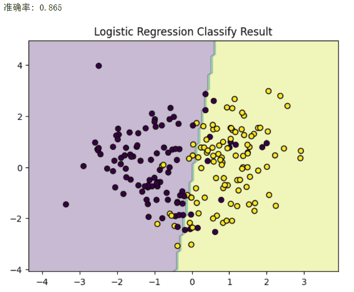
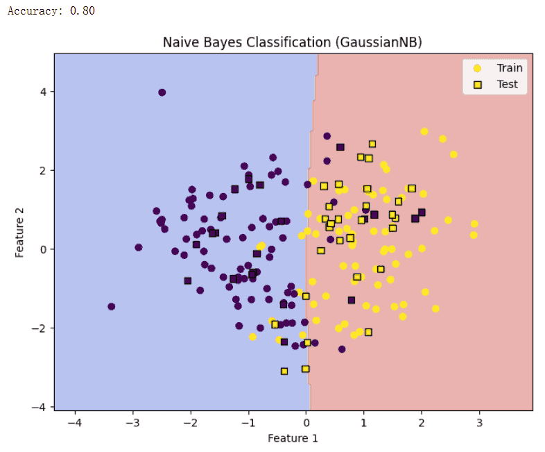
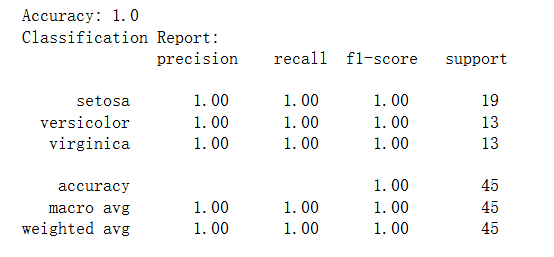
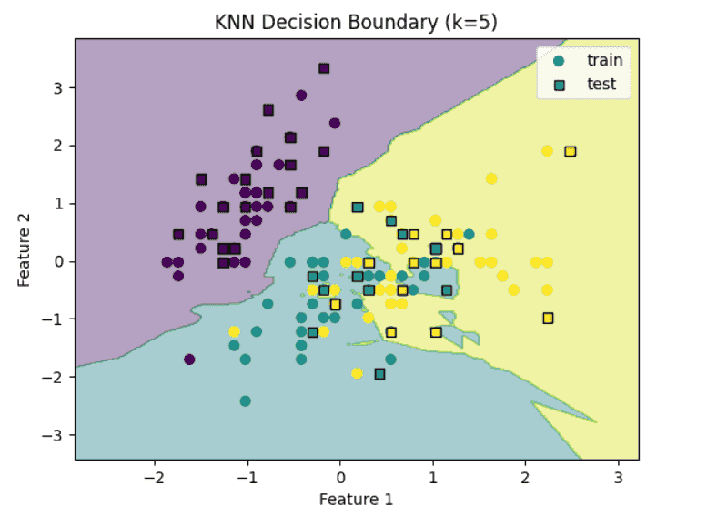
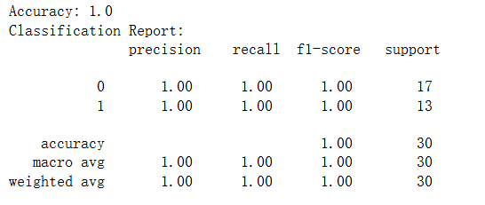
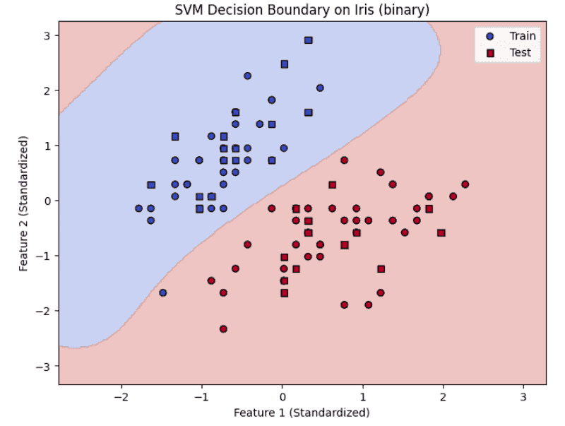

# 分类模型 
分类模型（Classification Models） 是监督学习中的另一大核心分支，目标是将输入样本正确地划分到预定义的类别中。与回归模型预测连续值不同，分类模型的输出是 离散的类别标签。

典型的分类任务包括垃圾邮件识别（邮件 → 正常/垃圾）、疾病诊断（患者症状 → 是否患病）、图像识别（图片 → 猫/狗/人）等。

在分类方法中，有的模型通过 概率推断 来进行分类（如逻辑回归、朴素贝叶斯），有的依赖 相似性度量（如 k 最近邻），还有的借助 决策边界与超平面 来完成划分（如支持向量机）。除此之外，树模型和集成方法也在分类问题中表现突出。

## 逻辑回归
在分类任务中，我们常常希望回答这样的问题：
- 一封邮件是垃圾邮件还是正常邮件？
- 一位患者是否患有某种疾病？
- 一张图片是猫还是狗？
这些问题的本质就是 二分类问题。逻辑回归（Logistic Regression）是解决二分类问题最经典、最常用的方法之一，因其简单高效，被广泛应用于金融风控、医学诊断、自然语言处理等领域。

### 逻辑回归的基本思想
与线性回归类似，逻辑回归也尝试通过输入特征的线性组合来预测结果。但不同的是：
- 线性回归直接输出一个连续值；
- 逻辑回归需要输出一个概率（范围在 0 到 1 之间）。
因此，逻辑回归引入了一个 Sigmoid 函数，将线性模型的输出“压缩”到概率空间。

### 数学原理
**1.Sigmoid 函数**

Sigmoid 函数将任意输入映射到 (0,1) 区间，非常适合用于二分类问题。

$$\sigma(z) = \frac{1}{1 + e^{-z}}$$

其中：
- $$z = \beta_0 + \beta_1 x_1 + \cdots + \beta_n x_n$$
- σ(z) 的输出范围在 (0,1)

例如：
- 如果 σ(z)≈0.9，说明样本属于正类的概率高；
- 如果 σ(z)≈0.1，说明样本更可能属于负类。

**2.假设函数**

逻辑回归的预测函数为：$$h_\theta(x) = \frac{1}{1 + e^{-(\theta^T x)}}$$

这里 $$h_\theta(x)$$表示样本 x 属于正类（记为 y=1）的概率。

**3.决策规则**

最终分类时，逻辑回归采用 阈值法：$$\hat{y} = \begin{cases} 1, & h_\theta(x) \geq 0.5 \\ 0, & h_\theta(x) < 0.5 \end{cases}$$

**4.损失函数**

逻辑回归使用 对数似然损失函数（Log Loss）：
$$L(\theta) = - \frac{1}{m} \sum_{i=1}^{m} \Big[ y^{(i)} \log h_\theta(x^{(i)}) + (1-y^{(i)}) \log (1-h_\theta(x^{(i)})) \Big]$$

这个损失函数在概率接近真实标签时惩罚小，偏离时惩罚大，保证模型能更好地拟合概率分布。

直观点理解的话可以把逻辑回归想象成线性回归 + Sigmoid 激活函数，输出的是一个 事件发生的概率，最后通过阈值把概率转化为类别。

如果还不知道什么是激活函数，我在后面的深度学习内容中有讲。


下面依然是实践环节：
```python
import numpy as np
import matplotlib.pyplot as plt
from sklearn.datasets import make_classification
from sklearn.linear_model import LogisticRegression
from sklearn.metrics import accuracy_score

# 生成二分类数据
X, y = make_classification(n_samples=200, n_features=2, 
                           n_redundant=0, n_informative=2,
                           random_state=42)

# 拟合逻辑回归模型
model = LogisticRegression()
model.fit(X, y)

# 预测
y_pred = model.predict(X)
print("准确率:", accuracy_score(y, y_pred))

# 可视化分类边界
x_min, x_max = X[:, 0].min()-1, X[:, 0].max()+1
y_min, y_max = X[:, 1].min()-1, X[:, 1].max()+1
xx, yy = np.meshgrid(np.linspace(x_min, x_max, 100),
                     np.linspace(y_min, y_max, 100))
Z = model.predict(np.c_[xx.ravel(), yy.ravel()])
Z = Z.reshape(xx.shape)

plt.contourf(xx, yy, Z, alpha=0.3)
plt.scatter(X[:, 0], X[:, 1], c=y, edgecolors='k')
plt.title("逻辑回归分类结果")
plt.show()
```
运行结果如下，图中不同颜色的区域是逻辑回归划分的类别，数据点根据真实类别着色，可以看到逻辑回归学习到了一条线性决策边界。


简单总结，逻辑回归是一种 线性分类模型，通过 Sigmoid 函数输出概率，使用 对数似然损失 进行优化，简单高效，适合处理二分类问题，同时在高维稀疏数据（如文本分类）中也表现出色。

逻辑回归在金融：信用评分、违约预测，医疗：疾病诊断（如是否患癌症），市场营销：客户是否购买产品，NLP：文本情感分类（积极 / 消极）等方面已经成功实践。但是方法太简单，现在已经没人用了，不过依然是很重要的机器学习知识，所以学学还是有必要的！

## 朴素贝叶斯
朴素贝叶斯是一类基于贝叶斯定理（Bayes’ Theorem）的概率分类方法。它以“特征条件独立”的假设为基础，因此被称为“朴素”。尽管这个假设在现实中往往过于简化，但在许多实际应用（如文本分类、垃圾邮件过滤、情感分析等）中，朴素贝叶斯依然能够取得令人满意的效果。

其核心思想是：通过训练数据估计每个类别的 先验概率 和 条件概率，在预测时利用贝叶斯公式计算样本属于不同类别的后验概率，并将其分配给概率最大的类别。

### 贝叶斯定理回顾
贝叶斯定理的数学形式为：$$P(C|X) = \frac{P(X|C) \cdot P(C)}{P(X)}$$

其中：
- $$C$$：类别（class）
- $$X$$：特征向量（feature vector）
- $$P(C|X)$$：后验概率（样本属于类别 C 的概率）
- $$P(X|C)$$：类条件概率（在类别 C 下观测到 X 的概率）
- $$P(C)$$：先验概率（类别 C 出现的概率）
- $$P(X)$$：证据概率（样本 X 出现的概率）

在分类任务中，$$P(X)$$ 对所有类别相同，因此只需比较分子部分：$$P(C|X) \propto P(X|C) \cdot P(C)$$

### 朴素独立性假设
朴素贝叶斯的关键假设是：特征之间条件独立。即在给定类别 $$C$$ 的条件下，特征 $$x_1, x_2, ..., x_n$$ 相互独立：
$$P(X|C) = P(x_1, x_2, ..., x_n|C) = \prod_{i=1}^{n} P(x_i|C)$$
这种简化极大地降低了参数估计的复杂度，否则条件概率的计算会变得不可行。

### 朴素贝叶斯分类器的步骤
**1. 训练阶段：**
  - 计算每个类别的先验概率 $$P(C)$$；
  - 计算在不同类别下每个特征的条件概率 $$P(x_i|C)$$。

**2. 预测阶段：**
  - 对新样本 $$X=(x_1, x_2, ..., x_n)$$，计算每个类别的后验概率：$$P(C|X) \propto P(C) \cdot \prod_{i=1}^{n} P(x_i|C)$$
  - 选择概率最大的类别作为预测结果。

### 常见的朴素贝叶斯模型
**1. 高斯朴素贝叶斯（Gaussian NB）**
  - 假设特征服从高斯（正态）分布，常用于连续值特征。
  - 条件概率形式：$$P(x_i|C) = \frac{1}{\sqrt{2 \pi \sigma^2_C}} \exp \left(-\frac{(x_i - \mu_C)^2}{2\sigma^2_C}\right)$$

**2. 多项式朴素贝叶斯（Multinomial NB）**
  - 适合特征为计数型的数据，如文本词频。
  - 在文本分类（垃圾邮件识别、情感分类）中应用广泛。
  
**3. 伯努利朴素贝叶斯（Bernoulli NB）**
  - 特征取值为二元（0/1），例如词语是否在文档中出现。

```python
import numpy as np
import matplotlib.pyplot as plt
from sklearn.datasets import make_classification
from sklearn.naive_bayes import GaussianNB
from sklearn.metrics import accuracy_score

def naive_bayes_demo():
    """
    朴素贝叶斯分类示例函数
    """
    # 1. 构造二维分类数据
    X, y = make_classification(
        n_samples=200, n_features=2, n_classes=2, 
        n_informative=2, n_redundant=0, random_state=42
    )
    
    # 2. 拆分训练集和测试集
    train_size = 150
    X_train, X_test = X[:train_size], X[train_size:]
    y_train, y_test = y[:train_size], y[train_size:]
    
    # 3. 训练 Gaussian Naive Bayes 模型
    model = GaussianNB()
    model.fit(X_train, y_train)
    
    # 4. 测试集预测
    y_pred = model.predict(X_test)
    acc = accuracy_score(y_test, y_pred)
    print(f"Accuracy: {acc:.2f}")
    
    # 5. 可视化分类边界
    x_min, x_max = X[:, 0].min() - 1, X[:, 0].max() + 1
    y_min, y_max = X[:, 1].min() - 1, X[:, 1].max() + 1
    xx, yy = np.meshgrid(np.linspace(x_min, x_max, 200),
                         np.linspace(y_min, y_max, 200))
    
    Z = model.predict(np.c_[xx.ravel(), yy.ravel()])
    Z = Z.reshape(xx.shape)
    
    plt.figure(figsize=(8, 6))
    plt.contourf(xx, yy, Z, alpha=0.4, cmap=plt.cm.coolwarm)
    plt.scatter(X_train[:, 0], X_train[:, 1], c=y_train, marker='o', label="Train")
    plt.scatter(X_test[:, 0], X_test[:, 1], c=y_test, marker='s', edgecolor="k", label="Test")
    plt.xlabel("Feature 1")
    plt.ylabel("Feature 2")
    plt.title("Naive Bayes Classification (GaussianNB)")
    plt.legend()
    plt.show()

# 调用示例
naive_bayes_demo()
```
结果如下，图中不同颜色的区域是朴素贝叶斯划分的类别，数据点根据真实类别着色，可以看到朴素贝叶斯学习到了一条线性决策边界。


朴素贝叶斯的优点是简单高效，训练和预测速度快；对小规模数据表现良好，抗噪声能力较强；在文本分类、情感分析等任务中效果突出；并且参数少，解释性强。但是缺点包括特征独立性假设往往不成立，可能降低分类精度；对连续特征需要分布假设，若分布不符合，性能会下降；当某些条件概率为零时，可能导致整体概率为零。

简单进行总结，朴素贝叶斯是一种基于概率论的经典分类算法，依赖于条件独立的假设。尽管这个假设在现实中通常并不严格成立，但在实际应用中，它常常能取得相对优秀的效果。尤其在文本处理任务中，朴素贝叶斯因其高效、稳健而成为一个重要的基准模型。

## 最近邻（KNN）
K近邻算法（K-Nearest Neighbors, KNN）是一种常用的监督学习方法，既可用于分类，也可用于回归。它的核心思想非常直观：对于一个未知样本，计算它与训练集中所有样本的距离，找到距离最近的 K个邻居，然后根据这些邻居的类别或数值来确定预测结果。
KNN 不依赖于显式的模型假设，是一种 基于实例的学习方法，因此又称为 懒惰学习（Lazy Learning）。
### 基本思想
KNN的基本思想如下：
- 分类任务：未知样本的类别由它最邻近的 K 个样本类别“投票”决定，出现次数最多的类别即为预测结果。
- 回归任务：未知样本的预测值为它最邻近的 K 个样本目标值的平均值（或加权平均）。

是不是很简单，有同学就想了，就这，我也能想出来，但是一些最伟大的技术往往就源于最简单的思想，加油，说不定有一天你也可以提出一个震惊世界的理论。
### 距离度量
KNN 的核心是“距离”的定义，常见的距离度量方式有：
1. 欧氏距离（Euclidean Distance）：$$d(x, y) = \sqrt{\sum_{i=1}^n (x_i - y_i)^2}$$
2. 曼哈顿距离（Manhattan Distance）：$$d(x, y) = \sum_{i=1}^n |x_i - y_i|$$
3. 闵可夫斯基距离（Minkowski Distance）：$$d(x, y) = \left(\sum_{i=1}^n |x_i - y_i|^p \right)^{1/p}$$
4. 余弦相似度（Cosine Similarity）：常用于文本数据。

不同的任务可根据特征类型和分布选择合适的距离度量。

### 算法步骤
1. 确定参数K（邻居数）。
2. 计算距离：对待分类样本，计算它与训练集中所有样本的距离。
3. 选取K个最近邻居：按距离从小到大排序，选择前K个样本。
4. 投票或平均：
  - 分类：选择出现次数最多的类别；
  - 回归：计算K个邻居的均值或加权均值。
这里用 Python 的 scikit-learn 库来实现 KNN 分类，以经典的鸢尾花（Iris）数据集为例：
```python
from sklearn.datasets import load_iris
from sklearn.model_selection import train_test_split
from sklearn.preprocessing import StandardScaler
from sklearn.neighbors import KNeighborsClassifier
from sklearn.metrics import accuracy_score, classification_report

# 1. 加载数据集
iris = load_iris()
X, y = iris.data, iris.target

# 2. 划分训练集与测试集
X_train, X_test, y_train, y_test = train_test_split(X, y, test_size=0.3, random_state=42)

# 3. 特征标准化（非常重要，避免不同量纲影响距离计算）
scaler = StandardScaler()
X_train = scaler.fit_transform(X_train)
X_test = scaler.transform(X_test)

# 4. 定义并训练KNN模型
knn = KNeighborsClassifier(n_neighbors=5, weights='distance')  # K=5，距离加权
knn.fit(X_train, y_train)

# 5. 预测
y_pred = knn.predict(X_test)

# 6. 评估结果
print("Accuracy:", accuracy_score(y_test, y_pred))
print("Classification Report:\n", classification_report(y_test, y_pred, target_names=iris.target_names))
```
其中的工作流程如下：
1. 数据加载：使用 load_iris() 获取鸢尾花数据集。
2. 数据划分：train_test_split 将数据分为训练集和测试集。
3. 特征标准化：StandardScaler 确保不同特征在同一量纲上。
4. 模型定义：KNeighborsClassifier，其中 n_neighbors=5，weights='distance' 表示邻居越近权重越大。
5. 模型训练与预测：fit() 和 predict()。
6. 性能评估：使用 accuracy_score 和 classification_report 查看效果。
输出如下：

对于二维数据，可以画出 KNN 的分类决策边界：
```python   
import matplotlib.pyplot as plt
import numpy as np

# 仅取iris前两个特征用于可视化
X_vis = X[:, :2]
X_train_vis, X_test_vis, y_train, y_test = train_test_split(X_vis, y, test_size=0.3, random_state=42)
scaler = StandardScaler()
X_train_vis = scaler.fit_transform(X_train_vis)
X_test_vis = scaler.transform(X_test_vis)

# 训练KNN
knn = KNeighborsClassifier(n_neighbors=5)
knn.fit(X_train_vis, y_train)

# 网格预测
x_min, x_max = X_train_vis[:, 0].min() - 1, X_train_vis[:, 0].max() + 1
y_min, y_max = X_train_vis[:, 1].min() - 1, X_train_vis[:, 1].max() + 1
xx, yy = np.meshgrid(np.arange(x_min, x_max, 0.02),
                     np.arange(y_min, y_max, 0.02))
Z = knn.predict(np.c_[xx.ravel(), yy.ravel()])
Z = Z.reshape(xx.shape)

# 绘图
plt.contourf(xx, yy, Z, alpha=0.4)
plt.scatter(X_train_vis[:, 0], X_train_vis[:, 1], c=y_train, marker='o', label='train')
plt.scatter(X_test_vis[:, 0], X_test_vis[:, 1], c=y_test, marker='s', label='test', edgecolor='k')
plt.xlabel("Feature 1")
plt.ylabel("Feature 2")
plt.title("KNN Decision Boundary (k=5)")
plt.legend()
plt.show()
```
这段代码会绘制出 KNN 分类边界图，直观展示不同类别的划分区域，如下图：

其中的关键参数包括：
- K值选择：
  - K过小 → 模型复杂度高，容易受噪声影响，过拟合；
  - K过大 → 模型过于平滑，可能欠拟合；
  - 一般通过交叉验证确定最优K。
- 加权策略：
  - 默认情况：所有邻居权重相等；
  - 改进方法：邻居与目标点距离越近，权重越大（如权重取 1/d）。

KNN简单直观，容易实现；无需训练过程，适合在线学习；适合处理多分类问题；能自然处理非线性决策边界。

但是KNN计算复杂度高，预测时需要与所有样本计算距离；对高维数据敏感，容易受到“维度灾难”的影响；对噪声和不平衡数据敏感；存储成本大，需要保存全部训练数据。

可以通过以下方法进行改进：
1. 数据预处理：对特征进行归一化或标准化，避免不同量纲影响距离计算。
2. 降维：通过 PCA、LDA 等方法降低维度，缓解维度灾难。
3. 快速近邻搜索：利用 KD树、Ball树等数据结构加速最近邻查找。
4. 加权KNN：根据距离给邻居分配不同权重，提高预测准确率。

KNN的部分到此结束啦，应该对你小菜一碟，简单总结一下，KNN 是一种典型的基于实例的学习方法，思想简单，效果直观，尤其在小规模数据和低维特征空间下表现良好。尽管其在大规模和高维数据场景下存在计算效率与性能瓶颈，但通过合适的数据预处理与近邻搜索算法，KNN 仍然还是很能打的。

## 支持向量机
### 基本原理
支持向量机（Support Vector Machine, SVM） 是一种常用的 二分类模型，它的目标是找到一个 最优超平面（Optimal Hyperplane），将不同类别的样本尽可能清晰地分开。

在二维空间中，这个“超平面”就是一条直线；在三维空间中，它是一个平面；而在高维空间中，它就是一个超平面。

SVM 的核心思想是：
- 不仅要把数据分开，还要保证 间隔（margin）最大化。
- 那些离分类边界最近的样本点，被称为 支持向量（Support Vectors），它们决定了超平面的位置和方向。

数学上，如果分类超平面为：$$w^T x + b = 0$$

则目标是最小化 $$∥w∥$$，同时保证所有样本满足：$$y_i (w^T x_i + b) \geq 1$$，这样就能最大化边界间隔 $$\frac{2}{\|w\|}$$。

### 线性与非线性分类
**1.线性可分情况**

 如果数据本身可以用一条直线/超平面完美分开，SVM 就能直接找到最大间隔的分割线。

**2.线性不可分情况**

 在实际问题中，数据通常并不是线性可分的。SVM 通过两种方式解决：
  - 软间隔（Soft Margin）：允许部分样本被误分类，用松弛变量 $$\xi_i $$控制。
  - 核函数（Kernel Trick）：把数据映射到高维空间，在高维空间中寻找线性可分的超平面。

    常见的核函数：
    - 线性核：适合线性可分数据
    - 多项式核：处理多项式特征关系
    - RBF 核（高斯核）：最常用，能处理复杂的非线性关系

### SVM 的工作流程
一个 SVM 模型的典型训练流程如下：
1. 输入数据：准备训练数据集（特征+标签）。
2. 选择核函数：决定模型是线性还是非线性。
3. 训练模型：通过凸优化问题求解最优超平面。
4. 得到支持向量：确定分类边界的关键点。
5. 预测新样本：根据新样本与支持向量的关系进行分类。

下面用 scikit-learn 实现一个 SVM 分类器，以鸢尾花（Iris）数据集为例：
```python
from sklearn.datasets import load_iris
from sklearn.model_selection import train_test_split
from sklearn.preprocessing import StandardScaler
from sklearn.svm import SVC
from sklearn.metrics import accuracy_score, classification_report

# 1. 加载数据
iris = load_iris()
X, y = iris.data, iris.target

# 2. 仅选择两个类别做二分类任务
X = X[y != 2]
y = y[y != 2]

# 3. 划分训练/测试集
X_train, X_test, y_train, y_test = train_test_split(X, y, test_size=0.3, random_state=42)

# 4. 标准化
scaler = StandardScaler()
X_train = scaler.fit_transform(X_train)
X_test = scaler.transform(X_test)

# 5. 定义SVM模型（RBF核）
svm_clf = SVC(kernel='rbf', C=1.0, gamma='scale')
svm_clf.fit(X_train, y_train)

# 6. 预测
y_pred = svm_clf.predict(X_test)

# 7. 评估
print("Accuracy:", accuracy_score(y_test, y_pred))
print("Classification Report:\n", classification_report(y_test, y_pred))
```
输出如下：

对于二维数据，同样可以画出SVM 的分类决策边界：
```python
import numpy as np
import matplotlib.pyplot as plt

# 可视化 (选择前两个特征绘制决策边界)
X_vis = X_train[:, :2]  # 取前两个特征
X_test_vis = X_test[:, :2]

svm_clf_vis = SVC(kernel='rbf', C=1.0, gamma='scale')
svm_clf_vis.fit(X_vis, y_train)

# 网格坐标
x_min, x_max = X_vis[:, 0].min() - 1, X_vis[:, 0].max() + 1
y_min, y_max = X_vis[:, 1].min() - 1, X_vis[:, 1].max() + 1
xx, yy = np.meshgrid(np.linspace(x_min, x_max, 300),
                     np.linspace(y_min, y_max, 300))

# 预测网格点类别
Z = svm_clf_vis.predict(np.c_[xx.ravel(), yy.ravel()])
Z = Z.reshape(xx.shape)

# 绘制
plt.figure(figsize=(8, 6))
plt.contourf(xx, yy, Z, alpha=0.3, cmap=plt.cm.coolwarm)
plt.scatter(X_vis[:, 0], X_vis[:, 1], c=y_train, cmap=plt.cm.coolwarm, edgecolor='k', label="Train")
plt.scatter(X_test_vis[:, 0], X_test_vis[:, 1], c=y_test, cmap=plt.cm.coolwarm, marker='s', edgecolor='k', label="Test")
plt.xlabel("Feature 1 (Standardized)")
plt.ylabel("Feature 2 (Standardized)")
plt.title("SVM Decision Boundary on Iris (binary)")
plt.legend()
plt.show()
```
输出结果如下：

SVM只依赖支持向量，模型更简洁，同时核方法强大，能处理复杂的非线性问题，对高维数据表现良好，比如文本分类、人脸识别。但是对大规模数据训练较慢（因为要解二次规划），参数选择（如 C、核函数、gamma）对性能影响也比较大。

简单总结一下就是支持向量机适合样本数量不大、维度较高的任务。它通过 最大化间隔 来增强泛化能力，并借助 核函数技巧 处理非线性问题。

在现代深度学习崛起之前，SVM 曾经是图像分类、文本分类等任务的王者。即使在今天，它依然是机器学习学习之路上绕不开的重要算法。

最新的文章都在公众号更新，别忘记关注哦！！！如果想要加入技术群聊，扫描下方二维码回复【加群】即可。

