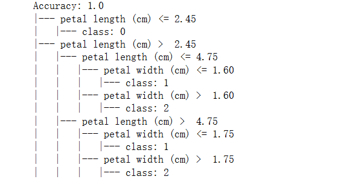
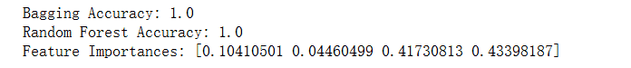
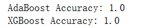
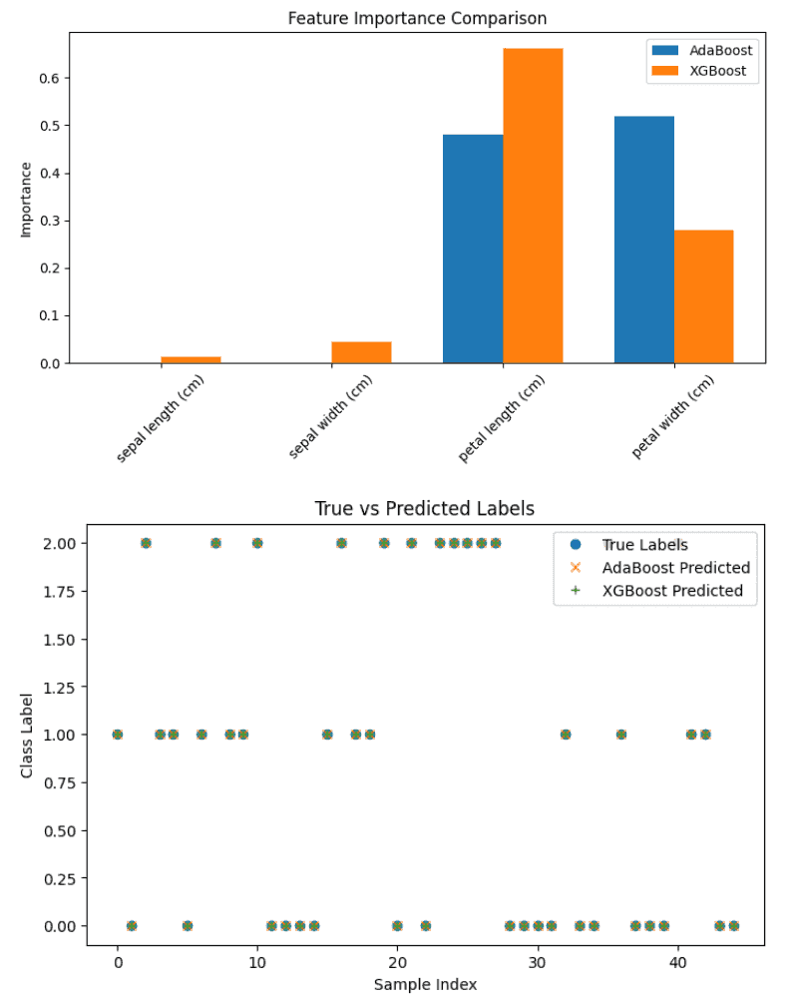
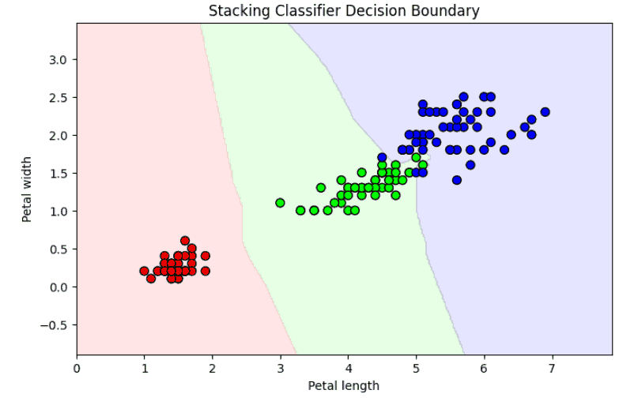

# 树模型与集成学习
树模型与集成模型是机器学习中非常重要的一类方法。树模型（如决策树）通过逐层划分特征空间，把复杂的预测问题转化为一系列“如果-那么”的规则，具有直观、可解释性强的特点。

单棵决策树往往容易过拟合，但当多个树结合在一起，就能形成更强大的 集成模型。常见的集成方法包括 Bagging（如随机森林），它通过多棵树投票减少方差；Boosting（如 AdaBoost、GBDT、XGBoost、LightGBM、CatBoost），它通过迭代训练不断纠正错误，提高精度；还有 Stacking，通过多层模型组合提升泛化能力。集成模型通常比单一模型更稳定、更准确，是工业界大规模应用的主力方法之一。

## 决策树
### 基本原理
决策树（Decision Tree） 是一种常用的监督学习方法，可用于分类和回归任务。它通过不断地“提问”并“分裂”，把复杂问题分解成一系列简单的判断。

例如，在分类问题中，决策树会根据某个特征是否满足条件，把数据划分成不同的子集，直到最终得到叶节点的分类结果。整个过程像是一连串的 “如果...那么...” 规则。
数学上，决策树的学习过程就是 选择最优特征和最优切分点，使得数据划分后“不确定性”最小。

### 划分准则
决策树的核心问题是 如何选择最佳特征来划分数据。常见的准则包括：

**1. 信息增益（ID3）**

  信息增益通过衡量数据集在某一特征上划分后熵的减少量，来选择最优划分特征。它直观地表示划分前后不确定性的下降程度。信息增益越大，说明该特征能更好地区分样本。但它偏向于选择取值较多的特征。

公式为：$$Gain(D, A) = Entropy(D) - \sum_{v \in Values(A)} \frac{|D_v|}{|D|} Entropy(D_v)$$

其中:
- $$D$$：训练数据集。
- $$A$$：某个特征（属性）。
- $$Values(A)$$：特征 $$A$$ 所有可能的取值集合。
- $$D_v$$：数据集中在特征 $$A$$ 上取值为 v 的子集。
- $$|D|$$：数据集 $$D$$ 的样本总数。
- $$|D_v|$$：子集 $$D_v$$的样本数。
- $$Entropy(D)$$：数据集 $$D$$ 的熵，表示不确定性。
- $$Entropy(D_v)$$：子集 $$D_v$$ 的熵。

**2. 信息增益率（C4.5）**

  信息增益率是对信息增益的改进，它在计算信息增益的同时，引入特征自身取值分布的“固有值”进行归一化，从而削弱了取值过多特征的优势。它能够在保证区分度的同时，避免偏向高取值特征。
  
  $$Gain\_ratio(D, A) = \frac{Gain(D, A)}{IV(A)}$$

$$IV(A)$$：信息增益的归一化因子（固有值，Intrinsic Value），$$IV(A) = -\sum_{v \in Values(A)} \frac{|D_v|}{|D|} \log_2 \frac{|D_v|}{|D|}$$

表示按照特征 $$A$$ 进行划分本身带来的信息量大小。

**3. 基尼指数（CART）**

  基尼指数用来衡量数据集的不纯度，其值越小表示数据越“纯”，即大部分样本集中在同一类别中。在分类任务中，CART 决策树通过选择能使基尼指数最小的特征和划分点来生成树结构，因此常用于二叉树的构建。
$$Gini(D) = 1 - \sum_{k=1}^{K} p_k^2$$
其中：
  - $$K$$：类别总数。
  - $$p_k$$：样本属于类别 $$k$$ 的概率（即频率）。

**4. 最小方差（回归树）**

在回归问题中，决策树不再使用熵或基尼指数，而是通过最小化均方误差（MSE）来选择划分点。这样划分后，叶节点内的数据点与其均值的偏差最小，从而保证预测值尽量接近真实值。

### 决策树的构建与剪枝
**1. 构建阶段**
  - 从根节点开始，选择最优特征进行划分
  - 重复划分，直到满足停止条件（如叶子节点纯度足够高，或树的深度达到限制）

**2. 剪枝阶段**

  决策树容易过拟合，因此需要 剪枝（Pruning）：
  - 预剪枝（Pre-pruning）：在构建过程中提前停止划分（如设置最大深度、最小样本数）。
  - 后剪枝（Post-pruning）：先生成一棵完整的树，再通过交叉验证剪去效果不佳的分支。

### 常见决策树算法
1. ID3：使用信息增益作为划分准则。
2. C4.5：改进 ID3，使用信息增益率。
3. CART（Classification and Regression Tree）：既可用于分类（基尼指数），也可用于回归（最小方差）。

在实际应用中，CART 是最常用的算法，也是随机森林和梯度提升树的基础。

下面我们用 scikit-learn 构建一个决策树分类器，处理鸢尾花（Iris）数据集：
```python
from sklearn.datasets import load_iris
from sklearn.model_selection import train_test_split
from sklearn.tree import DecisionTreeClassifier, export_text
from sklearn.metrics import accuracy_score

# 1. 加载数据
iris = load_iris()
X, y = iris.data, iris.target

# 2. 划分训练/测试集
X_train, X_test, y_train, y_test = train_test_split(X, y, test_size=0.3, random_state=42)

# 3. 构建决策树（CART算法，使用基尼指数）
clf = DecisionTreeClassifier(criterion="gini", max_depth=3, random_state=42)
clf.fit(X_train, y_train)

# 4. 预测
y_pred = clf.predict(X_test)

# 5. 评估
print("Accuracy:", accuracy_score(y_test, y_pred))

# 6. 打印规则
tree_rules = export_text(clf, feature_names=iris.feature_names)
print(tree_rules)
```
输出如下，在 Iris（鸢尾花）数据集中，每朵花有 sepal length（萼片长度）、sepal width（萼片宽度）、petal length（花瓣长度）、petal width（花瓣宽度） 四个特征，用于分类不同种类的鸢尾花。

可以看到，决策树非常直观，直接给出了分类规则。

决策树模型直观、可解释性强，不需要特征缩放或归一化，既能做分类，也能做回归。适合处理非线性关系。

但是缺点就是容易过拟合（需要剪枝或结合集成方法），对噪声数据和小变动敏感，单棵树的预测能力有限。

简单总结一下就是决策树是一种简单而强大的模型，通过**分而治之**的思想，把复杂问题转化为一系列简单判断。虽然单棵树存在一定的局限性，但它作为 集成学习（随机森林、GBDT 等） 的基础，仍然是机器学习中不可或缺的重要方法。

## Bagging方法
### Bagging 方法概述
Bagging（Bootstrap Aggregating） 是一种 集成学习方法，通过训练多个基学习器并进行投票（分类）或平均（回归）来提高模型稳定性和预测精度。

核心思想：
1. 自助采样（Bootstrap Sampling）：从原始训练集随机采样（允许重复），生成多个子训练集。
2. 并行训练基模型：在每个子训练集上训练同类型基学习器（如决策树）。
3. 结果集成：对分类任务采用多数表决（Majority Voting），对回归任务采用平均（Averaging）。

Bagging 的优势在于降低模型方差，尤其适合容易过拟合的模型，如决策树。

公式表示：
 假设有 M 个基模型 $$h_1, h_2, \dots, h_M$$，Bagging 的集成预测为：
- 分类任务：$$\hat{y} = \text{mode}\{h_1(x), h_2(x), \dots, h_M(x)\}$$
- 回归任务：$$\hat{y} = \frac{1}{M} \sum_{m=1}^{M} h_m(x)$$

### 随机森林（Random Forest）
随机森林 是 Bagging 的改进版本，专门针对决策树基模型提出。

随机森林的主要改进包括以下两点：
1. 随机特征选择：在每个节点划分时，只从随机选取的部分特征中选择最优特征，这样可以减少树之间的相关性，提高整体泛化能力。
2. 多棵树投票：训练多棵决策树，然后对分类结果进行投票。

通过多棵树的投票能平滑单棵树的噪声，减少过拟合，并且相比单棵树通常性能更好，实现更高的准确率，同时通过观察特征在树中的分裂贡献，可评估其重要性。

### 随机森林的工作流程
**1. 生成训练子集**
  - 从原始数据集中使用自助采样生成 B 个训练子集。

**2. 训练基模型**
  - 对每个训练子集训练一棵决策树
  - 节点划分时只从随机选择的 m 个特征中选取最优分裂
  
**3. 集成预测**
  - 分类：多数表决
  - 回归：取平均

**4. 模型评估与特征重要性**
  - 使用 OOB（Out-of-Bag）样本评估性能
  - 计算特征重要性指标（如 Gini Importance）

下面用 Python 的 scikit-learn 演示 Bagging 与随机森林分类：
```python
from sklearn.datasets import load_iris
from sklearn.model_selection import train_test_split
from sklearn.ensemble import BaggingClassifier, RandomForestClassifier
from sklearn.tree import DecisionTreeClassifier
from sklearn.metrics import accuracy_score

# 1. 加载数据
iris = load_iris()
X, y = iris.data, iris.target

# 2. 划分训练/测试集
X_train, X_test, y_train, y_test = train_test_split(X, y, test_size=0.3, random_state=42)

# 3. Bagging（基于决策树）
bagging_clf = BaggingClassifier(
    base_estimator=DecisionTreeClassifier(),
    n_estimators=100,
    max_samples=0.8,
    max_features=1.0,
    random_state=42
)
bagging_clf.fit(X_train, y_train)
y_pred_bag = bagging_clf.predict(X_test)
print("Bagging Accuracy:", accuracy_score(y_test, y_pred_bag))

# 4. 随机森林
rf_clf = RandomForestClassifier(
    n_estimators=100,
    max_depth=None,
    max_features='sqrt',
    random_state=42
)
rf_clf.fit(X_train, y_train)
y_pred_rf = rf_clf.predict(X_test)
print("Random Forest Accuracy:", accuracy_score(y_test, y_pred_rf))

# 5. 特征重要性
print("Feature Importances:", rf_clf.feature_importances_)
```
输出结果如下，可以看到Iris（鸢尾花）数据集中 sepal length（萼片长度）、sepal width（萼片宽度）、petal length（花瓣长度）、petal width（花瓣宽度） 四个特征的重要程度。


总结一下哈，Bagging 是集成学习的基础，通过随机采样和并行训练降低模型方差；随机森林在此基础上加入随机特征选择，进一步减少树之间相关性，使模型更强大且稳定。随机森林相比于决策树有可以提高模型准确率与鲁棒性，减少过拟合风险，并且可以处理高维数据，提供特征重要性评估。但是缺点是模型复杂，难以解释，训练和预测时间较单棵树更长，对异常值仍然敏感。

## Boosting方法
### Boosting 概述
Boosting 是一种 集成学习方法，它通过 顺序训练一系列弱学习器，每一轮都尝试修正前一轮模型的错误，从而得到一个强大的预测模型。

核心思想：
1. 弱学习器：单个基模型预测能力略优于随机猜测即可，例如深度为1或2的决策树（即决策桩）。
2. 迭代训练：每个新模型关注前一轮模型预测错误的样本，提高整体准确率。
3. 权重更新：错误样本被赋予更高权重，促使下一轮学习器重点学习困难样本。

Boosting 的优势是能显著提高准确率，尤其适合中小规模数据集，但训练是顺序执行，无法并行，因此计算成本较高。

### Boosting 的基本流程
假设有训练数据 $$(x_1, y_1), \dots, (x_n, y_n)$$，分类问题中 Boosting 的工作流程：

**1. 初始化样本权重**：每个样本权重相等 $$w_i = \frac{1}{n}$$。

**2. 对 $$m = 1, 2, \dots, M$$ 轮迭代**：
  - 在加权数据集上训练弱学习器 $$h_m(x)$$
  - 计算弱学习器误差率 $$\epsilon_m = \frac{\sum_i w_i I(y_i \neq h_m(x_i))}{\sum_i w_i}$$
  - 计算弱学习器权重 $$\alpha_m = \frac{1}{2} \ln \frac{1 - \epsilon_m}{\epsilon_m}$$
  - 更新样本权重：错误样本权重增加，正确样本权重降低
  - $$w_i \leftarrow w_i \cdot \exp(\alpha_m \cdot I(y_i \neq h_m(x_i)))$$
  - 归一化权重，使总和为1

**3. 最终预测**：$$H(x) = \text{sign}\Big(\sum_{m=1}^M \alpha_m h_m(x)\Big)$$

### 常见 Boosting 算法
1. AdaBoost（Adaptive Boosting）：AdaBoost是经典的 Boosting 算法，它按错误率调整样本权重，弱学习器通常使用决策桩，对噪声敏感，但在干净数据上效果非常好。
2. GBDT（Gradient Boosting Decision Tree）：GBDT每一轮拟合前一轮残差（负梯度），而不是直接拟合错误，可以处理回归与分类任务，同时损失函数灵活，可选择平方误差、对数损失、Huber 等
3. XGBoost：XGBoost是基于 GBDT 的优化版本，支持正则化、列抽样、缺失值处理，它采用二阶梯度提升，提高收敛速度与预测精度，在 Kaggle 竞赛中非常流行。
4. LightGBM：LightGBM基于 XGBoost 的改进，采用 基于直方图的叶子生长策略（Leaf-wise），对大规模数据和高维稀疏特征非常高效
5. CatBoost：CatBoost天然处理类别特征，无需独热编码，采用 有序Boosting 避免预测偏差，在分类问题中对类别变量效果尤为突出

下面用 Python 的 scikit-learn 和 xgboost 实现 AdaBoost 和 XGBoost 分类：
```python
from sklearn.datasets import load_iris
from sklearn.model_selection import train_test_split
from sklearn.ensemble import AdaBoostClassifier
from xgboost import XGBClassifier
from sklearn.metrics import accuracy_score

# 1. 加载数据
iris = load_iris()
X, y = iris.data, iris.target

# 2. 划分训练/测试集
X_train, X_test, y_train, y_test = train_test_split(X, y, test_size=0.3, random_state=42)

# 3. AdaBoost
adaboost_clf = AdaBoostClassifier(n_estimators=50, learning_rate=1.0, random_state=42)
adaboost_clf.fit(X_train, y_train)
y_pred_ada = adaboost_clf.predict(X_test)
print("AdaBoost Accuracy:", accuracy_score(y_test, y_pred_ada))

# 4. XGBoost
xgb_clf = XGBClassifier(n_estimators=100, learning_rate=0.1, use_label_encoder=False, eval_metric='mlogloss')
xgb_clf.fit(X_train, y_train)
y_pred_xgb = xgb_clf.predict(X_test)
print("XGBoost Accuracy:", accuracy_score(y_test, y_pred_xgb))
```
输出结果如下：

下面的图第一张图对比了 AdaBoost 和 XGBoost 的特征重要性，我们可以看到哪些特征对分类最关键。第二张图是每个测试样本的真实标签和预测标签对比。



总结一下，Boosting 是一种强大的集成方法，通过顺序训练弱学习器、关注困难样本，实现 弱变强。Boosting能够处理复杂的非线性关系，显著提升模型准确率，同时可计算特征重要性，但是训练顺序依赖，无法完全并行，对噪声敏感，尤其是 AdaBoost。并且参数较多，需要调参优化，模型解释性相对弱于单棵树。

## Stacking与集成策略
### 集成策略概述
在机器学习中，单一模型通常无法在所有数据和任务上达到最优性能。集成策略（Ensemble Methods） 的核心思想是群体智慧：将多个模型的预测结果组合起来，使最终模型比单个模型更稳健、更准确。

主要集成策略包括：
1. Bagging（Bootstrap Aggregating）：通过并行训练多个基模型，降低方差（如随机森林）。
2. Boosting：通过顺序训练弱学习器，提高偏差-方差权衡（如 AdaBoost、GBDT）。
3. Stacking（堆叠泛化）：通过多层模型融合，将不同类型模型的预测结果作为输入训练一个“元模型”，提升整体性能。

### Stacking 原理

Stacking 的核心思想：
- 不同模型对数据的偏差不同
- 将这些模型的预测结果作为新特征，训练一个元模型（Meta-model），学习如何组合这些预测

假设有三个基模型 $$M_1, M_2, M_3$$ 和一个元模型 $$M_{meta}$$，Stacking 流程为：

**1. 训练基模型**
  - 将训练集 $$X$$ 分成 $$k$$ 个折（K-fold）
  - 在每个折上训练基模型并对未见数据进行预测，得到基模型预测特征

**2. 构建元训练集**
  - 将基模型对训练集的预测结果组成新的训练集 $$X'$$
  - 标签 $$y'$$ 与原训练集标签相同

**3. 训练元模型**
  - 在 $$X'$$ 上训练元模型，学习如何组合基模型预测

**4. 预测新样本**
  - 基模型对新样本进行预测
  - 将预测结果输入元模型，得到最终预测

表示成公式就是：$$X' = [M_1(X), M_2(X), M_3(X)]$$ $$\hat{y} = M_{meta}(X')$$

### Stacking 流程
1. 原始训练集 → 分成 $$k$$ 折
2. 基模型交叉验证预测 → 得到基模型预测特征
3. 构建元训练集 → 训练元模型
4. 基模型预测新样本 → 元模型输出最终预测

Stacking 可以结合不同类型的基模型，例如：决策树 + 逻辑回归 + KNN，然后使用线性回归或梯度提升树作为元模型。

下面我们用 Python scikit-learn 实现一个简单的 Stacking 分类示例：
```python
from sklearn.datasets import load_iris
from sklearn.model_selection import train_test_split
from sklearn.ensemble import StackingClassifier
from sklearn.linear_model import LogisticRegression
from sklearn.tree import DecisionTreeClassifier
from sklearn.neighbors import KNeighborsClassifier
from sklearn.metrics import accuracy_score

# 1. 加载数据
iris = load_iris()
X, y = iris.data, iris.target

# 2. 划分训练/测试集
X_train, X_test, y_train, y_test = train_test_split(X, y, test_size=0.3, random_state=42)

# 3. 构建基模型和元模型
base_models = [
    ('dt', DecisionTreeClassifier(max_depth=3)),
    ('knn', KNeighborsClassifier(n_neighbors=3))
]
meta_model = LogisticRegression()

# 4. 构建 Stacking 模型
stacking_clf = StackingClassifier(estimators=base_models, final_estimator=meta_model)
stacking_clf.fit(X_train, y_train)

# 5. 预测与评估
y_pred = stacking_clf.predict(X_test)
print("Stacking Accuracy:", accuracy_score(y_test, y_pred))
```
输出为：
```
Stacking Accuracy: 1.0
```

可以看到，Stacking 结合了不同模型的优势，通常性能优于单一模型。

最后我们来总结一下Stacking，同时也总结一下集成学习，Stacking 是一种强大的 多层集成策略，通过将不同基模型的预测组合训练一个元模型，实现更强的泛化能力。

Stacking可以融合不同类型模型，提升整体性能，对偏差和方差都有一定改善，并且相对灵活，可选基模型和元模型，但是训练较复杂，需要多轮训练，对数据量要求较高，否则容易过拟合，同时元模型选择不当可能导致性能下降。

Bagging 和 Boosting 解决了方差和偏差问题，而 Stacking 则进一步通过模型组合提升最终性能，是现代集成学习的重要方法。

最新的文章都在公众号更新，别忘记关注哦！！！如果想要加入技术群聊，扫描下方二维码回复【加群】即可。
